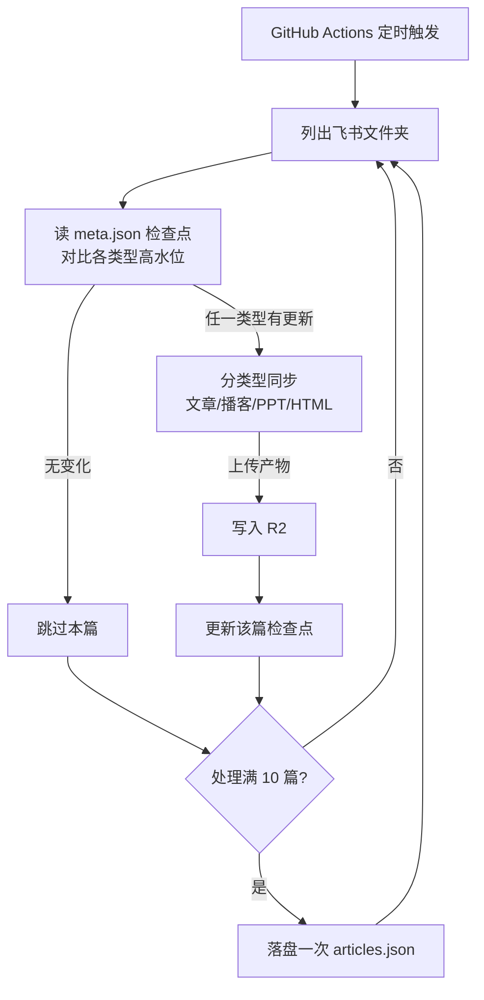

# 无服务器博客搭建记（2/7）：同步器——163 篇文章如何做到每天只传有变化的

## 一、这期解决什么问题

上一期说过，GitHub Actions 这个快递员每天去飞书取稿。问题是：博客有 163 篇文章，如果每天把 163 篇全部重新下载、转换、上传一遍，一轮要跑约 1 小时 40 分钟，又慢又容易超时。这期讲快递员怎么判断"哪几篇改过了"，只取有变化的那几篇。

## 二、背景

### 文章在飞书里长什么样

先交代一下数据的物理形态。我的博客在飞书里是一个云盘文件夹，里面按分类组织，每篇文章有两种形态。

旧格式是单文档：一个飞书文档就是一篇文章。新格式是一个以文章标题命名的文件夹，我叫它 blogFolder，里面按内容类型放子文件夹：`文章`（必选项，主文档加封面图）、`播客`（同名音频、封面、文字稿）、`PPT`（HTML 幻灯片）、`html`（独立交互页面）。子文件夹的名字是严格匹配的映射表，大小写敏感，同步器靠名字认出每种类型。

同步到 R2（对象存储仓库）之后，每篇文章有自己的目录，里面是 `meta.json`（元数据）、`content.md`（正文）和各类型资源文件。仓库根部还有一个 `articles.json`，是全站文章的总索引，列表页就靠它渲染。

### 全量重传有多贵

同步一篇文章不是下载一个文件那么简单。同步器要调飞书 API 拿文档结构，把文档块转成 Markdown，下载正文里的每张图片，生成封面缩略图，再把一堆文件逐个上传到 R2。一篇带图的文章，往返十几次网络请求很正常。

### 一篇文章要搬多少东西

以一篇形态齐全的文章为例，快递员要搬的货包括：主文档转成的 Markdown、正文里的每一张插图、封面原图、一张用 sharp（一个 Node 图像处理库）现场压出来的 400 像素宽 WebP 缩略图、播客音频和文字稿、一整套幻灯片文件、一个交互 HTML，最后还有记录这一切的 meta.json。

而且搬图还有重试机制：下载失败会重试，最多三次。飞书的 API 偶发抽风，硬重试能解决大部分偶发失败，代价是耗时进一步拉长。

163 篇全量跑一轮，实测约 1 小时 40 分钟。而 GitHub Actions 我给 workflow 设的超时是 60 分钟——全量重传连超时线都跑不过。更别说每天 163 篇里真正改过的通常只有一两篇，99% 的传输都是浪费。

## 三、别人是怎么做的

"只同步变化的部分"是个老问题，成熟方案的思路各不相同：

| 维度 | 飞书事件订阅 webhook | Contentful / Sanity 增量 sync API | 我们的方案（定时轮询 + 高水位） |
|------|-----------|-----------|-----------|
| 触发方式 | 平台实时推送事件 | 客户端调用 sync 接口拿变更 | 每天定时去问一遍 |
| 要不要常驻服务 | 要，得有个 endpoint 一直在线接推送 | 不要 | 不要，GitHub Actions 就是全部 |
| 绑定厂商 | 绑定飞书事件格式 | 绑定对应 CMS，换家就没了 | 只依赖飞书的列表 API |
| 延迟 | 秒级 | 取决于调用频率 | 小时级（每天一次） |
| 实现成本 | 部署 + 验签 + 重放防护 | 学一套产品 API | 一个对比时间戳的循环 |

还有一类是文件系统思路：rsync、git diff 这类工具用文件内容或 mtime（文件修改时间）做增量，又快又准。但我的"源文件"不在本地文件系统里，在飞书的云盘上，只能通过 API 一个个列出来问，rsync 够不着它。

## 四、我们是怎么做的

### 高水位：给每种类型记一笔账

核心概念叫高水位（watermark）。想象水库边上刻的一道水位线：下次来只要看水面有没有超过这条线，就知道涨没涨水。

同步器给每篇文章的每种内容类型各记一条水位线，存在这篇文章的 `meta.json` 里，字段叫 `syncCheckpoints`：上次同步时，`文章` 子文件夹里观测到的最大 mtime 是多少、`播客` 是多少、`PPT` 是多少、`html` 是多少。

下一轮同步时，对每篇文章做这样的事：列出各类型子文件夹，算当前最大 mtime，和对应的水位线比一比。任何一个类型涨水了，这篇就重传；全都没涨，整篇跳过，一个文件都不用下载。

```ts
// workers/feishu-blog-sync/src/sync.ts（blogFolderNeedsSync，截短）
for (const folder of foldersToCheck) {
  const type = subFolderTypeOf(folder.name);
  const files = await client.listFiles(folder.token);
  const currentMax = maxModifiedTime(files);
  const checkpointMs = checkpoints[type] ? new Date(checkpoints[type]!).getTime() : 0;
  if (currentMax * 1000 > checkpointMs) {
    return { needsSync: true, cached, subItems };
  }
}
return { needsSync: false, cached };
```

就这几行。判断一个 blogFolder 要不要同步，平均只花两三次列目录的 API 调用，不下载任何文件内容。

### 举个具体的例子

假设我昨晚改了某篇文章的正文，又给它重新生成了一期播客。今天早上同步开始，同步器翻到这篇文章：列出 `文章` 文件夹，当前最大 mtime 是昨晚九点，水位线是昨天早上九点——超线了。不用再查播客和 PPT，直接判定要同步。

同步完成后，水位线更新：`文章` 记成昨晚九点，`播客` 记成播客文件的时间，`PPT` 和 `html` 维持原值。明天再来，四个类型的水位都没涨，这篇文章整个跳过，连正文长什么样都不需要知道。

### 失败的类型会自己补票

前面提到失败隔离，这里补一个连带的好处。假设今天播客同步失败了，文章照常上线，但播客类型的水位线不会更新——下一轮判断时，播客的当前 mtime 依然超线，这篇文章会被再同步一次，等于自动补票。

失败不阻塞主流程，也不会被悄悄忘掉。这个"记仇"的特性不是专门设计的，是水位线机制的自然结果，我很喜欢。

### 一轮同步的完整流程



图里有两个值得说说的设计。

一个是失败隔离。一篇文章的四种类型里，只有 `文章` 是必选的，播客、PPT、HTML 任何一类同步失败，都会被 try/catch 接住，记一条日志继续跑，不阻塞主文章。播客音频几十 MB，传输出错是常事，不能因为一期播客没传上去，就让整篇文章从网站上消失。

另一个是每 10 篇落盘一次索引。早期的版本是在整个循环结束后才写 `articles.json`，这意味着跑到一半被杀，这一轮就白跑了——单篇文章的文件传上去了，总索引却没更新，网站上看不到。现在的做法是每处理完 10 篇就把索引写一次：

```ts
// workers/feishu-blog-sync/src/sync.ts（主循环，截短）
// 超时防护：每处理 10 篇落盘一次索引，运行中途被杀时已处理文章不丢失
if (allArticles.length > 0 && allArticles.length % 10 === 0) {
  await env.R2.put(`${env.R2_BASE_PATH}/articles.json`,
    JSON.stringify(allArticles, null, 2),
    { httpMetadata: { contentType: 'application/json' } });
}
```

这个改动是拿真实的血泪换的，完整故事在第 7 期。

### 跳过是最快的路径

值得量化一下增量带来的差距。判断一篇文章要不要同步，代价是两三次列目录的 API 调用，耗时以百毫秒计；而同步一篇文章，代价是十几次下载上传加图片处理，耗时以十秒计。两者差着两个数量级。

所以这套系统的真实面貌是：每天跑一轮，163 篇文章里一百六十多篇走的是"问两句就跳过"的快车道，只有真正改过的一两篇走完整的搬运流程。常规一轮下来是分钟级，和全量的 1 小时 40 分比，省下的不只是时间，还有 API 额度和超时风险。

## 五、为什么这么选

### webhook 差在哪

回头看第 3 章的对比表，webhook 路线唯一的硬门槛是"要一个常驻在线的接收端"。我整个架构的前提是没有服务器，为了接推送专门养一个 endpoint，等于为了不吃外卖先买了口锅。而且 webhook 要处理验签、重放、漏事件的补偿，复杂度比我整个同步器还高。

厂商增量 API 路线（Contentful、Sanity 那种）本质是把高水位逻辑做成了产品。它确实省心，但前提是你的内容整个住在那家 CMS 里。我的内容住在飞书，飞书没有这种 API，那就自己写——好在核心逻辑就是上面那几行时间戳比较。

### 轮询的真实代价只有一个

轮询的真正代价只有一个：延迟。文章改完最多等一天才上线。对照表里的秒级实时，这个差距看着刺眼，但对个人博客，没有读者会盯着等更新。真着急的时候，手动触发一次就行。我用小时级延迟，换来了零常驻服务和零厂商绑定，这笔交易我愿意做。

### 为什么不是一种类型一条线就够了

早期的单文档文章确实只有一条线：直接拿飞书文档的 mtime 和 R2 里记录的更新时间比，新就重传。这个简单策略对单文档够用，至今还在用。

但 blogFolder 来了之后就不灵了。一篇文章下面挂着四种类型的文件，各自有各自的修改时间，一个时间戳表达不了"谁变了"。水位线从一维变成四维，是数据结构跟着内容形态走的必然结果。

每 10 篇落盘索引则是另一种取舍：运行中途，索引会短暂处于"只包含已遍历文章"的中间态。极端情况下读者可能看到列表少了几篇。但几分钟后的下一次落盘或正常结束会覆盖它，相比"超时白跑一小时"，这个代价可以忽略。

## 六、踩过的坑

### mtime 不能跨类型混用

最初我想偷个懒：不用每种类型各记一条水位线，直接比较"子文件的 mtime 是不是比文章主文档新"，新就说明有衍生内容要同步。

这个思路上线就废了。多内容类型文章的生产顺序是先写文章、后生成播客和 PPT，所以播客文件的 mtime 天然比文章大。于是每篇文章每天都"有更新"，增量检测名存实亡，每天全量重传。这就是为什么水位线必须按类型各记各的：播客的水只能和播客的水位线比。

故事没完。后来水位线的"量法"本身又出过一次口径不一致的 bug，直接导致每日资讯停更一个月。那次故障太精彩，我把它整个留给第 7 期复盘。

### 把 API 当文件系统用的代价

还有一个不算故障的隐痛。rsync 做一次增量只要扫一遍本地目录，而我的同步器判断 163 篇文章，要对着飞书 API 发几百次列目录请求——每篇文章至少一两次。飞书 API 有调用频率限制，请求太密会被限流。

所以同步器是"耐着性子"跑的：一篇一篇来，不并发猛冲。这也让"能跳过的尽量跳过"变得更重要——高水位不只是省传输，还省 API 调用额度，两头都省。

### 超时不是随手填的数字

workflow 里的 `timeout-minutes: 60` 背后有一条纪律，我把注释写在了配置里：如果再次逼近上限，先查增量是不是失效了，不要直接调大超时。

超时是系统的熔断器，不是性能预算。增量失效的典型症状就是一轮同步的时间悄悄变长，如果每次都靠调大超时硬扛，真正的 bug 就被盖住了——第 7 期的停更事故，根子上就是有人（我）绕过了这个信号。熔断器响了，该查的是电路，不是换更粗的保险丝。

## 七、小结与下期预告

这期的要点：

- 163 篇全量一轮约 1 小时 40 分，超过 60 分钟超时线，增量检测不是优化，是活命。
- 高水位的做法：每种内容类型在 meta.json 里记一条"上次见到的最大 mtime"，任一类型超线就重传。
- mtime 只能同类型纵向比，跨类型横比会被生产顺序坑死。
- 失败隔离加每 10 篇落盘索引，让一轮同步在任何地方死掉都不至于全军覆没。

下一期换个视角，从"内容怎么进仓库"转到"内容怎么被看见"：同一篇文章有文字、播客、幻灯片、交互 HTML 四种形态，其中 HTML 是第三方生成的、不可信的一整个网页，怎么把它安全地嵌进文章页？答案是一个被锁死的 iframe 和一条唯一的 postMessage 通道。
