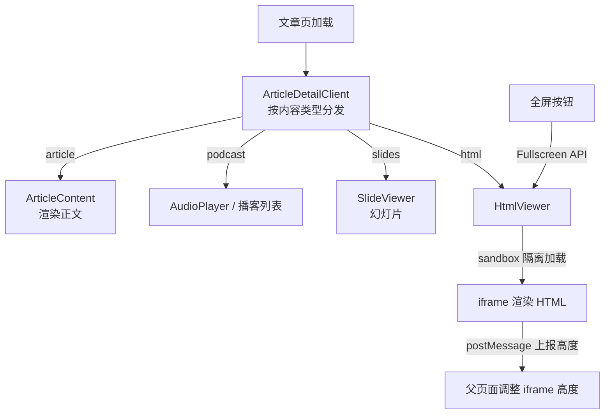

# 无服务器博客搭建记（3/7）：一篇文章的四种形态

## 一、这期解决什么问题

我的博客里，同一篇文章最多有四种形态：文字正文、播客音频、幻灯片、还有一个完整的交互 HTML 页面。前三样好办，难的是 HTML——它是第三方工具生成的一整个网页，里面有什么脚本我控制不了。这期讲这个不可信的网页怎么安全地嵌进文章页，还要做到高度自适应、自带目录、能全屏。

## 二、背景

### 四种形态从哪来

接上一期的设定：飞书里一篇文章是一个文件夹，里面 `文章`、`播客`、`PPT`、`html` 四个子文件夹对应四种内容类型。同步器按文件夹名字识别类型，同步完在 meta.json 里记下这篇文章有哪些形态。

一篇文章可以只有文字，也可以四样都有。读者打开文章页时默认看到哪个？我定了个优先级：html 大于 slides 大于 podcast。也就是说，只要这篇文章有交互 HTML 版本，它就是默认形态——HTML 是我投入最多精力的阅读体验，理应站在第一排。读者可以用页面上的切换器随时换形态。

### 为什么非要嵌 HTML

会有这个类型，是因为我用 AI 工具生成了一批可视化文章：时间线、架构图、交互动效，排印质量远超 Markdown 能表达的东西。这些 HTML 文件完全自包含，本身就是一个精致的迷你网站。

问题也在这：它们带着自己的 JavaScript。直接把这些脚本塞进我的博客页面，等于把家门钥匙给了别人——这就是 XSS（跨站脚本攻击：恶意脚本在你的页面上下文里执行，能读 Cookie、改页面、冒充你的站点发请求）。哪怕我信任生成工具，供应链上任何一环出问题，我的读者就要替我承担。

### 一个合规的 HTML 长什么样

能被嵌进博客的 HTML 不是随便一个 .html 文件，要符合我定的一套自包含规范，四个要素缺一不可：主题 CSS（和博客同一套深色设计，通过 CDN 引入）、字体、高度同步脚本（负责向父页面汇报身高）、内置浮动目录脚本。

这套规范由一个生成工具统一产出，保证每一篇可视化文章的结构都可预期。iframe 方案能成立，一半功劳在沙箱，另一半在这套规范——沙箱管住"不信任"，规范管住"不确定"。

## 三、别人是怎么做的

"文章里嵌入富内容"的方案，按表达力和安全性排开是这样的：

| 维度 | WordPress ACF 自定义字段 | Next.js MDX | 我们的方案（iframe 沙箱） |
|------|-----------|-----------|-----------|
| 内容形态 | 后台填结构化字段，模板渲染 | Markdown 里 import React 组件 | 一整个自包含 HTML 页面 |
| 表达上限 | 字段定义什么就有什么 | 能写任意组件，表达力最强 | 能跑任意 HTML/CSS/JS |
| 脚本来源 | 只有站点自己的代码 | 内容即代码，混在仓库里 | 第三方生成，不受信任 |
| 写作位置 | 后台表单 | 代码仓库里的 .mdx 文件 | 飞书文件夹，与正文一起同步 |
| 安全风险 | 低，但没有富交互 | 内容有仓库评审兜底 | 靠沙箱隔离兜底 |

Notion 的 embed 块是另一种思路：只允许嵌入白名单里的服务（YouTube、Figma 之类）。安全是安全，但白名单之外的世界与你无关，我的可视化文章不在任何白名单上。

MDX 那条路我认真考虑过。表达力确实最强，但它要求内容必须躺在代码仓库里，走 commit、评审、构建。我的 HTML 是工具批量生成的，一篇几百 KB，放 Git 仓库里纯属自虐；而且我想要的写作闭环是"飞书里什么东西，网站上就有什么东西"，MDX 把内容拽回了代码库。

## 四、我们是怎么做的

### 一把锁：sandbox 属性

答案其实便宜得出奇：iframe 加一行 `sandbox="allow-scripts"`。

sandbox 是 iframe 的安全属性，给嵌入内容划一个笼子。`allow-scripts` 的意思是：你可以跑脚本，但仅此而已。关键在于我**没有**给 `allow-same-origin`——没有这个许可，iframe 里的内容被浏览器当作跨源隔离：它摸不到父页面的 DOM，读不到 Cookie 和 localStorage，连"我是谁家的页面"都不知道。里面的脚本随便折腾，笼子外面毫发无伤。

这个封装全站只有一处：

```tsx
// components/article/IframeFrame.tsx
export function IframeFrame({ title, className, ...rest }: IframeFrameProps) {
  return (
    <iframe
      title={title}
      sandbox="allow-scripts"
      className={cn('border-0', className)}
      {...rest}
    />
  );
}
```

HtmlViewer 和 SlideViewer 都走这个组件。安全策略收在一个文件里，将来要调整白名单只改这里，不会出现"改了三处漏了一处"的漂移。

### 一条通道：postMessage 报高度

沙箱解决了安全，制造了新麻烦：高度。iframe 内外不同源，父页面读不到里面内容有多高，没法自适应。而一篇可视化文章可能有两万像素高，iframe 高度写死，要么大片空白，要么出现iframe内滚动条——体验都很糟。

内外之间唯一能用的通道是 postMessage（浏览器提供的跨窗口消息 API，沙箱也挡不住它）。规矩是：HTML 那边主动汇报，父页面被动接收。消息只有一种，叫 `html-content-height`。

```tsx
// components/article/HtmlViewer.tsx（截短）
const handler = (e: MessageEvent) => {
  if (e.source !== iframeRef.current?.contentWindow) return;
  if (r2Origin && e.origin !== r2Origin && e.origin !== 'null') return;
  if (e.data?.type === 'html-content-height' && typeof e.data.height === 'number') {
    throttledSetHeight(e.data.height);
  }
};
window.addEventListener('message', handler);
```

接收侧的两道校验值得看一眼：消息必须来自我这个 iframe 的窗口，origin 必须对得上。笼子开了一扇小窗递纸条，得先确认纸条真是里面那个人递的。

### 整篇文章页怎么分发



入口组件 ArticleDetailClient 拿着文章的 contentTypes，像分拣员一样把内容分发给四个查看器。只有 html 这一路要穿过沙箱。

还有两个配套设计。目录做进了 HTML 内部：一个浮动按钮加抽屉，用 IntersectionObserver（监测元素是否进入视口的浏览器 API）做高亮。为什么不让父页面做目录？沙箱把 DOM 隔开了，父页面连里面有哪些标题都读不到，高亮同步更无从谈起。

全屏模式用的是 Fullscreen API（浏览器原生全屏接口）。普通模式下 iframe 高度等于内容高度，用户滚的是父页面；全屏后 iframe 占满视口自己滚动，HTML 内置的 fixed 目录才真正"浮"起来，这是目录体验最好的状态。

### 页面其他部分的配合

HTML 形态下，页面布局也做了配合。普通文章页是"正文加右侧目录栏"的两栏布局；切到 HTML 形态，主内容区取消宽度限制占满版面，右侧栏不再显示目录（目录在 HTML 肚子里），换成一块阅读指南，告诉读者可以全屏、可以在形态之间切换。

侧边栏本身也随形态变化：播客形态显示章节列表和播放进度，幻灯片形态显示页码导航。四种形态共用一套页面骨架，各自的周边零件各就各位，这是 ArticleDetailClient 里两个 switch 语句干的活。

切换器的位置也分了场景：桌面端它待在右侧栏顶部，移动端则收进文章头部下面的一条横排按钮。判断逻辑很简单——一篇文章有超过一种形态时才显示，纯文字文章不打扰读者。

### 幻灯片和播客复用同一把锁

IframeFrame 这把锁不是 HTML 形态独享的。幻灯片形态里有一类是 HTML 幻灯片（工具导出的整套网页幻灯片），同样是不完全可控的嵌入内容，走的也是同一个 IframeFrame、同一条 sandbox 策略。

安全策略收敛成一个组件的好处在这体现出来：新增一类嵌入内容时，不用重新想一遍安全模型，套进现成的笼子就行。

## 五、为什么这么选

对照第 3 章的表，MDX 输在哪？不是表达力，是内容的位置。它要求内容进代码仓库，这直接撞碎了我的飞书工作流。ACF 输在表达上限：可视化文章的排版自由度，靠字段建模是给大象穿紧身衣。

iframe 沙箱这条路，等于承认"这些内容我不打算信任，也不打算审查"，然后用浏览器自带的能力把不信任变成无所谓。表达力拿满——里面跑什么随它去；安全拿满——笼子焊死了。

代价是通信只剩 postMessage 这一条单行道，而且消息格式得双方约好。目录跨 frame 高亮这种"看起来理所当然"的功能，就是在这条单行道前放弃的。我的解法是换边站：既然过不来，就把目录整个搬进 HTML 里，让它自给自足。这也让 HTML 文件有了规范：主题 CSS、字体、高度同步脚本、内置目录，四要素缺一不可。

### iframe 这顶老帽子

iframe 在前端圈子里名声不算好，很多人第一反应是"老古董""SEO 不友好""性能差"。这些批评对"拿 iframe 拼整页"的老用法成立，但对"嵌入一块不受信任的富内容"这个场景，iframe 加 sandbox 恰恰是浏览器官方给的正解，没有替代品。

技术选型有时候就是这样：一个被嫌弃的老方案，在特定的约束组合下反而是唯一正解。关键是把约束想清楚——我的约束是不可信内容、跨源、要脚本能力，这三条一摆，答案自己浮出来了。

### 为什么默认形态是 HTML

优先级 html 大于 slides 大于 podcast，不只是技术上的排序，是产品判断。可视化 HTML 是我内容里信息密度最高、别处看不到的形态；文字稿有 Markdown 版兜底，播客和幻灯片更像配菜。把最好的一道菜摆在默认位，读者不想吃可以换，但第一眼要看到它。

## 六、踩过的坑

### 跨 frame 目录同步，此路不通

最早我舍不得放弃父页面目录，试过让 HTML 通过 postMessage 把每个标题的位置报上来，父页面渲染目录。在沙箱无 `allow-same-origin` 的前提下，offsetTop 这类几何信息根本拿不准，高亮永远慢半拍或者错位。折腾几天后我认了：沙箱内外的几何同步不可靠，目录只能内置。现在 HtmlViewer 的注释里还留着这句话，提醒自己别再试。

### 高度抖动和永远加载

高度同步上线后，有些 HTML 里的图片是懒加载的，内容高度会连续变化，iframe 跟着一跳一跳。修法是节流：100 毫秒内只处理一次高度更新，末尾补发一次，同时给高度加了上下限（最小 200 像素，最大两倍视口），离谱的数值直接按掉。

另一个是加载失败。万一 HTML 里的上报脚本没跑，父页面会永远转圈。现在有五秒超时兜底，超时显示错误卡片，给读者两个按钮：重试，或者新标签页直接打开原始 HTML。嵌入态是增强体验，原始文件永远能独立打开，这是底线。

重试的实现有个小细节：出错时 iframe 已经从页面上卸载了，点重试不是"再给旧 iframe 一次机会"，而是把状态拨回 loading，让 React 重新挂载一个全新的 iframe 从头加载。状态机简单，行为就可预期。

### 高度校验的信任边界

接收高度消息时还有一层校验值得说：除了核对消息来源窗口，我还会核对 origin。跨源 iframe 发出的 postMessage，origin 是 R2 存储的域名，对不上的一律丢弃。

这防的是页面里万一还有别的 iframe 或弹窗也在发消息，冒充内容高度把页面布局搅乱。postMessage 是谁都能用的公共信箱，收信人自己得学会看信封。

## 七、小结与下期预告

这期的要点：

- 四种形态共用一篇文章页，默认形态按 html 大于 slides 大于 podcast 排优先级。
- 不可信 HTML 的安全方案便宜得离谱：iframe 加 `sandbox="allow-scripts"`，不给 `allow-same-origin`，笼子就焊死了。
- 沙箱内外只有一条 postMessage 通道，用来报高度；目录过不去，就整个搬进 HTML 里。
- 节流、高度上下限、五秒超时兜底，是让这个方案能见人而不是能演示的关键。

下一期聊聊文章页上最热闹的部分：评论、点赞、浏览量、访问分析。这四样都需要"存数据"，而我的博客一个数据库都没碰——数据存在四个互不相干的边缘小服务里，前端手里只有四把 URL。
