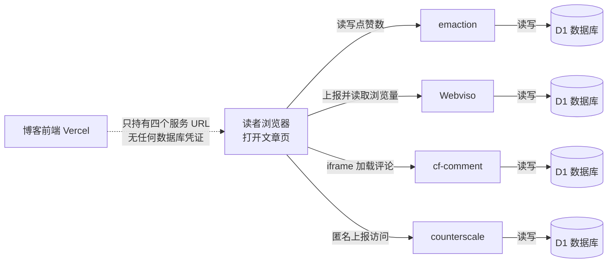

# 无服务器博客搭建记（4/7）：博客不碰数据库

## 一、这期解决什么问题

一个博客光有文章还不够，得有评论、点赞、浏览量，不然像对着空房间演讲。可这几样都要"存数据"，传统做法意味着后端 API 加数据库加防刷，为个人博客养这一整套不值当。这期讲我怎么在不碰一个数据库的前提下，把四样互动功能凑齐。

## 二、背景

### 互动功能的传统账单

给博客加评论，教科书做法是这样的：起一个后端服务，建几张表，写增删改查接口，做登录或验证码防刷，然后定期备份、盯盘、升级。点赞和浏览量看着简单，其实也躲不开存储和写入限流。

对个人博客，这笔账怎么算都不平。功能本身一周能写完，运维是一辈子的事。我一直想找一种形态：数据有人替我管，但数据归我；服务有人替我跑，但挂了不影响别人。

### 我要的互动清单

需求其实不多。评论要支持游客留言，不能要求读者先注册个什么账号；点赞要轻，点一下就走，最好还能换个表情；浏览量只要一个总数，不需要花哨的漏斗分析；访问分析能看趋势就行，我不想在博客里养一个 Google Analytics。

清单越短，越不该为它建一整套后端。这个判断是后面所有选型的起点。

### 边缘服务是什么

我最后的答案是 Cloudflare Workers（Cloudflare 的边缘函数平台：代码跑在全球边缘节点上，按调用计费，没有服务器要管）加 D1（Cloudflare 的 serverless SQL 数据库，随 Workers 按量计费）。

"边缘"的意思是代码跑在离读者近的节点上，不用跨半个地球回源。对我来说更重要的是另一个属性：这类小服务写一次部署上去，之后基本不用管，免费额度对个人博客的流量绰绰有余。

## 三、别人是怎么做的

评论和统计这块，市面上主要是两类解法，和我的对比落在具体行为上：

| 维度 | 自建 API routes + 数据库 | Disqus / Giscus | 我们的方案（Workers + D1） |
|------|-----------|-----------|-----------|
| 数据归属 | 自己的库，完全掌控 | 在第三方平台手里 | 自己的 D1，完全掌控 |
| 运维负担 | 后端、数据库、防刷全包 | 零运维 | 部署一次后基本零运维 |
| 样式统一 | 想怎样就怎样 | iframe 或主题受限，难融入深色设计 | 前端自己渲染或轻量 iframe |
| 访问可达性 | 取决于自己部署在哪 | 国内访问不稳定 | Cloudflare 边缘节点 |
| 成本 | 服务器月租 | 免费但置换数据与广告位 | 免费额度内零成本 |

Disqus 这类托管评论最大的诱惑是零运维，最大的问题是数据在别人手里——哪天服务关停、导出受限，评论区多年积累就没了。Giscus 把评论存进 GitHub Discussions，数据归属好一些，但要求读者有 GitHub 账号才能留言，我的读者不全是程序员。样式上它们都难免带着"外来户"的气质，塞进一个精心调过的深色主题里总有点违和。

自建则是另一个极端：什么都能控制，什么都要自己养。

## 四、我们是怎么做的

### 四个互不相干的小服务

我把互动拆成了四个独立服务，每个都是一个 Cloudflare Worker，各配一个自己的 D1 数据库：

- **cf-comment**：评论。前端用 iframe 嵌入它提供的评论组件，第三方代码不进主站 bundle，和上一期的 HTML 沙箱是同一个思路。
- **emaction**：点赞。兼容 GitHub 风格的表情反应，读者可以点大拇指也可以点别的表情。
- **Webviso**：浏览量。记录每个页面被访问了多少次。
- **counterscale**：访问分析。开源的轻量统计，看全站流量走势。

博客里调用它们的代码薄得像一张纸。前端持有的是四个 URL，通过 `NEXT_PUBLIC_*_URL` 环境变量配置，没有任何数据库凭证：

```ts
// lib/services.ts（截短）
const EMACTION_URL = process.env.NEXT_PUBLIC_EMACTION_URL || '';
const WEBVISO_URL = process.env.NEXT_PUBLIC_WEBVISO_URL || '';
const CF_COMMENT_URL = process.env.NEXT_PUBLIC_CF_COMMENT_URL || '';
```

用第 1 期的比喻说：印刷厂（Vercel 上的博客）只管印报纸，读者服务台是街对面的四个小窗口，读者想点赞、想留言，自己走过去就行，窗口各自有各自的账本（D1）。

### 打开一篇文章时发生了什么



注意图里的虚线：博客前端和四个服务之间不是"调用"，是"告诉浏览器窗口在哪"。数据流完全发生在读者浏览器和边缘服务之间，博客服务器自始至终没碰过互动数据。

### 浏览量是先加一还是先显示

Webviso 的计数分两步：浏览器打开页面时先发一个 `visit` 请求上报这次访问，再发 `count` 请求读回最新总数。所以你刷新一下页面，看到的数字里已经包含了你这次访问自己。

四个服务里最安静的是 counterscale：它不需要读者做任何交互，只是默默记一笔"有篇文章被打开了"，我隔几天去它的后台看一眼流量走势。它存在的意义不是给读者看，是让我知道哪篇文章有人在读。

### 前端聚合的小讲究

文章详情页要同时显示点赞数和浏览量，两个请求并行发出，结果汇成一个 stats 对象：

```ts
// hooks/useArticleStats.ts（截短）
const [reactions, views] = await Promise.all([
  isEmactionEnabled() ? getReactions(articleId) : Promise.resolve([]),
  isWebvisoEnabled() ? getViews(articleId) : Promise.resolve(0),
]);
const stats = { likes: reactions.reduce((sum, r) => sum + r.count, 0), views };
statsCache.set(articleId, stats);
```

这段代码里藏了两个细节。一个是 `Promise.all` 并行拉取，点赞和浏览量谁也不等谁。另一个是模块级的 Map 缓存加在途去重：文章页上有两个组件都要显示这两个数字（操作区和侧边栏），如果没有去重，同一篇文章会发两轮请求。现在第一个组件发起的 Promise 会被第二个直接复用，一篇文章只发一次。

列表页是另一个场景：一次要显示几十篇文章的浏览量，逐个请求就炸了。Webviso 提供了一个批量接口 `count/batch`，把几十个 pageKey 拼进一个请求拿回来，一轮搞定。

### 服务没配怎么办

四个服务全部是"可拔插"的。环境变量里没配某个 URL，对应的调用直接短路：点赞返回空列表，浏览量返回零，页面照常渲染，只是少了那个数字。

这不是摆设。本地开发时我经常不配这些变量，页面该什么样还是什么样；将来某个服务想换掉，改一个环境变量重新部署就完事，代码一行不动。

## 五、为什么这么选

对照第 3 章的表，我放弃 Disqus 的理由是表里的第一行：数据归属。评论是博客仅次于正文的内容资产，放在别人的平台上，等于把读者寄存在别人家里。自建 API routes 被排除则是运维那行：我没有服务器，也不想为一个评论框破例。

Workers 加 D1 正好卡在中间：数据在自己账号下的数据库里，随时能导出；服务跑在平台上，免费额度内零成本，也不需要我盯。代价是要写点代码——四个服务各几百行，写一次，部署一次，之后的边际成本趋近于零。

### 为什么拆成四个，而不是一个大服务

把四个功能合成一个 Worker 加一个库，部署配置能少四分之三，我也动摇过。最后拆开是因为故障隔离：评论服务挂了，点赞和浏览量照常工作，文章页最多少一个评论区，不会整页报错。各自演进也自由——给点赞加个表情种类，不用重启评论。免费额度也独立核算，某个服务流量爆了不会连坐。

代价是四套部署配置、四个环境变量。这个代价是一次性的，故障隔离的收益是持续的，交易划算。

顺带一提，这几个服务并非全都从零手写：emaction 和 counterscale 本身是开源项目，我把它们部署在自己的 Cloudflare 账号下；评论和浏览量服务也是同样的路子。自己部署开源服务，比自建省掉造轮子的功夫，又比用别人托管的实例多拿回数据主权，正好卡在我要的那个点上。

## 六、踩过的坑

### 给客户端 fetch 配服务端缓存

有个真实的糗事。Next.js 的 fetch 支持 `next: { revalidate: 300 }` 这样的缓存配置，我曾把它加在浏览量请求上，想着"缓存五分钟，减少请求"。

配完观察了几天，请求量一点没变。重读文档才醒悟：这个缓存是 Next.js 服务端 Data Cache 的配置，只在服务端渲染的 fetch 上生效。我的浏览量请求是浏览器直连 Webviso 发出的，根本不经过 Next.js 服务端，配置写了个寂寞。

后来把这行删了，`lib/services.ts` 里留了注释说明"此处直连，不配置"，防止未来的自己再犯。教训是：缓存配置长在哪个运行时上，就得在哪个运行时的请求上用。浏览器里的 fetch，缓存策略只能找 HTTP 缓存头或者自己写，框架魔法管不到。

### 无缓存直连是认真想过的

那这个"无缓存直连"的决策本身对不对？我认真想过给浏览量做服务端聚合缓存，让页面服务端渲染时就带上数字。最后放弃了：数字会滞后不说，还让博客服务端和边缘服务之间多了一层耦合。现在的形态是数字晚半秒出现，但永远是最新的，且两条系统互不依赖。半秒的延迟换一个架构上的干净边界，值。

### 快速离开页面丢计数

浏览量上报还有个隐蔽问题：读者点开文章扫一眼就关掉，上报请求可能还没发出去页面就没了，计数丢失。修法是 fetch 加 `keepalive: true`，浏览器会保证这类小请求在页面关闭后依然发完。一行参数的事，但发现这个问题靠的不是读文档，是盯着数据想"为什么短访问的计数明显偏少"。

## 七、小结与下期预告

这期的要点：

- 评论、点赞、浏览量、分析拆成四个 Cloudflare Worker，各配一个 D1，数据归自己，运维趋近于零。
- 博客前端只持有四把 URL，互动数据在读者浏览器和边缘服务之间直连，不经过博客服务器。
- 拆四个服务而不是合一个，买的是故障隔离和独立演进，付的是一次性的部署配置。
- 客户端 fetch 配服务端缓存是个真实的坑：框架魔法只管自己的运行时。

下一期回到文章本身，处理一个我一直心虚的问题：为了渲染 Markdown 里的公式、代码高亮和 Mermaid 图，我让每位读者的浏览器都背着一整套渲染全家桶。中文博客流量小但内容重，这笔账怎么算怎么亏——下一期讲怎么把渲染成本从读者挪到构建时。
