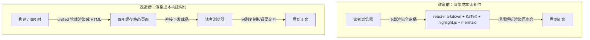

# 无服务器博客搭建记（5/7）：把渲染成本从读者挪到构建时

## 一、这期解决什么问题

上一期聊了评论、点赞、浏览量——四个边缘服务伺候浏览器，我的博客一台数据库都不碰。但边缘服务解决的是「动态数据从哪来」，页面上最重的东西其实是文章正文本身：公式、代码高亮、流程图，最初全靠读者的浏览器现场渲染。每个访客都要下载一整套渲染引擎再跑一遍，流量小、内容重的博客这么干纯亏。这期讲我怎么把这笔账从读者头上挪到构建时。

## 二、背景

### 正文里都有些什么

我的博客正文是 Markdown，但不是朴素的 Markdown。技术文章里有数学公式（要 KaTeX 渲染）、代码块（要语法高亮）、流程图（Mermaid）。这三样每一样背后都是个不小的 JavaScript 库，Mermaid 尤其重——它是个完整的图表引擎，光自己就是几百 KB。

先解释两个术语。**客户端渲染**：浏览器把 Markdown 原文和渲染库一起下载下来，在读者自己的机器上跑一遍，算出页面长什么样。**水合**（hydration）是 React 特有的环节：静态 HTML 到达浏览器后，还要再跑一遍 JS 把事件绑定装上，页面才会「活」。水合没完之前，页面看得见却点不动。

### 最初的实现有多浪费

最初的写法是 Next.js 社区最主流的姿势：页面组件里塞一个 react-markdown，挂上 rehype-katex、highlight.js、mermaid 插件。十几行代码，功能是齐的，公式能显示，图能画出来。

问题是账单由读者付。每个打开文章的人都要下载这几百 KB 的库，等它下载、解析、执行、水合完，才能看到渲染好的公式。手机上这个过程按秒计，期间读者看到的是先出文字、再跳公式的「两段式」加载。用报社的比喻说：我没让印刷厂（Vercel）把报纸印好，而是给每个订户寄了一台印刷机，让他们回家自己印。

### 为什么中文博客尤其亏

有人会说：流量大的站才值得优化。我的看法正相反。中文技术博客的典型画像是「流量小、内容重」——一篇文章可能几千字、十几张图、几十个代码块，但一天就几十个访客。

访客少，省下的总流量看着不多；但每位访客的体验是实打实的：首屏慢一秒，跳出就多一分。这几十个人恰恰是最可能读完文章、点下评论的人。而且渲染一万次和渲染一次，算出来的结果一字不差——重复计算本身就是浪费，跟流量大小无关。

### 全链路的时间观

这个博客的每个环节都尽量在「没人等」的时候干活：写作在飞书，随时；同步在每天早上九点，没人看；渲染在构建时，没人看；读者访问的时刻，只剩「拿成品」这一件事。这期就是把最后一笔「读者在场时发生的计算」也挪走。

## 三、别人是怎么做的

渲染时机这道题，市面上主要有三条路线：

| 维度 | 客户端渲染（react-markdown/MDX） | 纯静态导出（Hugo 路线） | 我们的方案（服务端预渲染 + ISR） |
|------|------|------|------|
| 正文在哪里渲染 | 读者浏览器现场跑 react-markdown | 构建时生成 HTML，之后永不重算 | 构建或 ISR 时在服务端渲染一次 |
| 读者实际下载 | 渲染库全家桶 + Markdown 原文 | 纯 HTML | 纯 HTML + 一个复制按钮的 JS |
| 公式和流程图 | 浏览器执行 KaTeX/Mermaid | 构建时算好 | 构建时算好 |
| 发一篇新文章 | 部署后立即可见 | 全站重新构建导出 | 最多等一个 ISR 周期（1 小时），可手动刷新 |
| 改一个组件样式 | 只动组件代码，重新部署 | 全站重建 | 只重建受影响的页面 |

### 路线一：客户端渲染

这是 Next.js 官方 MDX 插件的默认姿势，多数博客都这么跑。优点是想嵌什么交互组件都行，缺点也明显：渲染成本要乘以读者数——一万次访问就渲染一万次，而每次算出来的结果一模一样。

### 路线二：纯静态导出

Hugo 的思路：构建时把一切算成 HTML，读者侧快到极限，托管随便找个对象存储都行。代价在写作侧——发文即全站重建，站点越大构建越慢，改个页脚也得全量来一遍。我这种每天发文的用法，等于每天把整个报社的版面全部重排一次，只为换其中一页。

### 还有第四条路：SSR

SSR（按请求渲染）是每次访问都由服务器现场渲染一遍。这等于把印刷机搬到书店柜台，现点现印，页面永远新鲜，但每次访问都要消耗一次函数调用。Vercel 的免费额度按调用次数算，博客这种「内容不变、访问重复」的场景用它纯属烧钱，所以我也没选。

## 四、我们是怎么做的

一句话：**渲染发生在构建时，读者只收结果**。ISR（增量静态再生，Incremental Static Regeneration）是 Next.js 的机制：页面渲染一次后缓存起来，所有读者共享同一份成品，过期了才再生一次。具体落地拆成三板斧，顺序有讲究：先搬最大的渲染管线，再清理假客户端组件，最后给重组件做懒加载。

### 板斧一：服务端 unified 管线预渲染

unified 是 JavaScript 生态里处理文本的管线标准：Markdown 先进来被解析成语法树，插件依次在树上加工，最后序列化成 HTML 字符串。原来这条链跑在浏览器里，我把它整条搬到了服务端，构建和 ISR 再生时跑：

```ts
// lib/markdown.ts（截短）
export async function renderMarkdown(md: string): Promise<string> {
  const file = await unified()
    .use(remarkParse)         // markdown → 语法树
    .use(remarkGfm)           // 表格、删除线
    .use(remarkMath)          // 数学公式
    .use(remarkRehype, { allowDangerousHtml: true })
    .use(rehypeMermaid)       // mermaid → 内联 SVG
    .use(rehypeKatex)         // 公式 → 静态 HTML
    .use(rehypeHighlight)     // 代码高亮
    .use(rehypeStringify)     // 语法树 → HTML 字符串
    .process(md);
  return String(file);
}
```

链上还有几个自写的小插件值得提一句：rehypeHeadingIds 给每个标题生成锚点 id，目录跳转全靠它；rehypeLazyImages 给正文图片统一补上懒加载属性。这些活以前分散在客户端组件里，现在收进一条管线，一处管到底。

渲染好的 HTML 字符串存在文章数据的 renderedContent 字段里，页面组件拿到手直接渲染，不经过任何 Markdown 库。浏览器端剩下什么？静态 HTML，外加一个复制代码按钮。就这些。

### Mermaid：最值的一笔

自写的 rehypeMermaid 插件在服务端直接把流程图代码渲染成内联 SVG，浏览器端的 mermaid 库整个消失。读者收到的图就是一张矢量图，主题色还跟着站点的 CSS 变量走，深色模式下也是对的。你现在在这篇文章里看到的流程图，就是这么来的。

### 板斧二：假客户端组件降级

排查 bundle（打包产物）时发现一批组件顶着 `'use client'` 指令却毫无交互——它们只用了 useTranslations 做文案翻译。next-intl（国际化库）在服务端组件里同样可用，这个指令纯属白送浏览器一坨 JS。

`'use client'` 的含义是「这个组件要在浏览器里执行」，一旦标上，它和它引用的所有东西都会被打进浏览器 bundle。把 Footer、AboutMe、ContentTypeBadgeV2 等 9 个组件降级成服务端组件，功能零变化，每页的 bundle 直接缩小。判断标准就一条：没有 state、没有事件、不碰浏览器 API 的组件，都不该标。

### 板斧三：next/dynamic 分层懒加载

真正需要交互的重组件——播客播放器、幻灯片查看器、评论框——改成动态导入，用到才加载，加载期间显示骨架屏：

```tsx
// components/article/ArticleDetailClient.tsx（截短）
const AudioPlayer = dynamic(() => import('./AudioPlayer'), {
  loading: () => <div className="h-20 rounded-lg bg-muted animate-pulse mb-8" />,
});
const SlideViewer = dynamic(() => import('./SlideViewer'), {
  loading: () => <div className="aspect-video rounded-lg bg-muted animate-pulse" />,
});
const CommentSection = dynamic(() => import('./CommentSection'), {
  loading: () => <div className="h-24 rounded-lg bg-muted animate-pulse" />,
});
```

这里的思路是分层。第一层，首屏必需的——正文、标题、作者信息——静态下发，读者第一时间看到。第二层，用到才需要的——播放器、幻灯片查看器、评论框——动态导入，读者切到播客标签页那一刻才去下载对应代码。第三层，连服务端渲染都不必参与的——图片灯箱 ImageLightbox 标了 `ssr: false`，只在浏览器端出现。看纯文字文章的读者，永远不用为播放器和评论框的代码付流量。

### 前后对照



### 改造顺序与验证

三板斧的顺序是有讲究的：先搬渲染管线，因为它占大头，一次到位收益最大；再降级假客户端组件，零风险零功能变化，纯赚；最后做动态导入，因为要给每个重组件配骨架屏，工作量最碎。先砍大树，再扫落叶。

验证方式也很土但有效：每改完一板斧，跑一次生产构建，看构建输出里每个页面的 JS 体积变化，再上线用真机打开几篇不同类型的文章——纯文字、带播客、带幻灯片、带 HTML——挨个确认渲染结果和改造前一致。功能不变、体积下降，两条同时满足才算这板斧砍完了。

### 搜索是同一个思路

Pagefind 把这种哲学推到极致：构建时爬完全部静态页，生成一份压缩的索引文件放到站点目录里；读者搜索时，浏览器下载索引在本地检索，连「请求-响应」这个回合都省了——搜索功能零后端、零服务、零维护。

postbuild 脚本让它全自动：每次构建完，Pagefind 自动跑一遍，索引跟着内容走，永远是最新的。读者用的始终是构建时的产物，和正文渲染是同一笔账。

### 缓存策略配套

页面统一 ISR 3600 秒，也就是一小时。这个数是权衡出来的：我发文频率最多一天几篇，一小时的延迟读者无感；再短就是白白多渲染，再长就耽误日报更新。

紧急更新（改了个错字不想等一小时）调 /api/revalidate 接口全量清除，手动触发一次即可。这个接口在第七期的故事里还会出场——同步链路修好之后，新文章能秒级上线就靠它。

## 五、为什么这么选

### 为什么不是客户端渲染

回到第三章的表。客户端渲染的核心卖点是交互自由，但我的文章页交互清单列出来只有一项：复制代码按钮。为这一个按钮让每位读者背一套渲染引擎，怎么算都不值。什么时候该选客户端渲染？当你的「内容」本身就是应用的时候——仪表盘、在线编辑器、协同文档。博客不在此列。

### 为什么不是纯静态和 SSR

纯静态导出在读者侧最优，但写作侧受不了：我每天发日报，全站重建意味着构建时间和文章数线性挂钩，163 篇已经很可观，一年后更糟。SSR 则是另一个方向的浪费——页面永远新鲜，但博客的内容根本没那么新鲜。ISR 正好是中间点：渲染只发生一次，发文最多一小时生效，紧急情况有 revalidate 接口兜底。

### 代价交代

第一，构建和 ISR 再生变慢了，渲染挪到了这边，这笔时间现在由构建机付。第二，排错的战场从浏览器控制台挪到了构建日志——Mermaid 画不出来时只能 try/catch 记一条 warn，读者看到的就是原始代码块，不崩但难看。第三，管线里开了 allowDangerousHtml，意味着我完全信任内容源——能这么开是因为内容全部来自我自己的飞书编辑部，没有第二个人能往里写。

### 总账

渲染一次的成本从「每位读者付一遍」变成「构建机付一遍」，访问量越大省得越多；构建变慢的成本从「每次发文多等几分钟」变成……还是多等几分钟，没涨。一升一降，账就平了还带盈余。另一个隐性收益：搜索引擎爬虫拿到的也是渲染好的 HTML，不用执行 JS 就能读到正文，对收录友好，这是客户端渲染路线给不了的。

## 六、踩过的坑

### 坑一：把翻译当成了「需要客户端」

这个误会是翻构建输出时发现的：几个我心里认定的「纯展示组件」，名字赫然出现在客户端 bundle 清单里。一个个点开查，共同点浮出水面——它们都只调了 useTranslations。再翻 next-intl 文档，服务端版本的 API 一模一样，翻译在服务端就能查好，查完随着 HTML 一起下发。

9 个组件降级后没有任何功能变化，只是浏览器少下载了 JS。教训很朴素：给组件标 `'use client'` 之前先问自己三个问题——有没有 state？有没有事件回调？碰不碰浏览器 API？三样都没有，就别标。这个指令是会传染的：一个组件标了，它引入的子组件全部跟着进 bundle，标错一个父组件，污染一整棵子树。

### 坑二：搜索上线后一直是坏的

Pagefind 上线后，线上搜索一直全空，本地却是好的。查了才发现 pagefind 1.5 起变成了 ES module（新版 JavaScript 模块格式），我用传统的 script 标签加载，浏览器直接拒绝执行。改成动态 import 才修复（提交 507227e）。

这类「构建产物在、运行时加载失败」的问题，本地开发环境根本暴露不了——dev server 的加载路径和生产不一样。只能靠上线后真点一遍，所以现在我给每个新功能列了上线自查清单，搜索、评论、点赞挨个点过才算完。这个习惯在第七期会再次救场，也会再次缺席——到那时再讲。

## 七、小结与下期预告

- 渲染全家桶从浏览器赶到构建时：unified 管线出 HTML，Mermaid 服务端转内联 SVG，读者只收成品
- 9 个假客户端组件降级，重交互组件全部动态导入，bundle 能小则小
- 搜索同理：Pagefind 构建时建索引，浏览器本地检索，零后端
- ISR 3600 秒 + revalidate 接口，是「静态的快」和「更新的慢」之间的交易

渲染挪到构建时之后，读者是爽了，但整条链路的命门也跟着挪了——构建一旦失败，新文章就出不了印刷厂。下一期聊聊构建为什么总是失败：三个只有中文站才会踩的坑。
