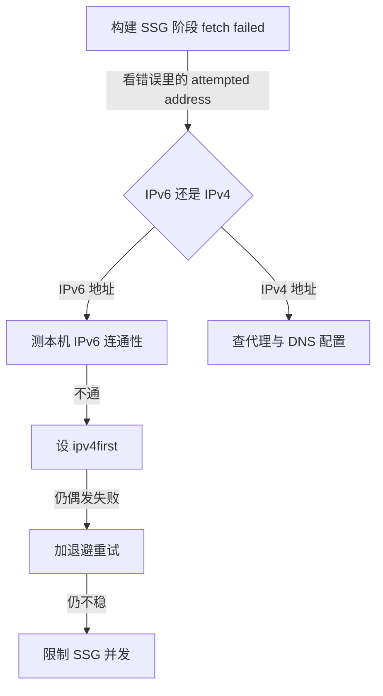

# 无服务器博客搭建记（6/7）：构建为什么总是失败

## 一、这期解决什么问题

上一期把渲染成本全挪进了构建时，读者爽了，命门也跟着挪了：构建一旦失败，新文章就出不了印刷厂。而我的构建那段时间确实一直在失败——中文字体把打包器搞崩、本机拉数据拉到超时、偶发的网络抖动，三个坑轮流上岗。这期是一次完整的排障复盘，外加一棵沉淀下来的排查决策树。

## 二、背景

### 构建时要干的事

这个博客的构建（build）不只是编译代码。SSG（静态站点生成，构建时把页面提前渲染成 HTML 文件）阶段，Next.js 会启动一批 worker 进程，从 R2 仓库拉取全部文章数据，逐篇渲染成静态页。163 篇文章，每篇至少一次网络请求，图片、播客、幻灯片还要更多。

也就是说，构建 = 编译 + 大规模网络抓取。前者考验打包器，后者考验网络，两个方向都可能挂。构建失败比运行时失败更讨厌的地方在于：它不出现在任何监控里，只出现在你 push 之后；而且失败的影响是「全站停在昨天」，读者看到的是旧内容，安安静静地过期。

### 两个环境，两种表现

构建发生在两个地方：我的本机（家庭宽带，挂着代理，直连 Cloudflare）和 Vercel 的构建机（海外机房，网络又近又干净）。同一个项目，同一份代码，两边的表现完全不同。

这个差异是后面所有故事的大前提：Vercel 上岁月静好，本机状况百出。如果只在 Vercel 构建，这期文章根本不存在——但我需要在本地验证构建，构建不过就没法放心推送；「本地过不了、线上再说」这个头一开，早晚要在生产上交学费。

## 三、别人是怎么做的

构建稳定性这件事，不同体量的项目解法差很远：

| 维度 | 官方默认路径 | 企业级做法 | 我们的方案 |
|------|------|------|------|
| 打包器 | Turbopack（Next.js 16 默认） | 跟官方默认走，踩坑提 issue 等修 | 退回 webpack，构建脚本里写死 |
| 构建在哪跑 | 本地开发直连外部服务 | 一切收进 CI 容器，网络出口统一管控 | 本地直连 R2，加 DNS 修正与退避重试 |
| 网络抖动 | 不处理，失败即挂 | 内网 registry 和镜像，基本无感 | 3 次重试 + SSG 并发限到 4 |
| 构建失败怎么发现 | 盯 CI 红绿 | Sentry/Datadog 接告警 | GitHub Actions 失败通知 + 翻日志 |

官方默认路径对英文站、网络好的环境是通的。我的环境三样全不占：中文 Web 字体、本机代理、到 Cloudflare 的烂链路。企业做法对我又太重——个人博客的构建稳定性，不该靠买监控服务和搭内网镜像来解决。

「跟官方默认走，踩坑提 issue 等修」听起来正确，实际是个时间陷阱：字体问题什么时候修好，取决于人家的排期，而我的构建今天就要跑。个人项目耗不起「等」，绕开比修好更现实。CI 容器方案倒是认真考虑过——把构建全搬到 GitHub Actions 上，本地不构建。否决的理由是反馈环太长：改一行样式也要 push 上去等 CI 跑完才知道对不对，写博客的快乐会被这个等待磨光。

## 四、我们是怎么做的

三个坑，三个修法，最后沉淀出一个文件和一棵树。

### 坑一：Turbopack 与中文字体

Next.js 16 默认用 Turbopack（新一代打包器，Rust 写的，主打的就快）替代 webpack。升级后第一次构建就崩了，报错指向 next/font/google 引用的中文字体（Noto Serif SC 等）。

中文字体的特殊性在于体积：英文字体全字符集几十 KB，中文几千字起步，所以中文 Web 字体必须现场做子集切分——这篇文章用到哪些字，就切哪些字进字体文件。这套流程在 Turbopack 的字体管线里当时有兼容问题，构建必崩。英文站大概率一辈子不会踩到，这也是标题里说「只有中文站才会踩」的原因之一。

我没去啃 Turbopack 的源码。解法很直接：构建脚本退回 webpack（`next build --webpack`），注释写明原因，并在项目文档里立了条规矩——别手痒切回去。Turbopack 是趋势，webpack 是老黄牛；等前者把中文字体修好再迁移不迟，那时迁移只是一行脚本的事。

### 坑二：IPv6 到 Cloudflare 不通

这是最折腾的一个。现象：本机构建挂在 SSG 阶段，报 fetch failed ConnectTimeoutError。盯着错误信息多看了一眼，关键线索藏在 attempted address 里——那是个 IPv6 地址。

顺着这条线验证：用 IPv6 地址直连 Cloudflare，超时；换 IPv4，秒通。真相浮出来：我家网络的 IPv6 到 Cloudflare 不通，IPv4 正常。而 Node 22 的 DNS 解析默认用 verbatim 模式（按 DNS 服务器返回的顺序用，IPv6 记录通常排前面），于是每个请求都先撞一次 IPv6 连接超时。修复只要一行：`dns.setDefaultResultOrder('ipv4first')`，强制 IPv4 优先。

### 第一次修复为什么没生效

我把这行加在 next.config.ts 里，构建照挂。排查后才明白：SSG 为了提速会并行渲染，worker 是独立拉起的进程；next.config 只被主进程加载，worker 不继承主进程的 DNS 设置——每个 worker 出生时，都是「IPv6 优先」的新人生。

真正的修法是 instrumentation.ts。这是 Next.js 的插桩文件，每个服务端实例（dev、生产、每个 SSG worker）启动时都会执行一次 register()，代码跟着 worker 走，这才根治：

```ts
// instrumentation.ts（文件主体，全文即此）
export async function register() {
  const dns = await import('node:dns');
  dns.setDefaultResultOrder('ipv4first');

  // 本地构建走代理时，让内置 fetch 尊重 HTTPS_PROXY
  if (process.env.HTTPS_PROXY || process.env.https_proxy) {
    try {
      const { EnvHttpProxyAgent, setGlobalDispatcher } = await import('undici');
      setGlobalDispatcher(new EnvHttpProxyAgent());
    } catch {
      // 无代理需求的环境直连即可
    }
  }
}
```

下半段是顺手修的另一个问题：Node 22 的原生 fetch 不读 HTTPS_PROXY 环境变量，本地挂代理构建时请求会绕过代理。用 undici 的 EnvHttpProxyAgent 补上；Vercel 上没装这个依赖，catch 静默跳过，保持直连。

### 坑三：偶发抖动

前两坑修完，构建从「必挂」变成「偶发挂」——十次里挂一两次，错误还是连接超时，但没有了固定规律。翻了几份失败日志找共同点：挂的时间不固定、挂的文章不固定，唯一固定的是都发生在 SSG 高并发拉数据的阶段。这种毛刺没法根除，只能吸收。

第一招，给 R2 请求加退避重试——失败后等一下再试，间隔按 300ms、800ms 翻倍，最多试 3 次；服务器返回 5xx 或 429（限流）也同样重试：

```ts
// lib/blog-data.ts（截短；网络异常的 catch 分支同样走退避重试）
async function fetchWithRetry(url: string, init?: Parameters<typeof fetch>[1], retries = 2) {
  for (let attempt = 0; attempt <= retries; attempt++) {
    const res = await fetch(url, init);
    // 5xx 和 429（限流）：退避 300ms/800ms 后重试
    if ((res.status >= 500 || res.status === 429) && attempt < retries) {
      await new Promise((r) => setTimeout(r, 300 * 2 ** attempt));
      continue;
    }
    return res;
  }
}
```

第二招，把 SSG worker 并发数限到 4（next.config.ts 里 `cpus: 4`）。本地直连 Cloudflare 时，十几个 worker 同时猛拉容易把连接打超时，慢一点换稳一点。三招合起来就是提交 d0fba8b，注释里写着「三层修复」。

### 排查决策树

这套流程后来被我自己反复使用，沉淀成一棵树。网络类构建失败，照它走比凭直觉乱试快得多：



树的用法只有一条纪律：从根节点开始，每走一步都要拿出证据再往下走。「我觉得是代理的问题」不算证据，「attempted address 是 IPv6 而且 ping 不通」才算。

## 五、为什么这么选

### 稳比快值钱

对照第三章的表。Turbopack 快，但快不过「构建跑不完」；退回 webpack 牺牲的是构建速度，换来字体管线成熟稳定——对每天构建的项目，「稳」比「快」值钱。监控方案同理：Sentry 对有常驻进程的服务端有意义，我的博客运行时全是静态页和边缘函数，唯一需要盯的进程就是构建本身，CI 自带的红绿通知已经够用。

### 一套代码路径

还有一个值得说清的决策：这些修复——ipv4first、退避重试、限并发——在 Vercel 构建机上全都不需要，那边网络本来就通。我选择统一保留，而不是加环境判断只在本地生效。理由是它们在线上零代价，而「本地和线上一套代码路径」本身值钱：环境分支越多，「我本地是好的」这类悬案就越多。

回头看，三个修法没有一个是「高科技」：一行 DNS 设置、一个重试循环、一个并发上限。构建稳定性拼的不是技术深度，是愿不愿意顺着错误信息把链路走完。

## 六、踩过的坑

这期整篇都是坑，正文讲了现象和修法，这里只留三条方法论。

### 先看证据，再怀疑代理

网络类构建失败，先看 attempted addresses 再动手。我在 IPv6 这个坑上先浪费了半天：怀疑代理、重装依赖、清缓存、换网络，全是无效动作。错误信息里那串 IPv6 地址，其实早就把答案写在脸上了——我不看，它就帮不了我。挂代理的环境里代理确实是最可疑的嫌疑人，但这次的真凶是 IPv6 和进程隔离，代理从头到尾是无辜的。

### 「修了」不等于「修好了」

ipv4first 第一次写进 next.config.ts 时我满心欢喜，构建照挂——主进程生效、worker 不继承，这是为「想当然」交的学费。现在的规矩是：改完必须完整跑一遍 pnpm build，亲眼看到 SSG 阶段过掉才算数。配置写在哪里，和配置写了什么，是同样重要的两个问题。

### 把排查过程写下来

事后我把决策树写进了项目文档。下次再遇到构建网络失败，不管是谁（包括三个月后的我自己），都能顺着树走，不用重新发明排查过程。个人项目没有运维团队，文档就是我的运维团队。

## 七、小结与下期预告

- Turbopack 配中文 Web 字体构建必崩，退回 webpack 并在文档里写明原因，勿切回
- 本机 IPv6 到 Cloudflare 不通 + Node 22 默认 IPv6 优先 = SSG 全超时；根治靠 instrumentation.ts，让每个 worker 启动时都执行 ipv4first
- 剩余抖动用退避重试（300ms/800ms）+ 并发限 4 吸收，本地与 Vercel 统一保留
- 方法论：先看 attempted address 再怀疑代理；改完必须完整构建验证

构建稳了，我以为这条链路终于可以撒手不管。直到九月底的某天，我发现每日资讯已经悄悄停更了一个多月——期间没有任何报警。下一期是收官篇，讲这次静默失败的完整复盘：三个故障如何叠加成完美的隐形。
