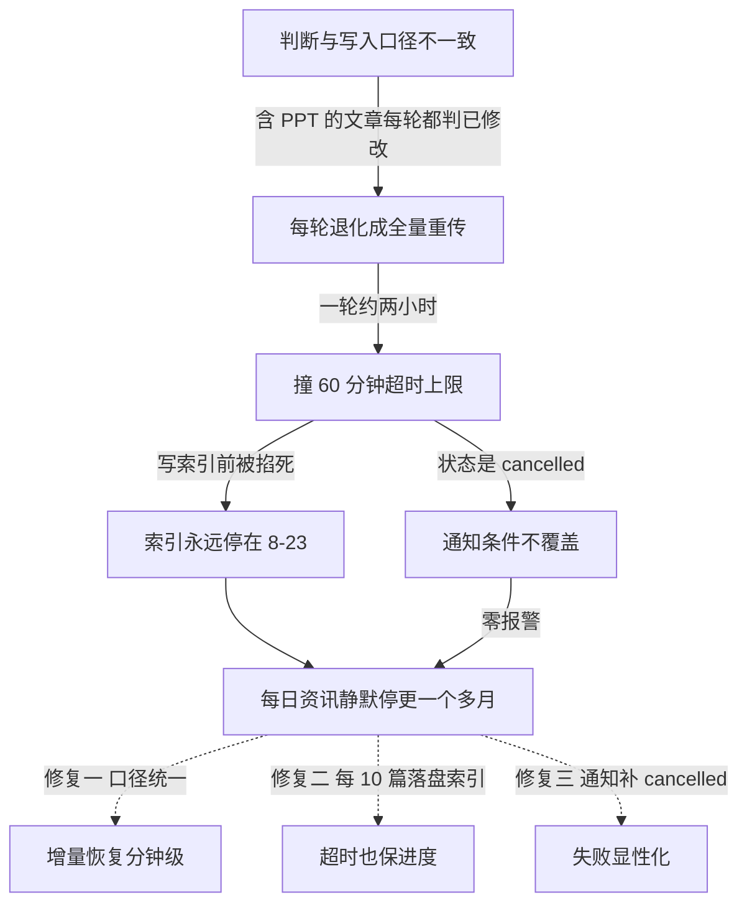

# 无服务器博客搭建记（7/7）：静默失败的一个月

## 一、这期解决什么问题

2026 年 8 月 23 日，我的博客每日资讯栏目悄悄停更了。同步任务每天照跑，没有任何报警，我直到九月底才发现——整整一个多月，快递员每天出门，却从没把新稿子真正送进仓库。这是系列收官篇：一次三重故障叠加的完整复盘，以及我从中捞出来的最重要的一条原则。

## 二、背景

### 链路复习

先把整条链路的角色复习一遍：飞书是编辑部，GitHub Actions 是每天上门取稿的快递员，R2 是仓库，Vercel 是印刷厂。快递员每天北京时间九点出发，把编辑部里有改动的文章搬进仓库；印刷厂每小时刷一次缓存，把新货摆上货架。

第二期讲过快递员的省钱诀窍——增量检测：每篇文章在 meta.json 里记一个「高水位」检查点，也就是上次见到的最大修改时间，有更新才重传。163 篇文章靠它做到每天只传有变化的几篇，一轮几分钟收工。

### 这条链路上谁会说话

注意一个细节：这条链路上，四个角色里有三个是哑巴。飞书不会主动告诉我「我的稿子没被取走」，R2 不会说「我收到的东西不完整」，Vercel 更不会说「我印的可能是旧闻」——它们都只回答被问到的问题。

唯一会主动说话的是 GitHub Actions：每次跑完，它有一个状态，可以配通知。也就是说，整条链路的「健康信号」全部系于这一个出口。这个出口要是瞎了，整条链路就瞎了。记住这一点，它是后面一切故事的土壤。

### 停更的栏目

每日资讯（Daily News）是全站更新最勤的栏目，一天一篇 AI 日报，读者感知最强。别的栏目停更几天没人看得出来，日报停更等于报社天天印旧闻。

讽刺的是，正因为它天天更新，我对它的「在」习以为常，反而不去看了。这个心理盲区是这个故事的人类学部分，后面还会回来讲。

## 三、别人是怎么做的

「任务挂了没人知道」是运维领域的经典问题，解法丰俭由人：

| 维度 | 全链路 APM（Sentry/Datadog） | 纯人工巡检 | 我们的方案 |
|------|------|------|------|
| 怎么发现故障 | agent 采集指标，异常自动告警 | 自己定期打开网站看看 | CI 通知覆盖所有失败状态 + 关键步骤失败即报错 |
| 部署与维护成本 | 接 SDK、配告警规则、可能付费 | 零 | 改几行 workflow 配置 |
| 故障定位依据 | 完整 trace 与性能曲线 | 从零开始翻日志 | Actions 日志 + 复盘文档 |
| 发现延迟 | 分钟级 | 以月计（本次实测） | 下一次任务运行时 |
| 适合谁 | 有 SLA 的商业服务 | 更新不勤的个人站 | 每天跑定时任务的个人项目 |

### 三个选项的取舍

APM（应用性能监控，给程序装上全套仪表盘和报警器的方案）对个人博客是杀鸡用牛刀：要维护的告警规则比博客的功能还多。纯人工巡检的延迟则以月计——这次就是活例，一个月。我的答案在中间：把 CI 自带的状态通知写对，把代码里吞错的地方删掉。

其实还有个轻量中间态我看过：healthchecks.io 这类「死人开关」服务——定时任务跑完主动 ping 它一下，超过一天没 ping 就告警，专治「任务没跑没人知道」。思路非常好，但它治不了本次故障：任务每天都「跑完了」，只是以 cancelled 的姿势。信号源本身的定义错了，下游接什么告警都白搭。

## 四、我们是怎么做的

### 发现：一个月后才拉响的警报

九月底我随手打开每日资讯页面，最新一篇停在 8 月 23 日。第一反应是同步任务挂了。打开 GitHub Actions 一看，任务每天都在跑，状态栏一片……黄。不是红色的 failure（失败），是灰色的 cancelled（被取消）。

更迷惑的是，R2 里单篇文章的文件其实是新的。也就是说数据搬了一半，只是首页索引没更新。这个「半新不旧」的状态骗过了我每一次随手抽查——点开文章能看，谁会去翻日期呢。

说实话，确认停更时长是一个多月的时候，我的后背凉了一下。这意味着三十多天里，每一个访问日报页的读者看到的都是旧闻，而我这个站长一无所知，还在别的功能上优哉游哉。

### 诊断：从症状到根因

排查从日志开始。翻最近一次的同步日志，第一眼就不对：增量同步应该是「跳过一百多篇、同步几篇」，实际日志里是大面积的全量重传——162 项里 76 项全量、仅 6 项跳过。增量机制显然失效了。

第二步，对照检查点。打开 R2 里某篇「每次都被重传」的文章的 meta.json，把检查点里记的修改时间和飞书侧实际时间一比，发现了那个要命的 1-2 秒差值。顺着差值回读源码，判断和写入两个口径的分叉浮出水面。

### 故障一：增量判断的口径不一致（根因）

先解释一个概念：mtime（修改时间），文件系统给每个文件和文件夹记录的最后改动时间，增量检测全靠它。

判断「这篇要不要重传」时，对 slides/html 子文件夹用的是**顶层列表**——连里面的子文件夹条目（比如截图目录）一起算最大 mtime；而写入检查点时用的是**递归遍历所有文件**的最大 mtime。一个数文件夹，一个不数。

飞书的文件夹 mtime 有个特性：恒比内部文件晚一到两秒。于是含 PPT 的文章，判断侧的值永远比检查点大那么一丁点，每轮都被判成「已修改」。文章和播客类型因为两侧口径一致，反而没事——这也是为什么问题藏了一个多月才暴露：它只祸害含 PPT 的文章。

### 两个口径为什么会并存

因为它们是在不同时间写的：slides 支持是后加的，写入侧用了当时顺手的新遍历方式，判断侧没跟着改。没有谁写错了，是两次「各自正确」的修改叠出了矛盾。

这类 bug 最难防——单看每一次提交都没毛病，代码评审也审不出来，只有把「判断」和「写入」摆在同一张桌子上对账，才看得见那条 1-2 秒的缝。

### 故障二：全量重传撞超时上限

增量失效后，一轮同步从分钟级膨胀到约两小时，而 workflow 的超时上限（timeout-minutes，超过就强制终止）是 60 分钟。于是每天的剧情都一样：任务跑满一小时，在写索引之前被平台掐死。

60 分钟这个上限本身没错——增量正常时一轮只要几分钟，60 分钟已经是十倍余量。错的是没人想到，有一天它会从「余量」变成「死因」。

这里还藏着第二个设计缺陷：articles.json（全站文章索引）原本在整个循环结束后才写一次。任务被杀，写索引这一步永远执行不到——所以索引永远停在 8 月 23 日，而单篇文章文件早已传上 R2。停更一个月、数据却是新的，这个诡异现象就是这么来的。

### 故障三：通知条件漏了 cancelled

最后一个问号：为什么一个多月零报警？看 workflow 的通知步骤，条件是 `if: failure()`——只有「失败」才发通知。而超时被平台掐死的任务，状态是 cancelled，不是 failure。门铃只接了正门，小偷天天走后窗。

三个故障单独看都不致命，叠在一起恰好构成完美的静默失败：口径不一致制造超时，超时截断索引写入，通知条件把最后一条求救信号也吞了。

### 修复：三处对症 + 一次追赶

修复和根因一一对应。检查点口径统一用顶层列表，判断和写入说同一种话；索引改成每同步 10 篇落盘一次，就算超时被杀也能保住进度；通知条件补上 cancelled：

```yaml
# .github/workflows/feishu-sync.yml 修复前后
- if: failure()
+ if: failure() || cancelled()
```

然后把超时临时调到 180 分钟，手动触发一次全量追赶：跑了 1 小时 37 分，索引刷新到 159 篇、覆盖至 9 月 27 日，8 月 23 日之后一天不缺。线上日报页重新显示出 9 月的 27 天，那一刻才敢说「修好了」。

确认恢复后把超时改回 60——注释里留了句话：若再次逼近上限，先查增量是否失效，不要直接调大。这句话是写给未来的自己看的：调大超时是掩盖症状，不是治病。

### 故障因果链



## 五、为什么这么选

### 为什么没上 Sentry

回到第三章的表。事故之后我认真考虑过上 Sentry，最后放弃了。理由很现实：我的博客运行时没有一台自己的服务器，唯一需要盯的进程就是这个每天跑一次的 CI 任务。为它接一套 APM，告警规则的配置量都比这次修复本身大，而且配完还得维护——多一个系统，多一种静默失败的可能。

真正的教训是另一条：**通知条件写对，比上监控系统重要**。GitHub Actions 自带邮件通知，问题从来不是「没有监控」，而是我把「失败」理解得太窄。failure() 加 cancelled()，两个词，防护力超过一套没人维护的告警平台。

### 当初为什么会写错

因为抄的是「任务失败就通知我」的直觉，没有去翻平台文档里状态枚举的全集。写条件只覆盖了自己想象得到的失败方式，想象不到的就成了盲区。

现在我写任何告警条件，第一件事是先把状态的全集列出来，逐个问：这个状态发生时，我想不想知道？success、failure、cancelled、skipped——每个都问一遍，盲区就没了。

### 巡检对象变了

人工巡检我也没放弃，但巡检对象变了：不再巡「内容有没有更新」——这靠心情，延迟以月计；改为巡「任务状态是不是全绿」——打开 Actions 页面扫一眼，十秒钟。巡检要检的是机器的信号，不是产品的表象。

还有一个决定值得交代：复盘文档留在了仓库的任务档案里，而不是只存在我的脑子里。个人项目最大的运维风险是「忘了」，文档是对抗遗忘的唯一武器。这期文章的故障时间线，就来自那份文档。

## 六、踩过的坑

### 彩蛋：手动全量同步从来没生效过

故事到这还没完。10 月 1 日，我想迁移封面图域名（从 R2 免费子域换到自定义域名），需要触发一次全量重传。workflow 里明明有 force_sync 开关，勾上、触发、跑完——看日志，还是增量。

查出来是个一句话的 bug：force_sync 是 boolean 类型的输入，命令展开时却写成了字符串比较：

```yaml
# .github/workflows/feishu-sync.yml 修复前后
- run: npx tsx src/cli.ts ${{ inputs.force_sync == 'true' && '--force' || '' }}
+ run: npx tsx src/cli.ts ${{ inputs.force_sync && '--force' || '' }}
```

GitHub Actions 的表达式里，boolean 和字符串 'true' 比较恒为 false。翻译成人话：这个「强制全量」按钮从上线那天起就是个摆设，我每次以为自己在全量，其实都在增量。修成布尔直判之后，真正的全量同步第一次跑通：1 小时 40 分 31 秒——还顺带验证了超时注释里「全量约 1 小时 40 分」的估算。

这个 bug 和主故事是同一类病：功能看起来存在，实际从未生效。按钮在、开关在、通知步骤也在，但「在」和「生效」之间隔着一次真实触发。没触发过的功能，都要默认它是坏的。

### 静默失败三要素

复盘下来，静默失败都有同样的配方：**状态误判**（cancelled 不算失败）+ **进度截断**（超时把写入掐在半截）+ **通知盲区**（报警条件没覆盖真实的故障路径）。三样凑齐，故障就能隐形一个月。

对应的解药是一条原则：让失败显性化。同类的雷我还排掉一颗：postbuild 脚本里生成搜索索引的命令，尾巴上挂着 `|| true`——失败也当成功。这种「为了构建不变红」写下的小聪明，本质和漏掉 cancelled 是同一种病：为了让系统看起来健康，亲手蒙住它的嘴。一起删了。

## 七、小结与下期预告

- 停更一个月的配方：增量口径不一致 → 每轮全量重传 → 超时截断索引 → 通知漏报，三坏叠加成完美隐形
- 修复三板斧：统一检查点口径、索引每 10 篇落盘、通知补上 cancelled；追赶跑一次，超时改回 60
- 方法论：通知条件写对比上监控系统重要；让失败显性化，删掉所有吞错的 `|| true`
- 彩蛋：boolean 输入跟字符串比较恒为 false，「强制全量」按钮当了很久的摆设

### 收官

这也是全系列的最后一期，多说两句收尾。回头看这七期，主线其实就一句话：**写作在飞书，算力在构建时，数据在边缘，服务器一台没有**。从让飞书文档变成博客，到把最后一处吞错的配置删掉，这个站现在每天自己取稿、自己印刷、自己报警，我只需要写。

七期里我最喜欢的反而是三期「失败复盘」——第六期的构建三连坑，这一期的静默一个月。顺利的部分证明方案可行，失败的部分才证明我真的拥有这个系统：每一处伤疤我都认得，每一道报警都是我亲手装上的。没有下期了，系列完结。如果你也照着搭了一个，欢迎来评论区告诉我，你踩了什么坑。
