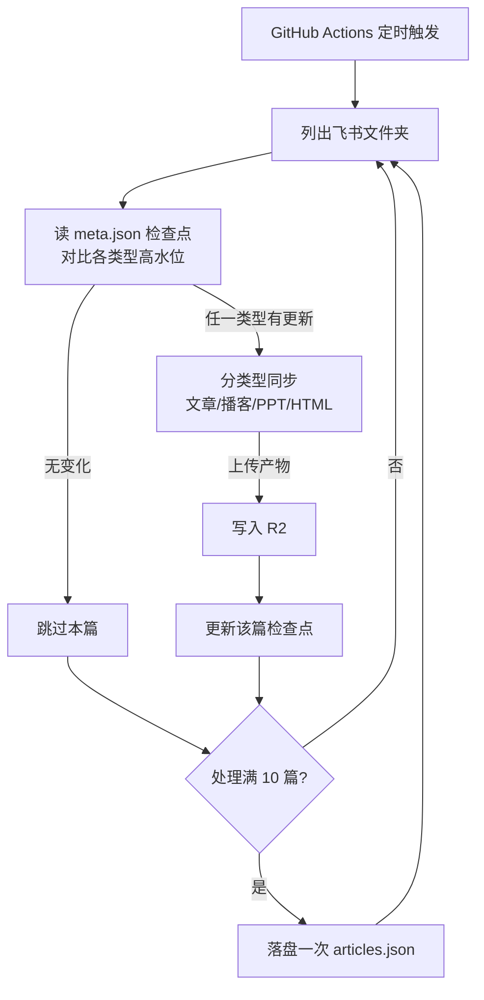

# 无服务器博客搭建记（2/7）：同步器——163 篇文章如何做到每天只传有变化的

我的博客在 lizizai.xyz 上，目前已经有 163 篇文章。这些文章都躺在飞书文档里，由 GitHub Actions 上的定时任务每天去飞书取稿、处理、同步到 R2 存储桶（这在《无服务器博客搭建记》第一期里已经讲过了）。

最初的想法是，每天定时跑一次，把所有文章都从飞书上拉下来，处理一遍，再传到 R2。听起来直接又省事，对吧？我当时也是这么想的。直到实际跑起来，发现全量同步一轮下来要将近 1 小时 40 分钟。而我的 GitHub Actions workflow，超时上限设的是 60 分钟。这就尴尬了，全量同步连超时线都跑不过。

更要命的是，每天 163 篇文章里，真正修改过的通常只有一两篇，甚至大部分时候一篇都没有，绝大多数传输在白白烧。所以，增量检测对我来说，早就不是一个“优化项”了，而是“能不能跑起来”的生死线。

### 同步一篇文章的代价：远不止下载一个文件

你可能觉得，同步一篇文章不就是下载一个文件嘛，能有多大代价？实际情况复杂多了。当同步器开始处理一篇文章时，它会做一系列的事情：

1.  调飞书 API 拿文档结构： 首先要通过飞书 API 获取这篇文档的详细结构，看看里面有哪些内容块。
2.  文档块转 Markdown： 飞书文档的内容块格式是特有的，需要解析并转换为标准的 Markdown 格式。
3.  下载正文里每张图： 文章里的插图都是外部链接，需要逐一下载到本地。
4.  图片处理： 下载下来的图片不能直接用。我会用 `sharp` 这个 Node.js 图像处理库，现场压一张 400 像素宽的 WebP 缩略图，用来做文章列表页的封面图。
5.  逐个上传 R2： 处理好的 Markdown 文件、每张插图、封面原图、缩略图，还有可能有的播客音频和文字稿、整套幻灯片、一个独立交互 HTML，以及记录这一切的 `meta.json`，所有这些文件都要逐个上传到 R2。

一篇形态齐全的文章，可能包含了主文档 Markdown、多张插图、一张封面原图、一张缩略图、一个播客音频、一份播客文字稿、一套 HTML 幻灯片，甚至一个独立的交互 HTML 页面，以及一个 `meta.json` 文件来记录所有相关信息。整个过程往返十几次网络请求是很正常的事情。任何一个环节出错，比如下载图片失败，同步器还会重试，最多三次，这也进一步增加了时间开销。

### 文章在飞书里的形态：从文档到文件夹

我的博客文章在飞书里有两种形态。

旧格式比较简单，就是一个飞书文档对应一篇博客文章。这种格式我至今还在用，同步器直接比较文档本身的修改时间（`mtime`）和 R2 上记录的更新时间，来判断需不需要同步。

新格式更复杂，也更强大，我称之为 `blogFolder`。它是一个以文章标题命名的飞书文件夹，里面包含四种不同类型的子文件夹，命名必须严格匹配，大小写敏感，同步器就是靠这些名字来识别类型的：

-   `文章` (必选)：这里面放主文档和封面图。
-   `播客`：这里面放同名音频文件、封面图、以及文字稿。
-   `PPT`：这里面放生成好的 HTML 幻灯片。
-   `html`：这里面放一个独立的交互 HTML 页面。

这种分类型存储，就是为了支持我的博客文章有文字、播客、PPT、交互 HTML 等多种表现形式。

### 核心方案：高水位（Watermark）

要解决全量同步的性能问题，核心方案就是增量同步。我的做法，可以形象地比喻成高水位（watermark）。你可以想象一个水库，水库边上刻着一道道水位线。下次你再来看，只要水面超过了上次刻的线，你就知道涨水了，需要处理。

在我的同步器里，我给每篇文章的每种内容类型都各记了一条水位线。这些水位线都存在这篇文章对应的 `meta.json` 文件里，字段名叫 `syncCheckpoints`。它记录了上次同步时，“文章”子文件夹观测到的最大 `mtime` 是多少，“播客”是多少，“PPT”是多少，“html”又是多少。

当下一轮同步开始时，同步器会针对每篇文章，列出它下面所有类型子文件夹，然后计算当前这些子文件夹里文件的最大 `mtime`。接着，它把这个当前最大 `mtime` 和 `meta.json` 里记录的水位线进行对比。只要任何一个类型（比如“文章”或者“播客”）的当前 `mtime` 超过了它对应的水位线，就说明这个类型有更新，整篇文章都需要被重传。如果所有类型都没有“涨水”，也就是当前 `mtime` 都没超过各自的水位线，那么整篇文章就会被跳过，一个文件都不会下载。

来看这段判断逻辑：

```ts
// workers/feishu-blog-sync/src/sync.ts（blogFolderNeedsSync，截短）
for (const folder of foldersToCheck) {
  const type = subFolderTypeOf(folder.name);
  const files = await client.listFiles(folder.token);
  const currentMax = maxModifiedTime(files);
  const checkpointMs = checkpoints[type] ? new Date(checkpoints[type]!).getTime() : 0;
  if (currentMax * 1000 > checkpointMs) {
    return { needsSync: true, cached, subItems };
  }
}
return { needsSync: false, cached };
```

这段代码遍历了文章文件夹下的各个子文件夹（比如“文章”、“播客”等），计算了当前子文件夹里所有文件的最大修改时间 `currentMax`，然后和 `meta.json` 里记录的 `checkpointMs`（也就是该类型上次同步时的水位线）进行比较。如果 `currentMax` 超过了 `checkpointMs`，就说明这个类型有更新，需要同步。

这种判断一篇要不要同步的开销非常小。平均下来，只需要两三次列目录的 API 调用，耗时在百毫秒级别。而一旦决定同步一篇，那就是十几次下载上传加上图片处理，耗时在十秒级别。两者差两个数量级。日常运行中，163 篇里有一百六十多篇是“问两句就跳过”，只有真正改过的那一两篇才需要走完整的搬运流程。这样一来，常规一轮同步的时间就从一个多小时缩短到了几分钟。节省的不仅是时间，还有宝贵的 API 额度——飞书 API 是有频率限制的，同步器一篇一篇串行跑，跳过的文章越多，省下的额度也就越多。

### 一个具体的例子

假设昨晚九点你改了某篇博客的正文，又重新生成了一期播客。今天早上同步任务开始跑的时候，同步器会翻到这篇博客：

1.  它会列出“文章”子文件夹里的文件，发现当前的最大 `mtime` 是昨晚九点。
2.  接着，它会读取 `meta.json` 里“文章”类型的水位线，发现是昨天早上九点。
3.  昨晚九点明显超过了昨天早上九点，水位线超了！于是，同步器决定重传这篇博客的“文章”部分。
4.  同样地，它会列出“播客”子文件夹里的文件，发现当前最大 `mtime` 是昨晚九点。
5.  读取 `meta.json` 里“播客”类型的水位线，发现也是昨天早上九点。
6.  播客的水位线也超了，于是“播客”部分也被重传。
7.  “PPT”和“html”子文件夹里的文件都没动，它们的当前 `mtime` 没有超过各自的水位线，所以这两个类型不会被处理。

等这篇博客的“文章”和“播客”部分都处理并上传完成之后，`meta.json` 里的 `syncCheckpoints` 会被更新：
-   “文章”类型的水位线会记成昨晚九点。
-   “播客”类型的水位线也会记成播客文件新的修改时间。
-   “PPT”和“html”类型因为没动，它们的水位线维持原值。

第二天再来同步时，这篇博客的所有四个类型（文章、播客、PPT、html）的当前 `mtime` 都不会超过它们各自的水位线了，整篇博客就会被跳过，不会再进行任何下载和上传。

### 意外的副产品：失败自动补票

高水位机制还有一个我很喜欢的副产品：失败自动补票。

假设今天同步时，因为网络波动或者飞书 API 临时抽风，这篇博客的播客文件同步失败了。但文章正文可能已经成功上线了。在这种情况下，因为播客类型同步失败，它的水位线就不会被更新。

到了下一轮同步时，同步器再次检查这篇博客，发现“播客”类型当前的 `mtime` 依然超过了它上次（因为失败而未更新的）水位线。于是，这篇博客就会再次被同步，并且这次会着重尝试同步播客。

所以某个部分同步失败，既不阻塞主流程，也不会被悄悄遗忘。这个“记仇”的特性不是我专门设计的，而是高水位机制自然而然的结果，却非常实用。

### 翻车史：经验都是血泪换来的

起初，我其实想偷个懒，没有给每种内容类型各记一条水位线。我的想法是：直接比较“子文件的 `mtime` 是不是比文章主文档新”，如果新就说明有衍生内容（比如播客、PPT）要同步。

这个思路一上线就废了。多类型文章的生产顺序通常是先写文章，然后基于文章内容生成播客和 PPT。播客文件或 PPT 文件的 `mtime` 天然就会比文章主文档的 `mtime` 要大。结果就是，每篇多类型文章每天都“有更新”，增量同步名存实亡，等于天天全量。我的 GitHub Actions workflow 还是会愉快地超时。

这个教训让我明白：播客的水位只能跟播客的水位线比，`mtime` 不能跨类型混着比。后来，水位线的“量法”本身还出过一次口径不一致的 bug，导致每日资讯停更了一个月——那个故事，我整个留给了《无服务器博客搭建记》的第 7 期再详细讲。

### 配套设计：失败隔离与增量落盘

为了让整个同步流程更加健壮，我还做了两个配套设计：

1.  失败隔离： 在文章的四种内容类型中，“文章”是必选的，因为它承载了博客的主体内容。但“播客”、“PPT”和“html”这三类内容，则不是强制性的。如果播客音频（几十 MB）在传输过程中出错，或者 PPT/HTML 生成失败，我不能因为这些次要内容的问题就导致整篇文章从网站上消失。所以，这任何一类内容的同步失败，都会被 `try/catch` 语句接住，只记一条日志，然后继续跑。这样就保证了核心文章内容的上线。

2.  每 10 篇落盘一次索引： 在早期版本里，`articles.json` 这个总索引文件是整个同步循环跑完才写一次的，如果 workflow 跑到一半被 GitHub Actions 杀掉（比如因为超时），那么这轮已经处理好的文章，虽然文件已经传到了 R2，但总索引没有更新，网站上依然是看不到的，这轮工作就白跑了。

    为了解决这个问题，我改成了每处理完 10 篇文章，就把当前的 `articles.json` 索引文件落盘一次。

    ```ts
    // workers/feishu-blog-sync/src/sync.ts（主循环，截短）
    // 超时防护：每处理 10 篇落盘一次索引，运行中途被杀时已处理文章不丢失
    if (allArticles.length > 0 && allArticles.length % 10 === 0) {
      await env.R2.put(`${env.R2_BASE_PATH}/articles.json`,
        JSON.stringify(allArticles, null, 2),
        { httpMetadata: { contentType: 'application/json' } });
    }
    ```

    这个改动也是拿真实的血泪换来的。关于这个“血泪”的完整故事，同样会留到第 7 期再聊。

### 整轮流程：Mermaid 图解

把上面讲的这些串起来，整个同步流程是这样的：



从 GitHub Actions 定时触发开始，worker 会列出飞书上的所有博客文件夹。对每个文件夹，它会读取 `meta.json` 里的检查点（高水位），然后对比当前各类型子文件夹的 `mtime`。如果发现有任何一个类型有更新，就会进入分类型同步流程（D）。同步完成后，产物上传到 R2（F），然后更新该篇文章的检查点（G）。如果没有更新，就直接跳过（E）。

无论是跳过还是同步完成，都会走到一个判断点（H）：是不是已经处理满了 10 篇文章？如果是，就会把当前的 `articles.json` 落盘一次（I），然后再继续处理下一篇文章。如果不是，就直接处理下一篇文章（回到 B）。这个循环会一直持续，直到所有文章都检查完毕。

### 为什么选择定时轮询 + 高水位，而不是 Webhook 或 CMS 增量 API？

这套方案走的是“定时轮询 + 高水位”的路线。市场上还有其他几种方案，为什么不选它们呢？

| 维度 | 飞书事件订阅 webhook | Contentful / Sanity 增量 sync API | 我们的方案（定时轮询 + 高水位） |
|------|-----------|-----------|-----------|
| 触发方式 | 平台实时推送事件 | 客户端调用 sync 接口拿变更 | 每天定时去问一遍 |
| 要不要常驻服务 | 要，得有个 endpoint 一直在线接推送 | 不要 | 不要，GitHub Actions 就是全部 |
| 绑定厂商 | 绑定飞书事件格式 | 绑定对应 CMS，换家就没了 | 只依赖飞书的列表 API |
| 延迟 | 秒级 | 取决于调用频率 | 小时级（每天一次） |
| 实现成本 | 部署 + 验签 + 重放防护 | 学一套产品 API | 一个对比时间戳的循环 |

1.  飞书事件订阅 Webhook 路线： 这种方案的硬门槛是“要一个常驻在线的接收端”。我的整个架构前提是没有服务器，为了接飞书的推送专门养一个 endpoint，就等于嘴上说着不开火，手里却在偷偷砌灶台。而且，Webhook 接收端还需要处理验签、重放防护、漏事件补偿等一系列复杂度，这些加起来可能比整个同步器本身的实现还要复杂。所以这条路直接放弃。

2.  Contentful / Sanity 这类 CMS 的增量 Sync API： 这些产品本身就把“高水位”的逻辑做成了产品化的 API 供你调用，非常方便。但前提是你的内容整个都住在这些 CMS 里。我的内容在飞书，而飞书并没有提供类似的增量同步 API。如果未来飞书有的话，我肯定会考虑。

3.  `rsync`、`git diff` 那类文件系统思路： 这种思路是针对文件系统上的文件进行比较。但我的源文件在飞书云盘上，只能通过 API 一个个列出来询问，无法直接进行文件系统级别的 `diff` 操作。

相比之下，定时轮询的真实代价只有一个：延迟。文章改完之后，最多需要等一天才会上线。但对于我这种个人技术博客来说，并没有读者会盯着等更新。如果真遇到什么紧急情况，需要立刻上线，我也可以手动触发一次 GitHub Actions 任务，就能实现即时同步。所以，这种延迟是完全可以接受的。

### `timeout-minutes: 60` 背后的纪律

在 GitHub Actions workflow 的配置文件里，我把 `timeout-minutes` 设成了 60 分钟，这个数字不是随便定的。在配置注释里，我给自己写了一条纪律：如果再次逼近这个上限，首先要检查的是增量同步是不是失效了，而不是直接调大超时时间。

增量失效的典型症状就是，一轮同步的时间会悄悄地变长，但因为不是每次都超时，所以很容易被忽视。如果每次都靠调大超时时间来硬扛，真正的 bug（比如高水位逻辑出了问题，导致天天都在全量同步）就会被盖住。这就像是熔断器响了，该去检查电路是不是有短路，而不是直接换一个更粗的保险丝。

### 下一期预告

说了这么多内容是怎么从飞书进到 R2 存储桶的，下一期我们换个视角，聊聊内容怎么被看见。同一篇文章有文字、播客、幻灯片、交互 HTML 四种形态，尤其是交互 HTML，它是第三方生成的不可信的整个网页，我怎么才能安全地把它嵌进我的文章页面呢？我们下期再见。

<!-- gemini: gemini-2.5-flash 生成，素材事实经核验 -->
