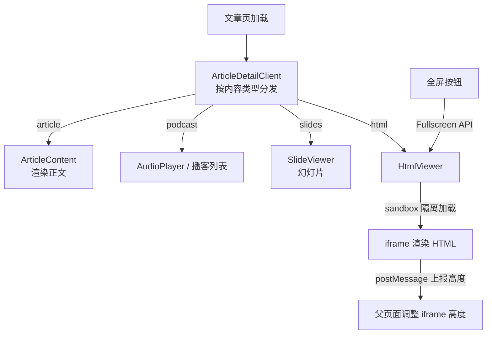

# 无服务器博客搭建记（3/7）：一篇文章的四种形态

大家好，又到了《无服务器博客搭建记》时间。前两期我们聊了博客的基础架构，从飞书到 CDN 的同步链路，还有文章元信息的管理。今天我们来聊聊博客里最核心的东西——内容本身，它在 lizizai.xyz 里可以有四种形态，以及为了承载这些形态我踩过的那些坑。

熟悉博客的同学可能知道，我的文章页不是只有一种样子。比如，一篇讲技术的文章，它可能是一个纯文本的 Markdown，配上右侧的目录。但有些文章，你点进去会发现它是一个带交互、带动画的完整页面，右侧的目录也变了个样。还有一些是播客，或者幻灯片。

在我的博客后端，也就是飞书文件夹里，一篇文章是一个 `blogFolder`。第二期我们提到过，这个文件夹里面可以有 `文章`、`播客`、`PPT`、`html` 这四个子文件夹，它们就对应着文章的四种内容形态。每次同步完，`meta.json` 文件里都会记下这篇文章有哪些形态。当读者打开文章页时，系统会根据优先级来决定默认展示哪种形态：`html` 的优先级最高，然后是 `slides`，再是 `podcast`。如果一篇文章有交互 HTML 版本，那它默认就会展示 HTML，因为那通常是我投入最多精力去优化的阅读体验。当然，读者随时可以用页面上的切换器来更换形态。

之所以搞出这么多形态，尤其是 `html` 这种，主要原因是我用一些 AI 工具生成了一批可视化文章。这些文章内容非常丰富，比如时间线、复杂的架构图、各种交互动效，排印质量和表现力远超 Markdown 能表达的范围。它们本身就是一个个精致的迷你网站，完全自包含，点击链接就能独立运行。

问题也恰恰出在这里：它们带着自己的 JavaScript 脚本。如果我直接把这些工具生成的 HTML 和脚本一股脑地塞进我的博客页面，那就相当于把家门钥匙直接扔给了别人。这在安全领域有个专有名词叫 XSS，也就是跨站脚本攻击：恶意脚本在你的页面上下文里执行，能干的事可就多了，比如读取你的 Cookie、篡改页面内容、甚至冒充你的站点发送请求。即便我信任生成这些内容的工具，但只要供应链上任何一个环节出了问题，最终的风险就得读者来替我承担。这可不行。

### 沙箱：给危险内容一个牢笼

面对这个问题，解决方案便宜得出奇，只需要在 `iframe` 标签上加一行属性：`sandbox="allow-scripts"`。

`sandbox` 是 `iframe` 的一个安全属性，它的作用是给嵌入的内容划定一个笼子，限制它能干什么、不能干什么。`allow-scripts` 的意思是，这个笼子里的内容可以运行 JavaScript 脚本，但仅此而已。

这里最关键的一点是，我 *没有* 给 `iframe` 加上 `allow-same-origin` 这个权限。没有这个许可，浏览器就会把 `iframe` 里的内容当作是“跨源隔离”的，什么呢？意味着 `iframe` 里的脚本摸不到父页面的 DOM 结构，读不到父页面的 Cookie 和 `localStorage`，甚至连自己是谁家的页面都不知道。所以，里面的脚本随便折腾，在自己的笼子里爱怎么跑怎么跑，笼子外面我的主页面毫发无伤。

整个博客，这种沙箱封装策略只在一个地方实现：

```tsx
// components/article/IframeFrame.tsx
export function IframeFrame({ title, className, ...rest }: IframeFrameProps) {
  return (
    <iframe
      title={title}
      sandbox="allow-scripts"
      className={cn('border-0', className)}
      {...rest}
    />
  );
}
```

可以看到，这个 `IframeFrame` 组件是核心。所有需要嵌入外部 HTML 内容的地方，比如 `HtmlViewer`（用来展示交互式可视化文章）和 `SlideViewer`（用来展示幻灯片），都通过它来加载内容。这样做的好处是，所有的安全策略都收敛在一个文件里。将来如果需要调整白名单，比如允许某个特定域名的脚本执行，我只需要修改这里，而不用担心改了三处却漏了一处，导致安全漏洞。

除了安全隔离，能进入博客的 `html` 类型内容也得符合一套自包含的规范。我给它定了四个要素，缺一不可：

1.  主题 CSS： 必须和博客的深色设计风格保持一致，并且通过 CDN 引入。这样视觉上才能统一。
2.  字体： 同样要和博客主体保持一致，减少视觉跳跃感。
3.  高度同步脚本： 这一点非常重要，后面会详细讲。
4.  内置浮动目录： 也是为了在沙箱环境下实现最佳的用户体验。

`sandbox` 解决了不受信任内容的安全问题，而这套规范则解决了这些内容的不确定性问题。

### 沙箱内外：失去联络怎么办？

`sandbox` 锁住了安全，但也给我带来了一个新麻烦——高度。由于 `iframe` 内外不同源，父页面是读不到 `iframe` 里内容具体有多高的。而一篇可视化文章，内容可能长达两万字，如果 `iframe` 的高度写死了，要么下面留一大片空白，要么 `iframe` 内部出现滚动条，两种情况都会让阅读体验大打折扣。

沙箱内外之间，唯一能用的通信通道是 `postMessage`。这是浏览器提供的一个跨窗口消息 API，即使在沙箱隔离下，它也依然能工作。我规定了一个简单的通信规矩：`iframe` 里的 HTML 页面主动汇报自己的高度，父页面则被动接收。消息格式也很简单，就一种，叫做 `html-content-height`。

在父页面接收消息的地方，我做了两道校验：

1.  消息必须确实来自这个 `iframe` 的窗口。
2.  消息的 `origin`（来源域名）必须对得上。

`postMessage` 就像一个公共信箱，谁都能往里面扔信。所以，收信人必须仔细查看信封上的来源，以防页面里其他 `iframe` 冒充内容高度，把我精心布局的页面搅乱。

```tsx
// components/article/HtmlViewer.tsx（截短）
const handler = (e: MessageEvent) => {
  if (e.source !== iframeRef.current?.contentWindow) return;
  if (r2Origin && e.origin !== r2Origin && e.origin !== 'null') return;
  if (e.data?.type === 'html-content-height' && typeof e.data.height === 'number') {
    throttledSetHeight(e.data.height);
  }
};
window.addEventListener('message', handler);
```

### 痛的领悟：跨沙箱目录的认输

在高度问题上好歹找到了 `postMessage` 这个办法，但在目录（TOC）这块，我最终是认输了。

最开始，我舍不得放弃父页面渲染目录的体验，所以尝试过让 HTML 页面通过 `postMessage` 把每个标题在 `iframe` 里的位置信息报上来，然后父页面根据这些位置信息渲染目录并做高亮。但折腾了几天，我最终放弃了。

在没有 `allow-same-origin` 的前提下，`offsetTop` 这类几何信息根本拿不准，父页面很难精确地知道 `iframe` 内部元素的位置。即使能勉强拿到一些数据，高亮效果也总是慢半拍或者错位。这种体验，还不如没有。

最终的解法是“换边站”：把目录整个搬进了 HTML 页面内部。我让这些可视化文章自己实现了一个浮动按钮，点击后可以展开一个抽屉式的目录。目录内部用 `IntersectionObserver`（一个监测元素是否进入视口的浏览器 API）来做高亮，实现自给自足。现在 `HtmlViewer` 的代码注释里还留着一行 `// 沙箱内外的几何同步不可靠`，提醒自己以后别再尝试这种折腾了。

### 文章形态的切换与页面布局

文章页的其他部分也会随着内容形态的变化而调整。

*   对于普通的 文章（Markdown 渲染），页面是经典的双栏布局：左侧是正文内容，右侧是目录栏。
*   当切换到 HTML 形态时，主内容区会取消宽度限制，占满整个版面。右侧栏不再放置目录（因为目录在 HTML 肚子里了），而是换成了“阅读指南”，告诉读者可以全屏阅读，或者切换回其他形态。
*   播客 形态下，侧栏会显示章节列表和播放进度。
*   幻灯片 形态则会显示页码导航。

只有当一篇文章拥有不止一种形态时，页面上的“切换器”才会出现，如果只是纯文字文章，就不会有这个额外的 UI 元素来打扰读者。

为了进一步优化阅读体验，特别是对于那些交互式的 HTML 内容，我还在“阅读指南”里加了一个全屏按钮。这里用的是浏览器原生的 Fullscreen API。在普通模式下，`iframe` 的高度是等于内容高度的，用户滚动的是父页面。但当点击全屏后，`iframe` 会占满整个视口，此时滚动条就变成了 `iframe` 内部的滚动条。这样一来，HTML 内容内置的 `fixed` 目录才能真正浮起来，用户的目录体验也达到了最佳状态。

文章页加载后，会根据内容类型进行分发：



### 那些真实的坑与解决方案

虽然整体方案清晰了，但实际实现过程中还是踩了一些真实的坑。

1. 高度抖动：

有些 HTML 内容里会包含图片懒加载，或者一些动态渲染的组件。当这些内容逐渐加载出来时，`iframe` 内部的高度会连续变化。如果父页面每次都立即调整 `iframe` 高度，就会导致页面一跳一跳的，用户体验很差。

我的修法是引入节流（throttling）：在 100 毫秒内，我只处理一次高度更新，并且在节流周期结束后，会补发一次最新的高度。此外，我还设定了高度的上下限：最小 200 像素，最大不超过两倍视口高度。任何离谱的数值都会被直接拦下，这样大大减少了高度抖动的情况。

2. 加载失败：

万一 `iframe` 里的 HTML 页面，由于某种原因（比如网络错误、脚本阻塞）导致上报高度的脚本没跑起来，父页面就会永远处于加载转圈的状态，这显然不能接受。

我给它加了一个 5 秒的超时兜底机制。如果 5 秒内没有收到高度上报，就会显示一个错误卡片，上面有两个按钮：重试，或者在新标签页直接打开原始 HTML 文件。之所以提供“在新标签页打开原始 HTML”，是因为嵌入态只是为了增强体验，原始文件永远能独立打开，这是底线。

“重试”的细节也比较有意思。当出错时，当前的 `iframe` 已经被卸载了。点击重试按钮后，我会把组件的状态拨回到 `loading`，让 React 重新挂载一个全新的 `iframe` 组件，从头开始加载。这种状态机的设计，使得行为变得简单且可预期。

### 为什么选择 `iframe` 沙箱？

在决定用 `iframe` 加 `sandbox` 之前，我也认真考虑过其他方案：

| 维度 | WordPress ACF 自定义字段 | Next.js MDX | 我们的方案（iframe 沙箱） |
|------|-----------|-----------|-----------|
| 内容形态 | 后台填结构化字段，模板渲染 | Markdown 里 import React 组件 | 一整个自包含 HTML 页面 |
| 表达上限 | 字段定义什么就有什么 | 能写任意组件，表达力最强 | 能跑任意 HTML/CSS/JS |
| 脚本来源 | 只有站点自己的代码 | 内容即代码，混在仓库里 | 第三方生成，不受信任 |
| 写作位置 | 后台表单 | 代码仓库里的 .mdx 文件 | 飞书文件夹，与正文一起同步 |
| 安全风险 | 低，但没有富交互 | 内容有仓库评审兜底 | 靠沙箱隔离兜底 |

*   MDX： 表达力确实是最强的，允许在 Markdown 里直接导入和使用 React 组件，理论上能实现任何复杂的交互。但它要求内容必须躺在代码仓库里，走 `git commit` 评审和构建流程。我的 HTML 内容是工具批量生成的，一篇可能几百 KB，如果都放到 Git 仓库里，纯属自虐。而且，我追求的是“飞书里有什么，网站上就有什么”的闭环体验，MDX 把内容又拽回了代码库，不符合我的初衷。

*   WordPress ACF 自定义字段： 这种方案的表达上限太低了。它通过后台表单定义结构化字段，然后模板来渲染。对于我那些追求极致排版自由度和复杂交互的可视化文章来说，用字段建模简直是给大象穿紧身衣，根本无法施展。

*   Notion 的 embed 功能： Notion 允许嵌入其他服务的内容，但通常只支持白名单服务，或者通过 URL 预览的方式。这种方案缺乏自定义和隔离能力，无法满足我的需求。

*   `iframe` 的名声： 在前端圈里，`iframe` 的名声确实不算太好，很多人觉得它是“老古董”，对 SEO 也不友好。这些批评对于“拿 `iframe` 拼接整页”的老旧用法是成立的，因为那确实容易导致页面结构混乱、通信复杂。但是，对于我这种“嵌入一块不受信任的富内容”的场景，`iframe` 加上 `sandbox` 属性，恰恰是浏览器官方给出的正解，几乎没有替代品。

我接受它带来的代价：通信只能依靠 `postMessage` 这条单行道，消息格式需要双方严格约定。正是在这条单行道面前，我最终放弃了像目录跨 `frame` 高亮这种复杂的功能，因为实现成本和可靠性实在太低了。

好了，这期关于文章的多种形态和背后的技术细节就聊到这里。下期我们来聊聊文章页上最热闹的部分——评论、点赞、浏览量、访问分析，这四样都要存数据，而博主的博客一个数据库都没碰。敬请期待！

<!-- gemini: gemini-2.5-flash 生成，素材事实经核验 -->
