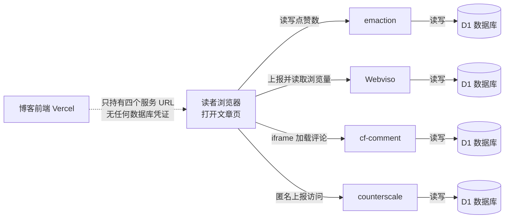

# 无服务器博客搭建记（4/7）：博客不碰数据库

光有文章的博客，就像只有骨架的生物，缺了血肉和呼吸。博客这东西，除了内容本身，还得有点互动，比如评论、点赞、浏览量，再不济，也得知道有没有人在看。

所以，在琢磨怎么把文章渲染出来之余，我给自己列了个短清单：

*   评论：得支持游客留言，不能逼着读者为了留个言先注册个账号，这门槛太高了。
*   点赞：轻量级，点一下就走，最好能换表情，GitHub 那种表情反应就挺好。
*   浏览量：一个总数就行，不用搞太复杂的统计。
*   访问分析：能看看文章的阅读趋势就好，不想在博客里养个 Google Analytics，太重了。

要是按传统做法来，要实现这些功能，那就得先起一个后端服务，建几张表，写增删改查接口，还得考虑登录验证或验证码防刷。然后呢？定期备份、盯盘、升级，这些运维负担一样都跑不掉。对那些流量动辄百万千万的大站来说，这套是标配，无可厚非。但对个人博客来说，这感觉就像为了打一只苍蝇，非要架起一门高射炮——功能本身可能一周就能写完，但之后的运维，那可是一辈子的事。这笔账怎么算都亏。

我的方案，是把这些互动功能全部扔给 Cloudflare Workers，再配上 Cloudflare D1 这个 serverless SQL 数据库。Workers 是个边缘函数平台，代码跑在全球各地的边缘节点上，按调用次数计费，没有服务器要你操心，而且代码跑在离读者最近的地方，请求不用跨半个地球回源。D1 则是 Cloudflare 推出的 serverless SQL 数据库，它跟着 Workers 按量计费，天生就是 Workers 的好搭档。

具体来说，我把评论、点赞、浏览量和访问分析这四个互动功能，拆成了四个独立的 Worker 服务。每个 Worker 都配了一个自己的 D1 数据库，它们之间没有任何直接调用，甚至彼此都不知道对方的存在。

1.  `cf-comment` 专门管评论。前端用 `iframe` 嵌入它的评论组件，这样第三方代码就不会进到我主站的 bundle 里，和之前第三期讲的 HTML 沙箱思路一脉相承。
2.  `emaction` 负责点赞功能，它兼容 GitHub 风格的表情反应，点赞体验很直观。
3.  `Webviso` 用来统计文章的浏览量。
4.  `counterscale` 则负责访问分析。它是个开源的轻量级统计服务，安静地在后台记录访问数据。

我的博客前端代码里，调用这些服务的部分薄得像一张纸：前端只持有这四个服务的 URL 环境变量，没有任何数据库凭证。用之前第一期的比喻，这就像一个印刷厂（我的博客）只管印报纸，而读者服务台是街对面的四个小窗口。读者想点赞、想留言，自己走到对应的窗口去办理，每个窗口都有自己的账本，互不干涉。

```ts
// lib/services.ts（截短）
const EMACTION_URL = process.env.NEXT_PUBLIC_EMACTION_URL || '';
const WEBVISO_URL = process.env.NEXT_PUBLIC_WEBVISO_URL || '';
const CF_COMMENT_URL = process.env.NEXT_PUBLIC_CF_COMMENT_URL || '';
```

没错，“博客不碰数据库”是字面意思。我的博客代码里，没有任何一处逻辑是直接和数据库打交道的，甚至连数据库的凭证都没有。你想碰，也碰不着。

来看看读者打开一篇文章的时候，背后到底发生了什么：



这里面，`Webviso` 的计数逻辑分两步：页面打开时，先发一个 `visit` 请求上报这次访问，接着再发一个 `count` 请求读回最新的总数。所以，如果读者刷新页面，看到的浏览量数字里，已经包含了自己这次访问。

四个服务里，`counterscale` 是最安静的一个。读者不需要做任何交互，它只是默默地记一笔“有篇文章被打开了”。它就像商场门口的客流计数器，存在的意义不是给读者看，而是让我这个博主隔几天去后台看一眼走势，知道哪篇文章有人在读。

在文章详情页，点赞数和浏览量往往需要同时显示。为了提升用户体验，这两个请求是并行发送的。我在前端用 `Promise.all` 来处理，让点赞和浏览量的请求谁也不等谁。

```ts
// hooks/useArticleStats.ts（截短）
const [reactions, views] = await Promise.all([
  isEmactionEnabled() ? getReactions(articleId) : Promise.resolve([]),
  isWebvisoEnabled() ? getViews(articleId) : Promise.resolve(0),
]);
const stats = { likes: reactions.reduce((sum, r) => sum + r.count, 0), views };
statsCache.set(articleId, stats);
```

这里还有个小细节：我用了一个模块级的 `Map` 来缓存正在进行的请求。因为文章页上可能有两个组件都要显示这组数字（比如操作区和侧边栏），如果没有去重，同一篇文章就会发两轮请求。现在有了这个 `statsCache`，第二个组件就能直接复用第一个组件发出的 Promise，避免重复请求。

列表页又是另一个场景了，一次要显示几十篇文章的浏览量。如果逐个请求，那对服务器的压力就太大了。好在 `Webviso` 提供了一个批量接口 `count/batch`，把几十个 `pageKey` 拼进一个请求里，一轮就能搞定所有文章的浏览量，效率很高。

这些服务都有一个共同的特性：它们都是可拔插的。如果某个环境变量没有配置对应的 URL，那么前端的调用就会直接短路，比如点赞直接返回空列表，浏览量返回零，但页面照常渲染，不会报错。这说明这些功能是博客的配件，而不是地基。抽掉任何一个，我的房子都不会塌。平时本地开发的时候，我经常就不配置这些变量；将来如果我想更换某个服务，只需要改一个环境变量，重新部署一下，前端代码甚至一行都不用动。

有人可能会问，为什么要把这些功能拆成四个独立的 Worker，而不是合成一个？合成一个 Worker 再配一个数据库，部署配置至少能少四分之三，坦白说，我一开始也动摇过。但最终还是决定拆开，主要是为了实现故障隔离。比如，如果评论服务挂了，点赞和浏览量照常工作，文章页顶多就是少个评论区，不会整页报错。此外，它们各自的演进也更自由，我给点赞功能加个新表情，不用担心重启评论服务。最实际的，Cloudflare 的免费额度是独立核算的，如果某个服务的流量爆了，也不会连坐，影响其他服务的免费额度。

当然，代价是四套部署配置、四个环境变量，但这只是一次性的配置代价，换来的是持续的隔离和灵活性，我觉得非常划算。顺带一提，`emaction` 和 `counterscale` 都是开源项目，我把它们部署在自己的 Cloudflare 账号下。自己部署开源服务，既省去了自己造轮子的功夫，又比用别人托管的实例多拿回了数据主权。

我这里也发生过一件糗事。Next.js 的 `fetch` 支持 `next: { revalidate: 300 }` 这样的缓存配置，我曾经把它加在浏览量请求上，想着缓存五分钟能减少一些请求量。配完之后观察了几天，发现请求量一点没变。后来重读文档才醒悟：这是服务端 Data Cache 的配置，只在服务端渲染的 `fetch` 上生效——我的浏览量请求是浏览器直连 `Webviso` 发的，根本不经过 Next.js 服务端，所以这个配置写了个寂寞。后来我把这行删了，在 `lib/services.ts` 里留了注释“此处直连，不配置”。教训就是：缓存配置长在哪个运行时上，就得在哪个运行时的请求上用。

那“无缓存直连”本身对不对？我认真想过做服务端聚合缓存，但最终还是放弃了。数字会滞后不说，还让博客服务端和边缘服务多了一层耦合。现在的形态是数字可能晚半秒出现，但永远是最新、最准确的，而且两条系统互不依赖。用半秒的延迟换一个干净的架构边界，我觉得很值。

最后一个隐蔽问题是：如果读者点开文章扫一眼就关掉，上报浏览量的请求可能还没发出去页面就没了，导致计数丢失。解决办法是在 `fetch` 请求里加上 `keepalive: true`。这样一来，浏览器就能保证这类小请求在页面关闭后依然能发送完成。普通请求就像你把一封信托付给一个马上要离开的人，人走了信可能就丢了；而 `keepalive` 就像是把信直接塞进了邮筒，保证能寄出去。这只是一行参数的事，但发现问题靠的不是读文档，而是盯着数据想“为什么短访问的计数明显偏少”。

最后，总结一下我们的方案和传统方案以及第三方服务对比：

| 维度 | 自建 API routes + 数据库 | Disqus / Giscus | 我们的方案（Workers + D1） |
|------|-----------|-----------|-----------|
| 数据归属 | 自己的库，完全掌控 | 在第三方平台手里 | 自己的 D1，完全掌控 |
| 运维负担 | 后端、数据库、防刷全包 | 零运维 | 部署一次后基本零运维 |
| 样式统一 | 想怎样就怎样 | iframe 或主题受限，难融入深色设计 | 前端自己渲染或轻量 iframe |
| 访问可达性 | 取决于自己部署在哪 | 国内访问不稳定 | Cloudflare 边缘节点 |
| 成本 | 服务器月租 | 免费但置换数据与广告位 | 免费额度内零成本 |

有了这些互动功能，我的博客终于有了点人气和呼吸感。下一期，我想回到文章本身，处理一个一直让我心虚的问题——为了渲染 Markdown 里的公式、代码高亮和 Mermaid 图，让每位读者的浏览器都背着一整套渲染全家桶，这笔账怎么算怎么亏。我们下期聊聊怎么优化它。

<!-- gemini: gemini-2.5-flash 生成，素材事实经核验 -->
