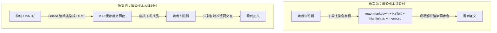

# 无服务器博客搭建记（5/7）：把渲染成本从读者挪到构建时

我的博客文章都是 Markdown 写的，但这可不是那种朴素的 Markdown。作为技术博客，文章里少不了数学公式（需要 KaTeX 渲染）、代码块（得有语法高亮）、流程图（Mermaid，光它自己就几百 KB 的完整图表引擎）。最初，我像很多 Next.js 社区的朋友一样，选择了一个最主流的姿势：在页面组件里塞一个 `react-markdown`，然后挂上 `rehype-katex`、`highlight.js`、`mermaid` 这些插件。十几行代码一写，功能就齐活了。

但问题是，这笔账是读者在付。每次有人打开文章，他们的浏览器就得下载这几百 KB 的库，然后等它解析 Markdown、执行渲染、最后再水合（hydration：静态 HTML 到了浏览器后，还要再跑一遍 JavaScript 把事件监听器绑上，页面才能“活”起来。水合没完成之前，你可能看得到内容但点不动）。在手机上，这个过程可能要按秒来计算。读者看到的是一个先出文字，接着公式和图表才“跳”出来、位置可能还会晃动的两段式加载体验。如果用第一期报社的比喻，这简直就等于给每个订户都寄了一台印刷机，让他们回家自己印报纸。

可能有人会说，流量大的网站才值得去优化这些吧？我的看法恰恰相反。中文技术博客的典型画像就是流量不大，但内容很重。一篇文章可能几千字、十几张图、几十个代码块，一天下来可能也就几十个访客。而恰恰是这几十个访客，最有可能认真读完文章、甚至点开评论区。首屏加载每慢一秒，读者的跳出率就可能高一分。更根本的是，渲染一万次和渲染一次，结果如果能做到一字不差，那么重复计算本身就是一种浪费，这跟流量大小根本没什么关系。

所以，我给出的方案一句话总结就是：渲染发生在构建时，读者只收结果。这里面用到了 Next.js 的一个核心机制——增量静态再生（ISR）。简单来说，页面渲染一次后会被缓存起来，所有读者都共享同一份成品。只有当缓存过期了，页面才会在后台重新生成一次。

要落地这个方案，我主要分了“三板斧”，顺序嘛，自然是先砍大树再扫落叶。

### 板斧一：把渲染管线整个搬到服务端

这绝对是最大的一笔优化。我之前用的 `react-markdown` 及其插件，整个 Markdown 解析、转换、渲染的管线，都是在读者的浏览器里跑的。现在，我把这条管线整体搬到了服务端，让它在构建时或者 ISR 再生时执行。

我用的是 `unified` 这个 JavaScript 生态里很标准的文本处理管线。它能把 Markdown 解析成语法树，然后各种插件可以依次对语法树进行加工，最后再序列化成 HTML 字符串。原来这条链是在浏览器里跑的，现在，它被完整地搬到了服务端。

```ts
// lib/markdown.ts（截短）
export async function renderMarkdown(md: string): Promise<string> {
  const file = await unified()
    .use(remarkParse)         // markdown → 语法树
    .use(remarkGfm)           // 表格、删除线
    .use(remarkMath)          // 数学公式
    .use(remarkRehype, { allowDangerousHtml: true })
    .use(rehypeMermaid)       // mermaid → 内联 SVG
    .use(rehypeKatex)         // 公式 → 静态 HTML
    .use(rehypeHighlight)     // 代码高亮
    .use(rehypeStringify)     // 语法树 → HTML 字符串
    .process(md);
  return String(file);
}
```

你看这段代码，`remarkParse` 把 Markdown 解析成语法树，接着 `remarkGfm` 处理一些常见的 Markdown 扩展（比如表格和删除线），`remarkMath` 处理数学公式。然后通过 `remarkRehype` 桥接，把 `remark` 的语法树转成 `rehype` 的 HTML 语法树。之后 `rehypeMermaid` 把 Mermaid 流程图转换成内联的 SVG，`rehypeKatex` 把数学公式渲染成静态 HTML，`rehypeHighlight` 给代码块加上高亮，最后 `rehypeStringify` 把处理好的语法树序列化成 HTML 字符串。

除了这些标准插件，我还加了几个自己写的小插件，比如 `rehypeHeadingIds` 会给文章里的标题自动生成锚点 `id`，方便做目录跳转；`rehypeLazyImages` 则会给图片自动补上懒加载属性。

渲染好的 HTML 会被我存进文章数据的 `renderedContent` 字段里，页面组件直接渲染这个字段就行了。这样一来，浏览器端还剩下什么？除了静态 HTML，就只剩下一个复制代码块内容的按钮所需的少量 JavaScript 了。

Mermaid 流程图是我觉得这其中最值的一笔优化。以前，浏览器要下载几百 KB 的 Mermaid 库，现场解析 Mermaid 语法，再把图画出来。现在，服务端直接把流程图渲染成内联的 SVG，浏览器端的 `mermaid` 库可以整个消失了！读者收到的直接就是矢量图，而且这些 SVG 图能完美地跟着站点的 CSS 变量走，主题色切换也毫无压力。

改造前后的效果对比，用一张图就能看得很清楚：



### 板斧二：一批“假客户端组件”

这第二个发现，纯属我翻看构建输出文件时偶然发现的。有几个我心里一直认为是纯展示型的组件，赫然出现在了客户端 bundle 的清单里，而且占用的体积还不小。我逐个点开这些组件去查，发现它们的共同点都是只调用了 `useTranslations` 来做文案翻译。我赶紧又去翻了 `next-intl` 的文档，发现翻译功能在服务端也有对应的 API，完全可以在服务端就把文案查好，然后随着 HTML 一起下发给浏览器。

这里面的关键是 `use client` 这个指令。它的含义是“这个组件要在浏览器里执行”。一旦一个组件被标记了 `use client`，那么它和它的所有依赖都会被打包进浏览器端的 bundle 里。更麻烦的是，这个指令是有“传染性”的。如果你不小心给一个父组件标记了 `use client`，那么它下面所有的子树，即使本来可以是服务端组件，也会跟着被“污染”，全部变成客户端组件，最终导致浏览器端 bundle 变大。

我把包括 `Footer`、`AboutMe`、`ContentTypeBadgeV2` 在内的 9 个组件降级成了服务端组件。功能上零变化，但客户端 bundle 的体积直接就缩小了一大截。

我总结了判断一个组件是否应该标记 `use client` 的三条标准：
1.  它有没有 `state`？
2.  它有没有事件回调（比如 `onClick`）？
3.  它有没有直接操作浏览器 API（比如 `window`、`document`）？

如果这三条都没有，那它就完全可以是一个服务端组件，没必要标 `use client`。

### 板斧三：真正要交互的用到才加载

在文章页面里，有些组件确实需要交互，比如播客播放器、幻灯片查看器、以及评论框。这些组件的代码量都不小，但并不是每个读者都会用到。看纯文字文章的读者，就不应该为播放器和评论框的代码付出流量。

我的做法是把这些组件改成了动态导入，并且在加载期间显示骨架屏。

```tsx
// components/article/ArticleDetailClient.tsx（截短）
const AudioPlayer = dynamic(() => import('./AudioPlayer'), {
  loading: () => <div className="h-20 rounded-lg bg-muted animate-pulse mb-8" />,
});
const SlideViewer = dynamic(() => import('./SlideViewer'), {
  loading: () => <div className="aspect-video rounded-lg bg-muted animate-pulse" />,
});
const CommentSection = dynamic(() => import('./CommentSection'), {
  loading: () => <div className="h-24 rounded-lg bg-muted animate-pulse" />,
});
```

这样我就把页面内容分成了三层：
1.  首屏必需的：像正文、标题、作者信息这些，仍然以静态 HTML 的形式直接下发。
2.  用到才需要的：比如播客播放器、幻灯片查看器、评论框，这些只有读者切换到对应的标签页或者滚动到可见区域时，才会动态下载它们的代码。在加载完成前，会显示一个骨架屏。
3.  连服务端渲染都不必参与的：例如图片灯箱这种，我直接给它标记 `ssr: false`。因为灯箱只有在图片被点击后才会在浏览器端打开，完全没必要参与服务端渲染。

这样一来，看纯文字文章的读者，永远都不会为播放器和评论框的代码付出任何流量。

### 验证方法：土但有效

每次改完“一板斧”，我都会跑一次生产构建，然后仔细查看构建输出里每页的 JavaScript 体积。接着，我会上线到预发布环境，用真机（尤其是手机）打开几种不同类型的文章——纯文字的、带播客的、带幻灯片的、带自定义 HTML 的——确认渲染结果和改造前一致，功能也没有任何变化。只有同时满足“功能不变”和“体积下降”这两个条件，才算这“一板斧”真正砍完了。这个方法虽然有点土，但非常有效。

### 额外的优化：搜索也是同一笔账

说到渲染成本的转移，搜索功能其实也是同一笔账。我用的是 Pagefind。它的原理是在构建时爬取我网站的全部静态页面，然后生成一个压缩过的索引文件。当读者在我的博客上进行搜索时，浏览器会下载这个索引文件，然后在本地进行检索。整个过程连请求-响应的后端交互都省了，真正做到了零后端、零服务、零维护。我只是在 `postbuild` 脚本里让它全自动运行。

不过，Pagefind 在给我提供便利的同时，也送了我一份“见面礼”——一个大坑。上线后，线上搜索功能一直显示为空，但在我本地开发环境却跑得好好的。我排查了半天，才发现 Pagefind 从 1.5 版本开始变成了 ES Module，如果用传统的 `<script>` 标签加载，浏览器会直接拒绝执行。最后，我把加载方式改成了动态 `import` 才修复了这个问题（对应的提交是 `507227e`）。

这类“产物在、运行时加载失败”的问题在本地开发环境是很难暴露出来的，因为 `dev server` 的加载路径和生产环境不一样。它只能靠上线后，你真的去点一遍、走一遍流程才能发现。从那以后，我给自己定了个规矩：每个新功能上线前，都要列一个详细的自查清单，搜索、评论、点赞这些核心交互，都必须挨个点过一遍，确认无误才算完。

### 为什么选择这条路？（方案比较）

我们来看一下几种常见的方案，以及我为什么最终选择了“服务端预渲染 + ISR”这条路：

| 维度 | 客户端渲染（react-markdown/MDX） | 纯静态导出（Hugo 路线） | 我们的方案（服务端预渲染 + ISR） |
|------|------|------|------|
| 正文在哪里渲染 | 读者浏览器现场跑 react-markdown | 构建时生成 HTML，之后永不重算 | 构建或 ISR 时在服务端渲染一次 |
| 读者实际下载 | 渲染库全家桶 + Markdown 原文 | 纯 HTML | 纯 HTML + 一个复制按钮的 JS |
| 公式和流程图 | 浏览器执行 KaTeX/Mermaid | 构建时算好 | 构建时算好 |
| 发一篇新文章 | 部署后立即可见 | 全站重新构建导出 | 最多等一个 ISR 周期（1 小时），可手动刷新 |
| 改一个组件样式 | 只动组件代码，重新部署 | 全站重建 | 只重建受影响的页面 |

1.  客户端渲染（`react-markdown`/MDX）：
    这是 Next.js 官方 MDX 的默认姿势，你可以在 Markdown 里随便嵌入交互组件。什么时候应该选它？当你的内容本身就是一个应用的时候，比如仪表盘、在线编辑器、协同文档。但我的文章页面的交互清单只有一项：复制代码按钮。为了这一个按钮，让每位读者都背一套渲染引擎，我觉得不值得。

2.  纯静态导出（Hugo 路线）：
    这种方案在读者侧体验是最优的，因为下发的就是纯 HTML。但对写作侧来说，我受不了。发一篇新文章，就意味着全站要重新构建导出。我每天发日报，构建时间会和文章数量线性挂钩。现在我的博客已经有 163 篇原创文章，这个构建时间已经很可观了。如果未来文章更多，那构建等待会变成一个巨大的负担。

3.  SSR（按请求渲染）：
    服务端渲染每次请求都能保证页面永远新鲜，但对于博客这种内容来说，它根本没那么新鲜。文章内容一旦发布，通常不会频繁变动。每次请求都重新渲染一次，是另一种方向的浪费。

4.  我们的方案（服务端预渲染 + ISR）：
    它恰好卡在中间，找到了一个平衡点。渲染只发生一次（在构建时或 ISR 再生时）。发一篇新文章，读者最多等一个 ISR 周期（我目前设置的是 3600 秒，也就是 1 小时）。因为文章内容更新频率没那么高，再短的周期只会白白多渲染；再长的周期又可能耽误我日报的更新。如果有紧急更新（比如改错字不想等），我可以手动调用 `/api/revalidate` 接口清掉缓存，强制页面立即再生。

### 诚实的代价

当然，天下没有免费的午餐，优化也是有代价的。我付出了三笔“诚实的代价”：

1.  构建和 ISR 再生变慢了：渲染逻辑挪到了服务端，这笔时间自然就由构建机来支付了。
2.  排错战场从浏览器控制台挪到了构建日志：以前 Mermaid 渲染出问题，我可以直接在浏览器控制台看到 JavaScript 的错误信息。现在，如果 Mermaid 画不出来，它只会 `try/catch` 记录一条 `warn` 日志，读者看到的是原始的 Mermaid 代码块，虽然不会导致页面崩溃，但观感肯定不佳。我得去构建日志里翻找。
3.  管线里开了 `allowDangerousHtml` 意味着完全信任内容源：在 `rehypeMermaid` 那个插件里，我开启了 `allowDangerousHtml: true`，我完全信任 Markdown 源里的 HTML 内容。我能这么开，是因为博客的所有内容都来自我自己的飞书文档，没有第二个人能往里写东西。如果你的内容源是不可信的，那这里需要更谨慎的处理。

但从总账来看，渲染成本从每位读者访问一次就支付一遍，变成了构建机支付一遍。这一升一降之间，还带着盈余。比如，爬虫拿到的也是渲染好的 HTML，不需要执行 JavaScript 就能直接读取文章正文，这对 SEO 收录来说非常友好。

---

读者是爽了，但整条链路的命门跟着挪了——构建一旦失败，新文章就出不了“印刷厂”。下一篇，我们来聊聊构建为什么总是失败：三个只有中文站才会踩的坑。

<!-- gemini: gemini-2.5-flash 生成，素材事实经核验 -->
