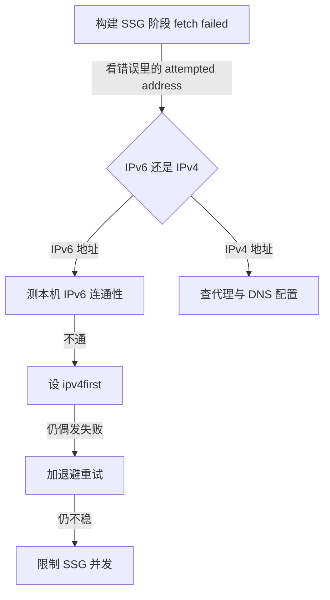

# 无服务器博客搭建记（6/7）：构建为什么总是失败

第五期我们把渲染成本全挪进了构建时，读者阅读体验爽了，但命门也跟着挪了——构建一旦失败，新文章就出不了“印刷厂”。而说来也巧，那段时间我的博客构建确实一直在失败：中文字体把打包器搞崩、本机拉数据拉到超时、偶发的网络抖动，这三个坑轮流上岗，搞得我头大。

### 构建，它到底在干啥？

咱们先来掰扯掰扯，我嘴里说的“构建”，它到底在干什么？它可不只是编译一下代码那么简单。这里面最核心的一个环节是 SSG（Static Site Generation，静态站点生成），也就是在构建的时候把页面提前渲染成 HTML。

为了完成 SSG，Next.js 会启动一批 worker 进程，你可以理解成是并行干活的子进程。它们会同时去我的 Cloudflare R2 对象存储里拉取全部文章数据，然后逐篇渲染。目前我的博客有 163 篇文章， SSG 阶段至少会有 163 次网络请求，如果文章里还包含了图片、播客或者幻灯片，请求次数还会更多。

所以你看，这个“构建”就等于“编译”加上“大规模网络抓取”。这两个方向的任何一个出问题，构建都可能挂掉。

构建失败比运行时失败要讨厌得多。运行时失败，比如某个 API 挂了，那多少还能进 Sentry 或者 Datadog 这样的监控系统，收到告警。但构建失败呢？它只出现在你 push 代码后，GitHub Actions 的红色叉号里，或者你本地命令行的一堆报错里。它不会出现在任何监控系统里，影响是“全站停在昨天”——就像印刷厂半夜停了工，报摊早上照样卖昨天的报纸，没人觉得出事了。

### 大前提：本地和 Vercel，两重天

构建发生在两个地方：一个是我自己的笔记本电脑（家庭宽带，挂着代理，直连 Cloudflare），另一个是 Vercel 的构建机（海外机房，网络又近又干净）。同一份代码，两边表现完全不同：Vercel 上岁月静好，风平浪静；我的本机上则状况百出，幺蛾子不断。

如果我只在 Vercel 上构建，那这篇文章根本就不会存在。但作为一名博主，我需要在本地验证构建。而且，“本地过不了线上再说”这个头一开，早晚要在生产环境上交学费。所以，本地构建的稳定性，我必须死磕到底。

### 坑一：Turbopack 与中文字体，天生不合？

Next.js 16 默认用 Turbopack 替代了之前的 webpack。Turbopack 是个新一代的打包器，用 Rust 写的，主打一个字——快。我当时升级到 Next.js 16 之后，第一次构建就崩了。报错信息指向 `next/font/google` 引用的中文字体，比如 Noto Serif SC。

中文字体有个特殊性，就是体积巨大。英文字体全字符集可能也就几十 KB，但中文动辄几千上万字，字体文件大小是 MB 级别。所以，Web 字体必须现场做子集切分——这篇文章用到哪些字就切哪些字进字体文件，就像印报纸只铸这篇文章用到的铅字一样。这套流程在 Turbopack 当时的字体管线里，存在兼容问题，导致构建必崩。英文站的开发者大概率一辈子都不会踩到这个坑。

我没去啃 Turbopack 的源码，因为那不是我的主业。解决办法很简单也很直接：在构建脚本里，我强制退回了 webpack (`next build --webpack`)。我还特意写了行注释，说明这么做的原因，并且在项目文档里立了个规矩：“别手痒切回去，等 Turbopack 把中文字体问题修好再说。”

### 坑二：IPv6 到 Cloudflare，一条不通的“高速公路”

搞定了 Turbopack，构建不再是百分百崩了，但还是会挂。现象是：本机构建经常挂在 SSG 阶段，报错 `fetch failed ConnectTimeoutError`。

我盯着错误信息多看了一眼，发现关键线索藏在 `attempted address` 里——那是一个 IPv6 地址。我立刻顺着这个线索去验证：用 `ping` 命令测试，发现我的 IPv6 连 Cloudflare 确实超时，但换成 IPv4 就秒通。

真相大白：我家庭网络的 IPv6 到 Cloudflare 是不通的，但 IPv4 正常。而 Node.js 22 的 DNS 解析默认是 `verbatim` 模式，也就是按照 DNS 服务器返回的顺序来使用 IP 地址，而 IPv6 记录通常排在前面。这就导致每个网络请求都先撞一次 IPv6 的墙，等超时了才换到 IPv4。这就像你先敲一扇敲不开的门，等够了才换下一扇。

我尝试的第一种修复方法，是加一行 `dns.setDefaultResultOrder('ipv4first')` 到 `next.config.ts` 里。满心欢喜地再次构建，结果照挂！

排查之后才明白：SSG 的 worker 进程是独立拉起的，`next.config` 只会被主进程加载，而 worker 进程并不继承主进程的 DNS 设置。这就像主进程是家长，worker 是分家出去的孩子，家里定下的规矩不会自动带到孩子的新家。

真正的修法，是利用 Next.js 的 `instrumentation.ts` 插桩文件。这个文件会在每个服务端实例（无论是开发环境、生产环境，还是每个 SSG worker 进程）启动时都执行一次 `register()` 函数。把代码写在这里，它才能跟着 worker 进程走，从而根治问题。

```ts
// instrumentation.ts（文件主体，全文即此）
export async function register() {
  const dns = await import('node:dns');
  dns.setDefaultResultOrder('ipv4first');

  // 本地构建走代理时，让内置 fetch 尊重 HTTPS_PROXY
  if (process.env.HTTPS_PROXY || process.env.https_proxy) {
    try {
      const { EnvHttpProxyAgent, setGlobalDispatcher } = await import('undici');
      setGlobalDispatcher(new EnvHttpProxyAgent());
    } catch {
      // 无代理需求的环境直连即可
    }
  }
}
```

这个文件的下半段，是顺手解决的另一个小问题：Node.js 22 的原生 `fetch` 不会读取 `HTTPS_PROXY` 环境变量。我本地挂着代理构建时，请求会绕过代理，直接发出。我引入了 `undici` 库里的 `EnvHttpProxyAgent` 来弥补这一点。因为 Vercel 上没有安装 `undici` 这个依赖，我用 `try-catch` 包裹住，这样在没有代理需求的线上环境，它会静默跳过，保持直连。

### 坑三：偶发抖动，连接的“毛刺”

前两个坑修完，构建从“必挂”变成了“偶发挂”——大概十次构建会挂一两次。错误信息还是连接超时，但没有固定的规律，挂掉的时间不固定，涉及的文章也不固定。唯一固定的是，它们都发生在 SSG 阶段高并发拉取数据的时候。

这种偶发的网络“毛刺”，没法根除，只能吸收。就像给汽车装悬挂系统，目的不是消灭颠簸，而是让颠簸传不到乘客身上。

我的第一招，是在 R2 的请求上增加了退避重试机制。如果请求失败，我不会立刻重试，而是等一下再试，并且每次等待的间隔会翻倍。具体来说，第一次失败等待 300ms，第二次等待 800ms，最多重试 3 次。这就像你敲门没人应，就站一会儿再敲，如果还没人应，就等更久一点再敲。对于 5xx 状态码（服务器错误）和 429 状态码（限流），我也同样进行重试。

```ts
// lib/blog-data.ts（截短；网络异常的 catch 分支同样走退避重试）
async function fetchWithRetry(url: string, init?: Parameters<typeof fetch>[1], retries = 2) {
  for (let attempt = 0; attempt <= retries; attempt++) {
    const res = await fetch(url, init);
    // 5xx 和 429（限流）：退避 300ms/800ms 后重试
    if ((res.status >= 500 || res.status === 429) && attempt < retries) {
      await new Promise((r) => setTimeout(r, 300 * 2 ** attempt));
      continue;
    }
    return res;
  }
}
```

第二招，我把 SSG worker 的并发数限制到 4 个（在 `next.config.ts` 里设置 `cpus: 4`）。本地直连 Cloudflare 时，十几个 worker 进程同时猛拉数据，很容易就把连接打超时。这就像十几个人同时挤一扇门，谁都过不去。把并发数降下来，慢一点，但会稳很多。

这三招合起来是提交 d0fba8b，注释里写着“三层修复”。

### 排查决策树：从错误信息里找答案

这张排查决策树，是我事后画出来的。图中的节点顺序，恰好就是我当时排查问题的实际顺序。这张图的用法，只有一条纪律：从根节点开始，每走一步，都必须拿出确凿的证据，才能往下走。

比如说，“我觉得是代理的问题”不算证据。但“attempted address 是 IPv6 而且 ping 不通”这才是证据。



这张树图虽然很小，但它的每个分叉口，都对应着我当时走过的一次真实弯路。比如在 IPv6 这个坑上，我先是浪费了半天的时间：怀疑代理、重装依赖、清理缓存、更换网络……这些全都是无效动作。那半天我修的是想象中的故障，而错误信息里那串 IPv6 地址早就把答案写在脸上。在挂代理的环境里，代理确实是最可疑的对象，但这次的真凶是 IPv6 和进程隔离，代理从头到尾都是无辜的。

还有一个教训是，“修了”不等于“修好了”。比如把 `ipv4first` 第一次写进 `next.config.ts` 时，我满心欢喜，结果构建照样挂。主进程生效，worker 不继承，这是为我的想当然交的学费。现在的规矩是：代码改完，必须完整跑一遍 `pnpm build`，亲眼看到 SSG 阶段顺利通过才算数。事后我把这张决策树写进了项目文档，这样下次不管是谁（包括三个月后的我自己），都能顺着它走。写文档花一小时，省的是以后每一次的下午。

### 选型：为什么不走“成熟方案”

| 维度 | 官方默认路径 | 企业级做法 | 我们的方案 |
|------|------|------|------|
| 打包器 | Turbopack（Next.js 16 默认） | 跟官方默认走，踩坑提 issue 等修 | 退回 webpack，构建脚本里写死 |
| 构建在哪跑 | 本地开发直连外部服务 | 一切收进 CI 容器，网络出口统一管控 | 本地直连 R2，加 DNS 修正与退避重试 |
| 网络抖动 | 不处理，失败即挂 | 内网 registry 和镜像，基本无感 | 3 次重试 + SSG 并发限到 4 |
| 构建失败怎么发现 | 盯 CI 红绿 | Sentry/Datadog 接告警 | GitHub Actions 失败通知 + 翻日志 |

表里的“成熟方案”不是贬义词，它们在自己的体量上是成立的，只是不匹配我这个个人博客。

“官方默认路径”对英文站、网络好的环境来说是通的，但我中文字体、家庭宽带、挂代理，这三样全不占。“企业级做法”对我来说又太重了——一个个人博客的构建稳定性，不应该靠买 Sentry 监控和搭内网镜像来解决。

“跟官方默认走，踩坑提 issue 等修”听起来很“正确”，但实际上是个时间陷阱。字体问题什么时候修好取决于人家的排期，而我的博客构建今天就要跑，不能等。

CI 容器的方案我也认真考虑过，但最终否决了。理由是反馈环太长：我改一行样式，也得 push 上去等 CI 跑完才知道对不对。写博客的快乐，很容易就会被漫长的等待磨光。

还有一个决策：这些修复在 Vercel 构建机上全都不需要，因为那边网络本来就通。但我选择统一保留这些修复，而不是加环境判断。它们在线上是零代价的，而“本地和线上一套代码路径”本身就很有价值：代码路径一旦分岔，bug 就有了藏身之处。

回头看这三个修法，没一个是高科技：一行 DNS 设置、一个重试循环、一个并发上限。构建稳定性拼的不是技术深度，而是你愿不愿意顺着错误信息，把整个链路完完整整地走完。

构建总算稳了，我以为这条链路终于可以撒手不管了。直到九月底的某天，我发现每日资讯已经悄悄停更了一个多月，期间没有任何报警。下一篇，也就是这个系列的收官之作，我会讲讲这三个故障是如何叠加，最终酿成了一场完美的隐形事故。

<!-- gemini: gemini-2.5-flash 生成，素材事实经核验 -->
