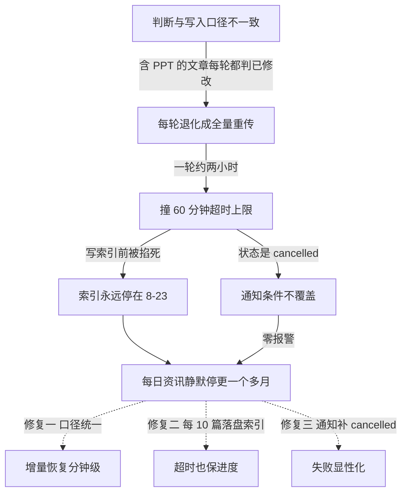

# 无服务器博客搭建记（7/7）：静默失败的一个月

本来想把这系列的收尾写成一个技术总结，或者给点未来展望什么的，结果九月底给我整了个大活，直接把我的计划打乱了。这篇与其说是技术总结，不如说是我的一个血淋淋的复盘——关于一个博客服务，如何在没有人察觉的情况下，静默停更了一个多月。

我的博客 `lizizai.xyz`，文章都存在飞书文档里。每天北京时间早上九点，GitHub Actions 会跑一个定时任务，把所有有改动的文章同步到 Cloudflare R2 存储，然后 Vercel 负责构建网站。这个同步过程，大部分时候都是增量更新，也就是它会记录每篇文章上次同步时的文件修改时间（我管这叫“高水位检查点”），只有真的有更新才会重新传一遍。平时一轮跑下来，也就是几分钟的事。

问题就出在，我这个同步任务的状态，只会在 GitHub Actions 页面里汇报。飞书、R2、Vercel，它们都不会主动告诉我任务跑得怎么样。而我，也一直习惯性地认为，只要 GitHub Actions 每天都是绿的，那就没问题。

直到九月底的某一天，我随手打开了博客的“每日资讯”页面。这是一个每天都会更新的 AI 日报栏目，我平时没事也会刷刷。这一刷，我后背唰地一下就凉了：最新的一篇，竟然还停留在 8月23日。

我的第一反应是：同步任务肯定挂了。赶紧打开 GitHub Actions 页面一看，每天九点的任务都在跑，但是状态不是我平时看到的绿色“success”，也不是红色的“failure”，而是灰色的“**cancelled**”。这什么情况？

更奇怪的是，我随手点开几篇最新更新的文章，里面的内容确实是新的。也就是说，文章文件本身是更新了，但是——只有全站索引 `articles.json` 没更新。这种半新不旧的状态，完美地骗过了我之前每次的抽查。文章能打开，内容看起来没问题，谁会想到去翻每一篇的发布日期呢？直到我发现“每日资讯”这种日期敏感的栏目停更，才意识到问题的严重性。当我确认它停更了整整一个月的时候，那种感觉真是难以形容。

### 零报警：通知为什么没发？

既然任务每天都“cancelled”了，为什么我一点报警都没收到？

我打开了 `feishu-sync.yml` 这个 workflow 的配置，发现通知步骤的条件是这么写的：`if: failure()`。

哦豁，怪不得。只有当任务状态是红色的 `failure` 的时候，我才会收到通知。而 `cancelled` 这种灰色状态，根本不在我的通知覆盖范围里。所以，一个多月，零报警，完美隐身。

### 诊断：增量为什么失效了？

既然确定了是同步任务出了问题，我得开始诊断了。

我翻出最近一次同步任务的日志，发现一个很反常的现象：按理说，我的增量同步，应该是“跳过一百多篇、同步几篇”才对。但日志显示，在总共 162 项文章里，竟然有 76 项是全量重传，只有区区 6 项是跳过的。这明显就是增量失效了！

每一轮都重传这么多文章，肯定有问题。我随便挑了一篇“每次都被重传”的文章，打开了它的 `meta.json` 文件，比对了里面记录的检查点时间，和我飞书侧实际修改时间。我发现，这两个时间之间，竟然有 1-2 秒的差异。

这 1-2 秒的差异，就是问题的关键。我顺着这个线索，回读了同步工具的源码，终于找到了根源。

### 根因：三个故障的叠加

这个静默失败，不是一个单一的故障，而是三个看似不严重的问题叠加在一起，形成了一个完美的隐身衣。

#### 故障一：增量判断口径不一致

当我检查判断“要不要重传”的代码时，发现对于那些包含 `slides/html` 子文件夹的文章（比如我的 PPT 讲解文章），我的判断逻辑用的是**顶层列表取最大 `mtime`**。而当我写检查点（也就是高水位）的时候，却用的是**递归遍历所有文件取最大 `mtime`**。

问题就出在这里：飞书文档的文件夹 `mtime`，通常会比它内部文件的 `mtime` 晚 1-2 秒。

所以，那些包含 PPT 的文章，每次都会被我的增量判断逻辑误判为“已修改”，从而导致每轮都被强制全量重传。而我的纯文章和播客文章，因为口径一致，所以一直都没受影响——这也是为什么这个问题只影响部分文章，并且藏了一个多月才暴露出来的原因。

这两处代码，其实是在不同时期写的。最初实现增量同步的时候，是针对纯文档设计的。后来为了支持 PPT 嵌入，我加了 `slides` 支持，但当时没仔细比对两边的 `mtime` 取值逻辑。单看哪次提交，似乎都没错，但放在一起对账，问题就暴露无遗了。

#### 故障二：全量重传撞上超时上限

在故障一的影响下，增量同步几乎退化成了全量重传。我的博客一共有 163 篇文章，全量重传一轮，时间就膨胀到了**大约两小时**。

而我的 GitHub Actions workflow 的超时上限，设置的是 60 分钟。

于是，每天的同步任务，都会在跑满一小时之后，在还没有来得及写 `articles.json` 这个全站索引文件之前，就被无情地掐死了。

`articles.json` 这个文件，原本是在整个同步循环结束后才统一写一次的。任务被杀，自然就永远写不到它——这就是为什么索引文件永远停留在 8月23日，而单篇文章的文件却都是新的。

#### 故障三：通知条件未覆盖 `cancelled` 状态

这个上面已经提到了，我的通知条件 `if: failure()`，只覆盖红色的失败状态，不覆盖灰色的 `cancelled` 状态。

这三个故障单独拿出来，似乎都不是致命的。但它们一叠加，就形成了一个完美的隐形失效链条：



（图：三个故障的叠加与修复）

### 修复：三管齐下

找到了根源，修复就比较直接了，我对着这三个故障，分别做了处理：

1.  **检查点口径统一**：把判断增量更新和写入检查点的逻辑都改成了统一使用顶层列表的最大 `mtime`。这样，`1-2` 秒的时间差就彻底消失了，增量判断恢复正常。

2.  **索引增量落盘**：`articles.json` 这个全站索引，不再是等到所有文章同步完才写一次。我改成了**每同步 10 篇文章就落盘一次**。这样即使任务在中间被掐死，也能保证一部分进度被保存下来，索引不会永远停在某一个旧日期。

3.  **通知条件覆盖 `cancelled`**：修复了通知条件，让它也能覆盖 `cancelled` 状态。

```yaml
# .github/workflows/feishu-sync.yml 修复前后
- if: failure()
+ if: failure() || cancelled()
```
这样一来，无论是红色的失败还是灰色的取消，我都能第一时间收到通知。

修复完成后，我把 workflow 的超时上限临时调到了 180 分钟，然后手动触发了一次全量追赶。任务跑了 1 小时 37 分钟，终于顺利跑完了！

我赶紧去博客页面看，索引刷新到了 159 篇，覆盖时间也更新到了 9月27日。8月23日之后一天不缺，日报页也重新显示了 9 月的 27 天。这下，总算是松了口气。

确认恢复正常后，我把超时设置改回了 60 分钟。不过，我在配置里留了个注释：如果未来再出现接近上限的情况，**第一时间要检查增量是否失效，而不是直接调大超时时间**。这是这次血泪教训得来的经验。

### 彩蛋：另一个隐形 bug

就在我以为一切都尘埃落定的时候，到了 2026年10月1日，我又遇到了一个“彩蛋”。

那天，我想把博客封面图的存储域名从 R2 的免费子域换成我的自定义域名。这个操作需要触发一次全量重传，让所有文章重新生成，把图片地址更新过来。我的 workflow 里有一个 `force_sync` 的开关，我勾上它，触发了一次任务。

任务跑完，我习惯性地查看日志。结果发现，它还是增量更新，不是全量！

这下我傻眼了。明明勾上了 `force_sync`，为什么没生效？

我查了半天，才发现这是一个**一句话的 bug**：`force_sync` 是一个 boolean 类型的输入，但在命令行展开的时候，我写成了 `${{ inputs.force_sync == 'true' && '--force' || '' }}`。GitHub Actions 的表达式里，boolean 类型和字符串 `'true'` 的比较，结果恒为 `false`！

也就是说，这个 `force_sync` 开关，从我上线起就从来没有生效过。以前每次我以为我在全量同步的时候，其实都只是增量同步。

我赶紧把代码改成了布尔直判：
```yaml
# .github/workflows/feishu-sync.yml 修复前后
- run: npx tsx src/cli.ts ${{ inputs.force_sync == 'true' && '--force' || '' }}
+ run: npx tsx src/cli.ts ${{ inputs.force_sync && '--force' || '' }}
```

修复后，我再次触发了一次任务。这次，真正的全量同步终于跑通了，总共耗时 1 小时 40 分 31 秒。这也顺带验证了之前全量耗时的估算。

这个 bug 和之前的主故事有些异曲同工之处：东西看起来在，也配置了，但实际上从来没工作过。顺着这个思路，我又排查了一遍，把 `postbuild` 脚本里生成搜索索引命令尾巴上的 `|| true` 也删掉了——这个 `|| true` 也是为了防止构建失败变红，但如果索引生成本身出问题，它也会被默默忽略。

### 事后考虑：要不要上监控？

经过这次事件，我认真考虑过要不要上 Sentry、Datadog 之类的全链路 APM 监控系统。

但是仔细一想，我的博客没有自己的服务器，只有一个每天跑一次的 CI 任务。为了这个唯一的任务，去接一个完整的 APM 系统，配置告警规则，可能还要付费，这比我这次修复的改动量还要大。而且，多一个系统，就多一种出问题的可能。

我还看过 `healthchecks.io` 那种“任务跑完 ping 一下”的死人开关（dead man's switch）。但这次的病，它也治不了：我的任务每天都跑完了，只是状态是 `cancelled`，信号源本身就错了。它只能判断任务是否 *没跑*，判断不了任务 *跑得对不对*。

所以，最终我还是决定暂时不上这些复杂的监控系统。我的博客目前还只是一个个人项目，保持简单和低维护成本是首要目标。

但是，这次的教训也让我养成了几个新的习惯：

*   **写告警条件前，把所有状态列出来，逐个问自己“出现这个状态我要不要知道”**。这是确保通知覆盖全面的最笨也最有效的方法。
*   **人工巡检不再是巡内容，而是巡 GitHub Actions 页面**。每天花十秒钟，打开 GitHub Actions 页面看一眼我的 workflow 是不是全绿。
*   **复盘文档**：这次的所有时间线和诊断过程，我都详细记录在了仓库里的一个复盘文档中。这样，即使未来再出现类似问题，也有迹可循。

| 维度 | 全链路 APM（Sentry/Datadog） | 纯人工巡检 | 最后的做法 |
|------|------|------|------|
| 怎么发现故障 | agent 采集指标，异常自动告警 | 自己定期打开网站看看 | CI 通知覆盖所有失败状态 + 关键步骤失败即报错 |
| 部署与维护成本 | 接 SDK、配告警规则、可能付费 | 零 | 改几行 workflow 配置 |
| 故障定位依据 | 完整 trace 与性能曲线 | 从零开始翻日志 | Actions 日志 + 复盘文档 |
| 发现延迟 | 分钟级 | 以月计（本次实测） | 下一次任务运行时 |

### 结语

写到这里，《无服务器博客搭建记》这个系列也就告一段落了。从最初的设想，到一步步搭建起来，再到这次的踩坑与修复，整个过程就像一次真实的冒险。虽然这次的静默失败让我有点后怕，但也让我对整个系统的健壮性和可维护性有了更深的思考。

希望这些经验教训，能对正在折腾无服务器博客的你有所启发。如果你有任何想法或者类似的踩坑经历，欢迎在评论区和我交流！

<!-- gemini: gemini-2.5-flash 生成（3.8-flash 拥塞暂用），素材事实经核验 -->
