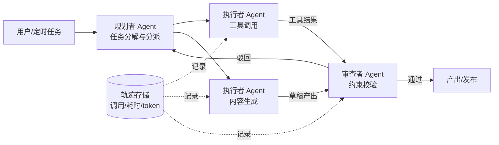

# 生产级 Agent 系统落地实录：多智能体协作与 7×24h 常驻调度

大家好，我是李自在。作为一名在数据与 AI 领域摸爬滚打了七年的老兵，从 2019 年城市交通大数据入行，到 2021 年阿里云 FDE，再到 2024 年淘宝数据工程，直到 2026 年选择独立开发，我一直都在思考如何将技术真正落地到生产环境，创造实实在在的价值。

过去一年多时间里，我投入了大量精力，独立落地了一套生产级的 Agent 系统。这不是一个简单的 Demo，而是一个真正在 7×24 小时运转，支撑着我的数字分身和商业化项目的核心平台。今天，想跟大家复盘一下这个项目的来龙去脉，以及我们在工程实践中遇到的挑战和解决方案。

## 从“能跑 Demo”到“生产级”：中间隔了什么？

当我们谈论基于大模型的 Agent 时，很多人都能快速搭起一个能跑的 Demo。但是，从一个能跑的 Demo 到一个能在生产环境稳定运行、可靠交付价值的系统，这中间隔着的距离，远比想象的要长。

最直观的挑战就是大模型生成式输出的不确定性。同样的输入，模型可能给出不同的输出，甚至同一轮对话中，Agent 的行为路径也可能发生偏差。这对于需要稳定性和可预测性的生产系统来说是致命的。

其次是长任务漂移。Agent 在处理复杂、多步骤的任务时，很容易在执行过程中逐渐偏离最初的目标，产生“迷失”或“幻觉”。这就像给一个实习生布置了一个大活，他可能一开始思路很清晰，但中途就跑偏了，最终交出的结果风马牛不相及。

还有外部工具失败的传导效应。Agent 系统通常依赖各种外部工具，比如数据库查询、代码执行、API 调用等。这些工具本身就可能失败，一旦某个工具调用失败，如果 Agent 没有恰当的异常处理机制，这种失败会沿着任务链条传导，导致整个任务卡死或产出错误。

所以，生产级的 Agent 系统的核心目标，就是要把“大概率对”变成“可验证地对”。我们要给 Agent 加上各种“护栏”，让它在自由发挥的同时，也能被约束和审计。

## 多智能体协作：按职责拆分，而非功能堆叠

为了解决上述不确定性和长任务漂移的问题，我选择了多智能体协作的架构。但这里的“多智能体”并非简单地把多个 Agent 堆在一起，而是借鉴了人类团队协作的模式，按照职责进行明确的拆分。

在我的系统中，主要有三类角色：规划者 Agent、执行者 Agent 和审查者 Agent。

-   规划者 Agent：它就像项目经理，负责理解用户需求或定时任务指令，然后将复杂的任务分解为一系列可执行的子任务，并分派给不同的执行者 Agent。它需要拥有全局视角，确保任务分解的合理性和完整性。
-   执行者 Agent：这些 Agent 是具体任务的执行者，它们各自拥有特定的工具集。比如，有的执行者 Agent 擅长数据查询和分析，调用 SQL 工具；有的擅长代码生成和执行，调用解释器；还有的负责信息检索和内容生成。执行者只专注于完成自己的子任务，并将结果返回。
-   审查者 Agent：这是整个流程的“质检员”。它负责校验执行者 Agent 产出的结果是否符合初始任务的约束、质量标准或预设规则。如果通过，则进入下一步或最终产出；如果驳回，则反馈给规划者 Agent，进行重新规划或修正。

这种拆分方式最大的收益是隔离。每个 Agent 只负责自己的职责范围，一个执行者 Agent 即使失败或产出不佳，也不会污染整条任务链，审查者会将其拦下，并触发重试或修正流程。这大大提升了系统的健壮性。

下图是这套多智能体协作架构的一个简化示意：

## 工具调用：把模型当成“半可信”的队友

Agent 的强大，很大程度上取决于它能够有效地调用外部工具。但在工程实践中，让模型正确、安全、高效地调用工具，这里面有很多门道。

首先是工具描述即接口文档。模型会根据我们提供的工具描述（Function Schema）来决定何时调用哪个工具，以及如何构造调用参数。如果工具描述含糊不清，模型在调用时就可能犹豫不决，或者给出错误的参数。所以，工具描述一定要像给人类工程师看的接口文档一样，清晰、准确、完整，包括参数的类型、用途、约束等。

其次是参数校验兜底。模型生成工具调用参数的能力，目前还没有达到 100% 可靠。它可能会“幻觉”出不存在的参数，或者生成不符合类型约束的值。因此，我们绝对不能直接信任模型给出的参数。在实际执行工具之前，必须进行严格的 Schema 校验。如果校验失败，轻则进行重试，重则直接拒绝调用，并反馈给上层 Agent 进行修正。这就像你给一个助手指令，他理解了，但写出来的具体实施方案可能有一些细节错误，你需要检查并修正。

最后是失败重试与降级路径。外部工具本身就可能不稳定，网络波动、服务过载、权限问题都可能导致调用失败。所以，工具调用必须内置重试机制，并考虑降级路径。比如，如果数据库查询失败，是否可以尝试从缓存中获取数据？如果某个 API 调用失败，是否有备用的 API 或策略可以替代？这些都是在设计工具时需要提前考虑的。

## 工作流编排：自由与确定性的混合艺术

在 Agent 系统中，我们常常面临一个两难的选择：是让 Agent 拥有完全的自由对话能力，还是通过硬编码来固定工作流？生产实践告诉我，两者都不是最优解，混合模式才是王道。

-   确定性环节走工作流硬编排：比如从数据库取数、将分析结果生成图表、或者最终将内容发布到指定平台，这些环节通常是高确定性的，每一步都需要严格遵循既定的流程和规范。如果让 Agent 在这些环节自由发挥，就可能出现数据取错、格式错误、发布失败等问题，而且难以审计和回溯。对于这类环节，我们选择使用传统的工作流引擎进行硬编排，确保其稳定可靠。
-   需要判断的节点交给模型：但在某些节点，比如如何分解一个复杂任务、如何根据数据分析结果给出解读建议、或者如何在多种工具中选择最合适的一个，这些需要灵活判断和决策的场景，正是 Agent 的优势所在。我们只在这些关键的“判断节点”将控制权交给模型，利用它的推理和决策能力。

| 环节 | 全自由 Agent | 硬编码工作流 | 我们的做法（混合） |
|------|------|------|------|
| 确定性取数/发布 | 可能跑偏，难审计 | 稳定可审计 | 走工作流硬编排 |
| 需要判断的节点 | 灵活但不可控 | 写死规则，维护爆炸 | 交给模型+审查者校验 |
| 失败处理 | 行为不确定 | 分支写全很冗长 | 重试+降级+监护重启 |
| 可观测性 | 黑盒 | 清晰但粒度粗 | 全轨迹记录可回放 |

通过这种混合模式，我们既保留了 Agent 的灵活性和智能，又保证了生产系统的稳定性和可控性。审查者 Agent 在其中扮演了关键角色，它确保了模型在自由判断后给出的决策或结果，仍然符合预设的约束。

## 7×24h 常驻调度：让 Agent 永不停歇

我的 Agent 系统需要支撑数字分身和商业化项目，它必须能够 7×24 小时常驻运行，不间断地处理任务。这对于任何长驻进程来说都是一个巨大的挑战，尤其是在 Agent 这种行为具有一定不确定性的场景下。

1.  长驻进程的状态管理：Agent 在执行一个复杂任务时，通常需要维护会话上下文，比如之前的对话历史、工具调用结果、当前任务进度等。一旦进程中断，这些状态就必须能够持久化，并在恢复时被准确加载。我采用了基于数据库的会话上下文持久化方案，确保每个任务的状态都能在任意时刻被快照和恢复。
2.  任务队列与优先级：系统同时会有多种类型的任务，有高优先级的实时交互任务，也有低优先级的定时批量任务。引入任务队列和优先级调度机制是必不可少的。高优先级任务可以插队，低优先级任务则在资源空闲时被处理，保证了服务的响应性和吞吐量。
3.  异常自愈：这是生产系统最重要的特性之一。单个 Agent 或子任务在运行过程中可能会因为各种原因挂掉，比如外部服务超时、内存溢出、模型返回异常格式等。我们建立了一套监护与重启策略：每个子任务都有一个“监护者”，一旦检测到子任务异常终止，监护者会尝试进行有限次的重试；如果重试仍然失败，则会触发更高级别的告警，并根据预设策略进行降级或将任务标记为失败。
4.  防范“安静地失败”：这是我踩过不止一次坑，也是我个人对生产系统的一个执念。最可怕的不是系统报错，而是系统“安静地失败”——它看起来在运行，但实际上已经停止工作，且没有任何告警。我之前博客里分享过一次同步任务静默停更一个月的事故，导致数据严重滞后。从那以后，我对所有关键业务流程都设置了严格的“心跳”检测和告警机制。例如，如果某个核心任务在预定时间内没有产出，或者 Agent 在连续 N 次重试后仍然失败，系统会立即通过短信、邮件或钉钉机器人发送告警，确保第一时间发现问题。宁可多报几次警，也绝不能让系统安静地停摆。

## 可观测性：任务轨迹回放，胜过千言万语

在 Agent 系统中，由于其行为的复杂性和不确定性，传统的日志和指标监控已经不够用了。我们需要更精细、更全面的可观测性。

我为 Agent 系统构建了一套完整的任务轨迹记录机制：

-   每次模型调用的输入输出摘要：记录每次向大模型发送的 Prompt 和它返回的 Completion。这能帮助我们理解模型是如何理解指令和生成回应的。
-   工具调用结果：记录每个工具调用的请求参数、响应结果、成功与否。这对于排查外部服务问题至关重要。
-   耗时与 token 消耗：记录每个步骤的执行时间以及模型调用的 token 消耗，这对于性能优化和成本控制非常关键。
-   异常与重试：详细记录每次异常发生时的堆栈信息、重试次数及策略。

当系统出现问题时，能够回放一次任务的完整轨迹，比任何理论分析都要快。就像看电影一样，你可以一步步地看到 Agent 是如何思考、如何决策、如何调用工具、在哪里失败的。这极大地提升了我们排查问题、优化 Agent 行为的效率。

## 提效 60%：迭代周期的缩短之道

在项目声明中提到，AI 辅助研发提效让迭代周期缩短了 60% 以上。这里需要诚实地说明一下这个“提效 60%”的具体口径。

这个效率提升主要体现在迭代周期上，也就是从需求提出到最终上线的时间。它并非指所有研发环节都提升了 60%，而是 Agent 在某些特定、重复且耗时的环节中发挥了巨大作用：

-   脚手架生成：对于一些结构化强、模式化的项目或模块，Agent 可以根据简单的需求描述，快速生成项目骨架、基础代码文件和配置。
-   测试用例生成：根据需求文档或代码功能，Agent 能够自动生成覆盖常见场景和边界条件的测试用例，大大减少了手动编写测试的时间。
-   重复代码搬运与改造：在企业级开发中，经常需要对现有代码进行小规模调整、迁移或适配。Agent 在理解代码逻辑后，可以高效地完成这类重复性强但又需要一定智能判断的工作。

这些环节的效率提升，累积起来显著缩短了整体的迭代周期。当然，对于那些需要高度创造性、复杂架构设计或深度领域知识的环节，Agent 仍然只是辅助角色，人类工程师的价值不可替代。

## 数字分身与商业化场景落地

最后，简单聊聊这套 Agent 系统目前支撑的两个主要场景：数字分身和商业化项目。

我的数字分身主要围绕内容生产管线展开。Agent 负责了内容生产的前三步：选题 → 检索 → 草稿生成。

1.  选题：Agent 会根据我的博客主题、近期热点、读者反馈等信息，分析并推荐潜在的选题方向。
2.  检索：针对选定的主题，Agent 会调用搜索工具、知识库等，收集相关资料、数据和事实依据。
3.  草稿生成：基于检索到的信息，Agent 会生成文章初稿。这大大减轻了我的前期资料收集和写作压力。

但需要强调的是，人审（人工审核）始终是底线。Agent 生成的草稿，最终仍然需要我进行深度修改、润色、补充个人思考和经验，才能发布。这保证了内容的质量和我的个人风格。

在商业化项目中，Agent 则主要作为数据查询与报表解读的自然语言入口。

我曾服务过一些客户现场，比如某省交通部门，他们的业务人员经常需要查询复杂的交通数据，或者解读密密麻麻的月报、季报。过去这需要依赖数据分析师编写 SQL 或制作复杂的 BI 报表。现在，通过 Agent 系统，业务人员可以直接用自然语言提问：“上个月晚高峰期间，某条快速路的平均车速是多少？”或者“这份交通季报中，哪些指标出现了异常波动？”Agent 会自动将自然语言转换为数据查询，并对返回的结果进行解读和可视化，极大地降低了数据使用的门槛，提升了业务决策效率。

## 总结与展望

这次 Agent 系统的落地实践，对我来说是一次意义重大的工程挑战。它让我对大模型在生产环境中的应用有了更深刻的理解，也验证了多智能体协作、精细化工具管理、混合工作流编排以及极致可观测性在构建可靠 AI 系统中的重要性。

未来，我还会继续深耕这个方向，探索 Agent 在更多场景下的应用，比如个性化学习助手、智能客服、复杂业务流程自动化等。每一次技术落地，都是对工程师能力的最佳检验。希望今天的分享能给大家带来一些启发。

感谢阅读。

<!-- gemini: gemini-2.5-flash 生成（作品集·素材经核验） -->
