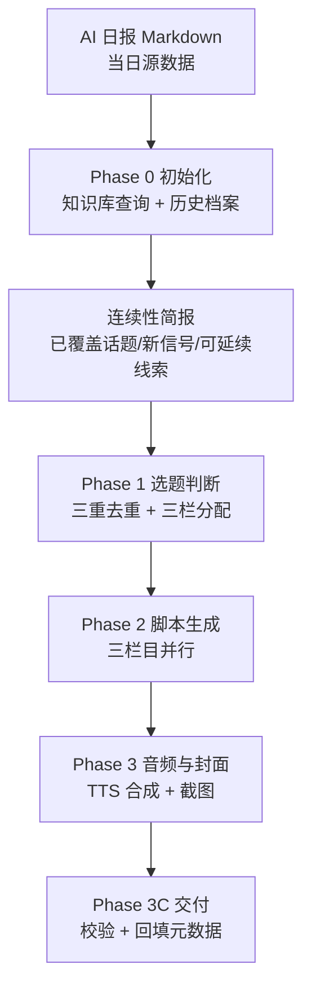

# 手把手做一个 AI 每日播客 Skill：从日报到三条互补播客的自动化生产实录

我的「AI 生产流水线」已经跑了一段时间了。上一篇，我们聊了如何用 AI 自动生成一份高质量的日报，从内容抓取到 Markdown 格式的排版，一份结构化的日报每日准时送达。然而，我很快发现，很多朋友是通勤、健身时获取信息的，他们更喜欢用听的。把每天的日报内容直接转化成音频，似乎是一个很自然的需求。

但事情并非简单地从文本转语音。如果只是把日报内容一股脑儿地读出来，不仅时长不好控制，内容也容易变成大杂烩，听众听着听着就分心了。我的目标不是简单地「有声化」，而是要构建一个有品相、有节奏、有连续性的播客产品。这促成了我的第二个 AI 生产项目——一个能自动生成三条互补播客的 Skill。

### 第一课：产品先行——为什么是三条互补播客？

在写一行代码之前，我先花了大量时间思考产品形态。我的日报内容丰富，覆盖了 AI 领域的热点、技术、观点等多个维度。如果一股脑儿地塞进一条播客，会遇到几个核心问题：

1.  时长失控：每天的 AI 新闻量很大，一条播客很容易做到 20-30 分钟，甚至更长。现代人的碎片化时间有限，过长的播客容易导致听众流失。
2.  内容定位模糊：什么都讲，反而什么都不精。听众很难找到自己真正感兴趣的部分，也难以形成稳定的收听预期。
3.  叙事节奏混乱：从热点新闻跳到开源项目，再跳到深度观点，内容之间缺乏自然的过渡和连贯性。

为了解决这些问题，我最终决定将日报的源数据拆解成三条定位清晰、内容互补的播客。这不仅能更好地服务不同听众群体的需求，也能让每条播客在各自的赛道上跑得更专业。

下面这张对比表清晰地展示了我的考量：

| 维度 | 一条大杂烩播客 | 三条互补播客（我们的做法） |
|------|------|------|
| 时长控制 | 越做越长，听众流失 | 各自 7-12 分钟，场景明确 |
| 内容定位 | 什么都讲等于什么都不精 | 每条一个定位：热点速览/开源实操/深度观点 |
| 制作复杂度 | 一份脚本 | 三份脚本，但模板化后成本不变 |
| 内容重叠 | 自己跟自己重复 | 零重叠约束 + 去重表强制检查 |

明确了拆分的方向，接下来就是为这三条播客赋予各自的灵魂：

*   每日精选：这是面向大众的 AI 热点速览。我设计它为双人联播，由男声李自在与女声肖然交替主持。每期时长设定在 8-12 分钟，对应 2400-3600 字的脚本。内容精选当天最有话题性的 10 条 AI 热点，两位主持人一人负责一条，从事实播报到观点点评再到自然过渡，力求节奏明快、信息量饱满。
*   开源解读：这条播客面向的是独立开发者和技术爱好者。单人主持，时长 8-10 分钟，脚本字数 2000-2800 字。它会聚焦 5 个与独立开发者直接相关的开源项目，深入解读其核心技术、应用场景，尤其强调它能否帮助听众赚钱或提高效率。
*   行业洞见：这是一档深度分析的播客，也是单人主持，时长 7-10 分钟，2000-3000 字的脚本。每期只讲一个观点，但会讲深讲透。我为它设计了独特的三层论证结构（现象→因果→行动）和倒叙的叙事结构，并在结尾提炼一个“钉子金句”，力求让听众听完有所启发。

这三条播客的核心设计原则是：内容零重叠，完全互补——同一个新闻事件、同一个开源项目，不会同时出现在多条播客中，确保听众收听任何一条都能获得独特价值。

### 第二课：架构设计——渐进式披露与模块化

产品形态确定后，我开始着手构建 Skill 的架构。之前的日报 Skill 是一个相对独立的模块，而播客 Skill 是一个下游应用，它需要更复杂的协调和调度能力。在设计时，我特别关注了“渐进式披露”原则，也就是按需加载、分离关注点。

整个流水线从 AI 日报的 Markdown 源数据开始，经过初始化、连续性简报生成、选题判断、脚本生成，最终输出音频和封面，并完成交付。

具体的代码层面，我没有把所有逻辑都塞进一个大文件。主 `SKILL.md` 文件（575 行代码）主要负责路由和共用流水线的调度，它就像一个中央调度员，知道什么时间该做什么。而三条播客各自的标题方法、文风、格式规范等，都被封装在独立的模块文件里。例如，`每日精选`、`开源解读`、`行业洞见` 各自对应一个模块文件，代码行数分别为 414、456、838 行。

我为什么这么设计？原因很简单：如果把三套文风规范和生成规则全部塞进主文件，每次运行 Skill 时，它都要加载两千多行无关内容，造成不必要的资源浪费。更重要的是，栏目规则之间很容易互相污染。比如，`开源解读` 的标题法，如果套到 `行业洞见` 上，那结果肯定会南辕北辙。

通过这种路由与规则分离、按需加载的模式，只有当 Skill 确定要生成某一栏播客时，它才会读取对应的模块文件，加载那套特定的文风和格式规范。这不仅提高了运行效率，也让未来的维护和扩展变得更加容易。这也是 Skill 工程中一个非常通用的模式：将核心业务逻辑和具体的规则配置解耦。

### 第三课：历史连续性——告别“冷重启”

播客最怕什么？是“冷重启”。想象一下，你每天听一档播客，但它每天都假设你第一次听，昨天讲过的今天又当作新闻来报。这种体验会极大地损害听众的忠诚度。为了避免我的 AI 播客陷入这种尴尬境地，我为它设计了一个独特而核心的机制：历史连续性。

我的解法是接入了一个本地知识库，我称之为 `DailyAINewsWiki`。在脚本生成前的 Phase 0 初始化阶段，Skill 会强制查询这个知识库。它会检索最近 3-7 天的日报页面、已经提及过的实体人物（比如某个公司创始人）、以及某个趋势的对照页。

通过这个查询动作，Skill 会产出一份详细的“连续性简报”。这份简报会清晰地标注出：

*   哪些话题在本周内已经被深度覆盖，不建议重复入选。
*   哪些是今日出现的新信号，具备优先入选的资格。
*   哪些是可以作为“第四集”式叙事线延续的话题，比如某家公司的融资进展。这样，在生成脚本时，AI 就能自然地带出“上周我们聊到它刚融完 B 轮，今天 C 轮到账了”这样的衔接，让整个内容听起来更像是一个有血有肉、持续更新的节目，而不是每天的独立新闻播报。

为了确保这个机制真正生效，我还设置了一个验证检查点：即使知识库查询的结果为空，也必须在内部记录查询动作已执行。这能有效防止模型“偷懒”跳过查询步骤，保证每次生成前都经过历史信息的洗礼。

### 第四课：三重去重——打造零重叠的播客矩阵

产品设计中，我强调了三条播客内容“零重叠完全互补”。这不仅仅是一个口号，我用一套严苛的“三重去重”机制来强制实现它。

我维护了一份近 7 天的播客选题历史档案。在每次选题判断（Phase 1）时，所有候选内容都必须强制对照这份档案进行检查：

1.  项目级去重：针对 `开源解读` 栏目。近 7 天内选过的开源项目，一律不得重选。如果命中，必须在选题文件中明确记录替换了哪个项目。
2.  新闻级去重：针对 `每日精选` 栏目。如果新闻标题的实质内容与近 7 天播报过的新闻相同，则不得重选。当然，如果是一个重大进展，可以作为故事线延续，但标题必须清晰地反映出“最新进展”，避免简单的重复。
3.  主题级去重：这是一个更宏观的去重维度。如果某个主题标签在近 7 天内出现 2 次即被视为“饱和”，那么原则上，同主题的新项目或新闻将不再入选。这确保了播客内容的多样性，防止某一特定话题霸屏。

除了内容去重，我甚至把“开头手法”也纳入了 7 天轮换机制。三条播客各自记录了它们过去用过的开头手法，确保下一期节目必须换一种新的开场方式，保持新鲜感。

最关键的是，去重的输出不是一个口头保证。我的 Skill 会强制生成一张详细的去重检查表，包含“候选项目”、“历史命中”和“处理方式”三列，并将其写入选题文件。这张表是最终脚本生成前的一个硬性门槛，确保去重机制被严格执行。

### 第五课：TTS 引擎选型实录——深坑与宝藏

从文本到音频，最核心的技术是文本转语音（TTS）。TTS 引擎的选择直接决定了播客的听感和成本。这其中，我踩过不少坑，也积累了一些宝贵的经验。

最终，我选择了火山引擎 API TTS。它的双人音色表现稳定且富有情感。我固定使用了男声“温暖阿虎”这个品牌音色，并搭配了同代系列的女性音色，确保两位主持人的播报腔调一致，听起来像一个默契的组合。

在定下火山引擎之前，我曾做过一次深入的本地模型评估，时间是 2026 年 9 月 28 日。当时考虑到成本和音色自由度，我尝试了本地部署的 IndexTTS-2，并搭配克隆音色。然而，实测发现三个未能解决的问题，最终导致我放弃了这个方案：

1.  本地语速比云上快 17%：这是一个硬伤。如果采用本地模型，我之前针对云服务 TTS 精心调整的字数标准和时长控制逻辑，全部都需要重新标定和调整，工程量巨大。
2.  英文术语发音不稳：我的 AI 播客脚本中会频繁出现英文技术术语，比如 HeyGen、diff 等。本地模型在处理这些词汇时，ASR（语音识别）回读的效果很不稳定，经常把 HeyGen 听成“黑”，把 diff 听成“di”。这种发音错误会严重影响专业性和听感。
3.  情感控制语法不匹配：现有的脚本生成逻辑已经内置了一套情感标签语法，用于控制 TTS 的语气和情绪。但本地模型的这套情感控制语法与我已有的语法体系不是一套，需要额外进行复杂的映射和适配，这无疑增加了开发和维护的成本。

这些问题让我意识到，为了短期内的“省钱”和“自由度”而牺牲质量和效率，是不划算的。我把这次试听样本和具体的评估结论都详细地写进了 Skill 的注释里，并且留下了一行硬规则：“`重新评估前不要再动引擎选型`”。这个细节非常重要，它本身就是一笔宝贵的工程资产。它防止了半年后我自己或者其他维护者，因为同样的需求，重新踩一遍我曾经走过的坑，大大节省了未来的决策成本。

### 第六课：像人说话——将“质感”工程化

要让 AI 生成的播客听起来“像人说话”，而不是冷冰冰的机器朗读，这需要将“质感”工程化。我没有满足于 TTS 引擎提供的基础能力，而是在脚本生成后，增加了一套专门的质量校验脚本。

这套校验脚本主要包含两个部分：

1.  双人联播规则校验：针对 `每日精选` 栏目，我设计了严格的规则：一条新闻必须从头到尾由一位主持人播报，不许中途突然换人。这个校验脚本能确保 AI 严格遵循这一规则，避免听感上的突兀。
2.  “口播声纹”校验：这是最能体现“像人说话”质感的部分。我量化了真人播客的特征，包括语气词密度（比如“嗯”、“啊”、“哈”）、第一人称使用频率、以及问句密度。这些特征让稿子听起来更像真人聊天，而不是死板的新闻稿。

这些“声纹”标准不是我拍脑袋定的。为了建立基线，我收集了 12 段真实的中文播客开头转写文本，然后对这些样本进行量化分析，统计出这些语气特征的平均密度。有了这个基线，我就能将生成脚本的这些指标与真实数据进行对比，并根据需要调整生成模型的 Prompt 或后处理逻辑。

我的观点是：生成式 AI 产物的“质感”完全可以工程化。首先，我们要定义什么叫“好”（通过采样真实样本进行量化），然后，将这些“好”的特征转化为可检查的指标，并写成检查脚本，卡在流水线里。这样，AI 生产的内容就能持续地逼近我们想要的“真人质感”。

### 音频与封面的工程细节

在 TTS 生成音频后，流水线还会自动处理一些工程细节，让播客更完整：

*   音频拼接与混音：自动将生成的核心播报音频与片头片尾的 BGM 进行拼接，并在条目之间插入翻页音效，模拟真实电台的过渡。同时，BGM 的署名也会被自动添加，确保版权合规。
*   封面生成：播客需要一个吸引人的封面。我设计了一个 HTML 模板，采用复古中文报纸风格。然后，利用 Playwright 自动化工具，对这个 HTML 页面进行截图，生成一张 2048x2048 像素的高清封面图。
*   并行处理：为了效率，三条播客的脚本生成不是串行执行的。它们被设计成三个并行的子任务，同时进行生成，确保整体耗时最短。

### 收尾段落：从日报到内容矩阵的飞跃

至此，我的 AI 每日播客自动化生产 Skill 已经完整地运行起来了。这条流水线与上一篇介绍的 AI 日报流水线无缝衔接，共同构成了“一份日报源数据 → 文章 + 三条播客”的完整内容矩阵。

对于读者来说，我希望这篇教程不仅是展示我如何“堆砌”技术，更重要的是传递一套可复刻、可迁移的方法论：

*   产品先行：在编码前充分思考产品的形态、目标受众和核心价值，而不是为了技术而技术。三条互补播客的设计就是最好的例证。
*   架构分层：通过路由与模块分离，实现渐进式披露和按需加载，提高效率并降低维护成本。
*   连续性设计：利用知识库注入历史信息，让 AI 生产的内容告别“冷重启”，拥有更强的叙事连贯性。
*   强制去重：建立多维度历史档案和去重机制，确保内容的新鲜度和独特性。
*   质量工程化：将“质感”量化为可检查的指标，并通过校验脚本将其嵌入流水线，让生成式产物也能达到高水准。

当然，我在教程中提到的 TTS 服务和知识库都是我的具体选择，大家完全可以根据自己的实际情况，替换成其他服务或自建系统。这套方法论是通用的，它能帮助你构建任何需要“连续性”和“高质量”的 AI 内容生成系统。

希望我的这份实录，能给你带来一些启发。期待你在 AI 生产流水线上的更多探索和实践！

<!-- gemini: gemini-2.5-flash 生成（tech-blog-writer 流水线·素材经核验） -->
