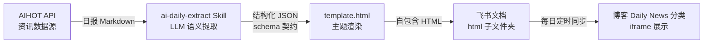

# 手把手做一个 AI 日报自动生产 Skill：从资讯抓取到网站上线的完整实录

作为一名数据与 AI 自媒体博主，我的博客 lizizai.xyz 上一直有一个名为「Daily News」的栏目，每天发布一篇 AI 领域精选资讯日报。最开始，我每天要花费几十分钟的时间，手动从各个信息源抓取、筛选、整理内容，再排版发布。这个过程不仅耗时，而且非常容易因为格式问题导致排版出错。当日报数量累积到一定程度（目前已经 157 篇，其中 91 篇是 HTML 格式），我意识到这种人工模式不可持续。我需要一套自动化方案，将我从繁琐的重复劳动中解放出来，让我的主要精力聚焦在审核和按下发布键上。

于是，我动手搭建了一套从资讯抓取到网站上线的 AI 日报自动生产 Skill 链路。现在，这套系统已经稳定运行，最新一篇日报的日期显示在 2026-10-02，并且还在每天持续更新中。这套链路的搭建，本质上是将一个「内容生产」的复杂问题，拆解成了几个可控的自动化环节。今天，我就来手把手复盘我是如何从零开始，一步步实现这个自动化流程的。

整条链路的核心在于将非结构化的资讯内容，通过语义提取转换为结构化数据，再用统一的模板进行渲染和发布。其设计思路可以用下面这张图概括：



可以看到，整个过程被拆解为五个主要环节。接下来，我将逐一讲解每个环节的实现细节、设计考量以及我在开发过程中遇到的一些问题。

### 环节一：数据源——稳定高效的资讯供给

自动化链路的第一步，当然是获取可靠的资讯数据。我选择了一个名为 AIHOT 的中文 AI 资讯聚合服务。它提供了一个稳定且公开的 API 接口：`aihot.news/api/v1`。这个 API 是匿名只读的，不需要任何 API Key 就可以直接访问，并且能返回精选的 AI 资讯和现成的日报 Markdown 内容。

我是怎么做的：

我的 Skill 会定时调用这个 API 接口，获取当天最新的 AI 资讯日报 Markdown 文本。这个 Markdown 文本已经是经过 AIHOT 团队初步整理的，包含了头条、新闻、开源项目、模型产品等多个板块，为后续的语义提取提供了高质量的输入。

为什么这么设计：

选择 AIHOT 作为数据源，主要是因为它提供了现成的、经过筛选的 Markdown 日报内容，这大大降低了我处理原始资讯的成本。它避免了我从零开始搭建爬虫系统、处理各种网站反爬和格式不一致性的麻烦。

但我也想强调一点：本教程的重点并非数据源本身。如果你没有 AIHOT 这样的数据源，这套链路依然可以复刻。你可以替换成任何能产出日报 Markdown 的源，比如自己搭建的 RSS 聚合器、爬虫抓取结果，甚至可以利用另一个 LLM 模型来生成初步的日报内容。只要最终能提供一份相对规整的 Markdown 文本，就可以接入到我这套链路的后续环节。

### 环节二：核心决策——LLM 语义提取代替正则解析

这个环节是整个自动化链路的“大脑”，也是我做出的一个核心技术决策。它的目标是将环节一获取到的日报 Markdown 文本，转换成结构化的 JSON 数据。

直觉上，很多人可能会想到使用正则表达式或编写脚本来解析 Markdown。但我在项目一开始就否决了这条路。原因很简单：日报内容是人（或者另一个 AI）写的，它的格式是“活”的，会不断演化。

正则解析的困境：

*   格式漂移： 日报的板块可能会增减，例如某天没有融资板块就整个不出现。
*   标题措辞变化： 像“模型与产品”这样的板块标题，有时可能会写成“模型产品”，甚至“大模型与应用”。
*   字段顺序调整： 即使是同一个板块内部，字段的顺序也可能在不经意间调整。

在这样的场景下，如果我使用正则表达式来解析，就意味着我的正则规则需要永远追着格式的变化跑。每一次源数据的格式微调，都可能导致我的解析脚本崩溃，从而陷入无休止的维护泥潭。这对我来说，是不可接受的技术债。

LLM 语义提取的优势：

我选择让 LLM 模型来做语义理解。我的 Skill 指令会告诉 LLM，它需要读完整篇日报 Markdown，理解每段内容的语义角色。例如，哪部分是头条新闻，哪部分是融资表格，哪部分是观点引言。然后，LLM 会根据我预设的结构化 `schema`（稍后会详细介绍），将这些语义内容归位到对应的 JSON 字段中。

LLM 的强大之处在于它的语义理解能力。即使源文本的格式有微调，板块标题的措辞有变化，只要语义没有根本性改变，LLM 依然能够自然地适配并正确提取。我的 Skill 指令，自从写好后，一年内都没有进行过大的改动，足以证明这种方法的鲁棒性。

为了更直观地对比，我制作了一张决策对比表：

| 维度 | 正则/脚本解析 | 人工整理 | LLM 语义提取（我们的做法） |
|------|------|------|------|
| 格式漂移容忍度 | 改个标题就崩，维护跟着格式跑 | 天然容忍 | 语义理解自适应板块措辞变化 |
| 开发成本 | 每板块一套规则，越写越长 | 每天几十分钟人力 | 一次写好 Skill 指令 |
| 提取质量 | 精确但死板，异常输入出错 | 最高，但不可持续 | 接近人工，需 schema 约束 |
| 可持续性 | 格式演化即技术债 | 不可持续 | Skill 指令偶尔微调 |

什么时候该用 LLM 提取，什么时候不该：

我在这部分有个很明确的经验：
*   用 LLM 的场景： 当你的输入是人写的（或模拟人写出的）、格式会漂移、字段的语义大于其在文本中的位置（比如“融资”这个概念，可能在不同地方出现，但它都是融资信息）——这种情况下，LLM 的语义理解能力是不可替代的。它能帮你处理多变和不确定的输入。
*   不用 LLM 的场景： 如果你的输入是机器生成的，格式非常稳定，字段的位置和格式是严格固定的——那么正则解析会更可靠，成本也更低。LLM 虽然强大，但并非万能，也不总是最优解。过度使用 LLM 会带来不必要的成本和潜在的不稳定性。

### 环节三：schema 契约设计——约束 LLM 的“法律”

LLM 语义提取并非玄学，它的可靠性很大程度上依赖于一套严谨的“契约”来约束其行为。这个契约，就是我定义的 JSON Schema 文件 (`schema.json`)。它是我提取结果的唯一权威标准。在 Skill 指令中，我明确写明了“提取前必读 schema”，强制 LLM 在输出 JSON 前严格对照这个 schema。

我的设计哲学主要有两条：

1.  顶层字段的灵活性：
    我的日报 JSON Schema 顶层定义了 10 个字段：`meta`、`overview`、`headline`、`news`、`openSource`、`modelsAndProducts`、`companyUpdates`、`funding`、`opinions`、`research`。
    其中，只有 `meta`（元信息，如日期、标题）和 `overview`（日报总览）是必填字段。其余 8 个板块字段，我全部设计为可选。
    为什么这么设计？ 日报的源数据每天都在变化，可能今天有融资板块，明天就没有。如果我把所有字段都设为必填，那么当某个板块缺失时，LLM 就可能因为无法填充这个字段而报错，或者“过度热心”地编造内容，这都会炸掉我的渲染流程。将它们设为可选，意味着如果源日报中没有某个板块的内容，LLM 就整个不输出该字段。我的模板在渲染时，遇到缺失的字段会自动跳过，避免了因源数据波动而导致的渲染崩溃。这种弹性设计，是整个链路稳定运行的关键。

2.  字段语义的明确性与数据校验：
    我为每个字段都定义了明确的语义和数据类型，并附带了详细的说明。
    *   例如，`news` 条目包含 `title`、`url`、`source`、`keyPoints`、`analysis` 这五个子字段，每个都有其具体的意义和预期内容。
    *   又如，`openSource` 板块中的 `stars` 字段，我明确要求它必须是整数类型，并且要去掉千分位逗号（例如，源文本是 "34,394"，提取后必须是 34394）。这避免了后续处理时还需要进行类型转换或清洗。

除了 `schema.json` 之外，我还为 LLM 配套了一份输出前自检清单。这份清单包含了十几条详细的检查规则，例如：
*   “缺失板块不输出空对象，而是整个省略该字段。”
*   “中文内容不转义为 `\uXXXX` 格式。”
*   “链接提取时，要根据字段类型判断是取文字内容还是取 URL 本身。”
*   “确保所有数字字段都已正确转换为数值类型。”

正是通过这样严格的 `schema` 约束和详细的自检清单，我才将 LLM 的提取能力从“智能”变成了“可靠的工序”，让它在面对复杂和变化的输入时，依然能产出符合预期的结构化数据。

### 环节四：模板渲染——从数据到页面的优雅转化

有了结构化的 JSON 数据，接下来就是将其渲染成易于阅读的 HTML 页面。我使用了一个自包含的 `template.html` 文件，它采用了 Editorial Flow 主题的排版风格，与我的博客整体设计系统保持一致。

数据注入机制：

我是怎么做的：
我的 `template.html` 文件中，有一个专门用于承载日报数据的 `<script>` 标签：
```html
<script id="daily-data" type="application/json">
  <!-- 这里会在渲染时注入结构化 JSON 数据 -->
</script>
```
在渲染过程中，我将 LLM 提取出的 JSON 数据字符串化，然后注入到这个 `<script>` 标签的内部。页面加载后，模板内置的 JavaScript 脚本会通过 `document.getElementById('daily-data').textContent` 获取到 JSON 字符串，然后使用 `JSON.parse()` 将其解析为 JavaScript 对象。接着，脚本会根据这个 JavaScript 对象中的各个板块数据，动态生成相应的 DOM 元素，最终呈现在页面上。

为什么这么设计（`type="application/json"`）：
这种数据注入机制有几个重要的优点：
1.  浏览器不执行： `type="application/json"` 告诉浏览器这是一个 JSON 数据块，而不是可执行的 JavaScript 代码，浏览器不会尝试解析和执行其中的内容，安全性有保证。
2.  内容转义安全： JSON 数据可以直接作为文本内容注入，无需担心 HTML 实体转义问题，因为浏览器不会将其视为 HTML 标签。
3.  数据与逻辑分离： 这种方式将数据和渲染逻辑清晰地分离。`template.html` 只负责定义页面的结构和样式，以及如何从 `<script>` 标签中获取数据并渲染。而 JSON 数据则完全独立于模板逻辑之外。

模板的样式与规范：

我的 `template.html` 严格遵守了我的博客 HTML 内容规范的四要素：
1.  主题 CSS： 从 CDN 引入与我博客同一套设计系统的主题 CSS，确保日报样式与博客主站风格统一。
2.  Google Fonts： 使用 Google Fonts 加载字体，保证排版美观一致。
3.  高度同步脚本： 内置一个脚本，会向父页面 `postMessage` 汇报内容的高度。这对于在 `iframe` 中展示内容至关重要，父页面可以根据子页面的实际高度调整 `iframe` 的大小，避免滚动条和空白。
4.  内置浮动目录： 页面内部自动生成一个浮动的目录，方便读者快速跳转到不同板块。

这四要素中的后两项，即高度同步脚本和内置浮动目录，主要是为了我在博客中通过 `iframe` 沙箱展示日报而设计的。如果读者是构建自己的静态网站，直接将 HTML 文件发布，不需要在 `iframe` 中展示，那么这两项是可以选择性砍掉的，以简化模板。

### 环节五：发布闭环——将日报推向读者

最后一个环节是发布，它将生成的自包含 HTML 文件推送到我的博客上，供读者访问。

我是怎么做的：

1.  上传飞书文档： 每天生成的自包含 HTML 文件，会被自动化上传到我的飞书文档中。我为每篇日报创建了一个以文章标题命名的文件夹，并将 HTML 文件放在其内部的 `html` 子文件夹中。飞书文档在这里充当了一个私有但可访问的文件存储服务。
2.  博客同步系统： 我的博客后端有一个每日定时任务。这个任务会去飞书文档中检查是否有新的日报 HTML 文件，并将其取回，存储到我的 R2 存储桶中。我的博客整体是基于无服务器架构构建的，R2 提供了高性能的对象存储。
3.  前端展示： 博客的前端页面，在 Daily News 分类下，通过一个 `iframe` 标签来展示这些存储在 R2 中的日报 HTML 文件。为了允许 `iframe` 内部的 JavaScript 脚本正常运行（例如前面提到的高度同步脚本），我为 `iframe` 设置了 `sandbox="allow-scripts"` 属性。

你的发布方式：

我这套发布闭环依赖于我的博客特有的无服务器架构和飞书文档的集成。对于读者来说，这一环需要根据你自己的博客系统或发布平台进行替换。
*   如果你是静态站，可以直接将生成的 HTML 文件 `git push` 到你的仓库，通过 CI/CD 自动部署。
*   如果你使用 WordPress，可以将 HTML 内容作为自定义页面上传。
*   如果你是发布到公众号等平台，可能需要将 HTML 转换为特定格式的内容。

前面四个环节——数据源、语义提取、schema 契约和模板渲染——是通用的，可以轻松地适配到任何发布场景。

### 开发过程中的真实经验（踩坑与心得）

在搭建这套自动化链路的过程中，我踩过不少坑，也总结了一些宝贵的经验。

1. LLM 提取最大的坑是“过度热心”

早期版本的 LLM 在提取时，往往会表现出“过度热心”的毛病。
*   当源日报中没有某个板块（比如融资）时，它不是省略该字段，而是输出一个空对象 `{"funding": {}}`。这虽然不至于让渲染崩溃，但会导致我的 JSON 文件中出现很多不必要的空结构，增加文件大小，也让数据看起来不干净。
*   在提取 `source` 字段时，如果源文本中有 `[原文](url)` 这样的 Markdown 链接，LLM 会直接把 `[原文](url)` 原样作为字符串留在 `source` 字段里，而不是只提取出 `原文` 或 `url`。
*   `stars` 字段的提取也遇到过问题。源文本中可能是 `"34,394"` 这样的字符串，LLM 有时会直接输出字符串，而不是我期望的整数 `34394`。

解决之道：
每一次遇到这种“过度热心”的问题，我都在 `schema` 契约和自检清单里增加更明确的规则来治它。
*   针对空对象问题，我在 `schema` 中明确指定某个字段如果为空，则整个不输出。
*   针对 Markdown 链接问题，我要求 LLM 提取 `source` 字段时，只取链接的文本部分。
*   针对 `stars` 字段，我要求 LLM 必须将其转换为整数，并去除千分位分隔符。

教训： LLM 提取的质量不是靠提示词里的“请你认真提取”这样的美好愿望，而是靠严谨的契约和清晰的规则来收紧和约束。它像一个非常聪明的学生，你必须给他清晰的考试大纲和评分标准，他才能考出你想要的分数。

2. 语义提取和搬运的边界

在 Skill 指令中，我专门写明了“提取是搬运不是编辑”——正文、要点这类内容字段，LLM 必须保留原文措辞，不进行任何润色、概括或改写。
为什么这么做？ 一旦允许 LLM 对日报内容进行改写，日报的口径和风格就会变得不可控。我希望日报保持原汁原味的信息传递，LLM 只是一个格式转换的工具，而不是一个内容创作的参与者。这对于新闻的客观性和一致性至关重要。

3. 模板与数据的分工

我坚持一个原则：所有排版决策（比如几栏布局、卡片样式、深浅色模式切换）都完全在 `template.html` 模板中完成，而 JSON 数据中只包含纯粹的内容。
这样做的好处显而易见：
*   改版式不用碰数据： 无论我未来想如何调整日报的视觉风格，我只需要修改 `template.html` 文件，而无需触碰任何数据提取或存储逻辑。
*   换数据源不用碰版式： 如果我决定更换数据源，只要新的数据源能产出符合我 `schema` 的 JSON 数据，我就可以直接接入，而无需修改模板。
这种清晰的分工，让整个系统的维护和迭代变得非常高效。

### 你可以复刻到哪？

这套“数据源 → 语义提取 → 模板渲染 → 发布”的模式，远不止用于生成 AI 日报。它的核心在于处理“源内容格式会漂移、但目标格式固定”的场景。

你可以将它复刻到：
*   周报、月报的自动化： 从各种零散的项目进展、会议纪要中，提取关键信息，生成结构化的周报或月报。
*   论文速递/研报总结： 每天从新的论文发布平台（如 arXiv）抓取摘要和关键信息，生成结构化的论文速递。
*   开源项目月报： 汇总开源项目的更新、社区动态、Star 增长等，生成月度报告。
*   个人读书笔记汇总： 从散落在各种笔记应用中的读书笔记、摘录中，提取主题、亮点、感悟，生成结构化的个人知识库。

只要你面临的是一个内容来源多样、格式不稳定，但最终需要以固定、结构化形式呈现的问题，这套 LLM 驱动的语义提取加模板渲染的方案，都能为你提供一个高效且可维护的解决方案。希望我的这篇实录，能为你带来一些启发，让你也能动手搭建属于自己的自动化 Skill！

<!-- gemini: gemini-2.5-flash 生成（tech-blog-writer 流水线·素材经核验） -->
