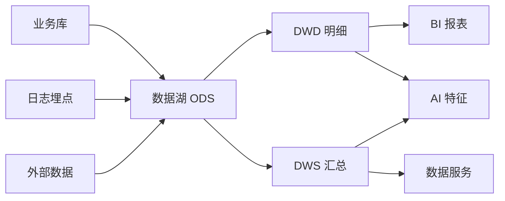

# PB 级数据底座架构实录：湖仓一体与 P99 ↓9× 调优

七年工程生涯，让我有机会深入数据领域，从政企客户的专有云交付，到如今淘宝内部的 PB 级数据链路调优，数据底座的建设与优化始终是我关注的核心。今天想和大家复盘的，正是我在数据底座方向的一次实践，它关于如何构建一个兼顾海量存储、实时计算与多维分析的湖仓一体平台，并最终将核心查询的 P99 延迟降低 9 倍。

这个项目，目标很明确：构建一个湖仓一体的数据平台，不仅要支撑 PB 级数据体量、百亿级行的数据存储，实现实时与离线一体化，更要能服务业务全链路，将核心查询的 P99 延迟降低 9 倍。这不仅仅是技术栈的堆砌，更是对数据架构、性能优化和业务理解的全面考验。

### 湖仓一体：不止是技术栈的叠加，更是理念的融合

谈到数据底座，绕不开“湖仓一体”这个词。在项目初期，我们面对的挑战是多方面的：一方面，业务部门对原始数据的灵活探索需求日益增长，希望能够快速 ingest 各类数据源，并进行 ad-hoc 查询；另一方面，传统数仓的治理、分层建模和质量约束，又是保障数据资产可靠性的基石。单独依赖数据湖，容易陷入“数据沼泽”；而纯粹的数仓，又可能因为严格的 Schema-on-write 限制，难以适应快速变化的业务需求和多样化的数据格式。

湖仓一体，正是为了解决这一矛盾而生。它不是简单地把数据湖和数据仓库的技术栈放在一起，而是融合了两者的核心优势：数据湖提供了存储原始数据的灵活性和弹性，让各种结构化、半结构化甚至非结构化数据都能“先进来再说”，满足了自由探索的需求；而数据仓库的治理能力，则通过分层建模、数据质量校验、元数据管理等手段，保证了数据的可靠性、一致性和可信性。

在我们的架构中，数据流转遵循经典的数仓分层思想，但每一个环节都融入了湖仓一体的考量：

可以看到，来自业务库、日志埋点和外部数据的原始数据首先进入数据湖的 ODS (Operation Data Store) 层。这一层保留了数据的原始形态，是整个数据链路的起点，也是我们日后回溯、重算的基石。接着，数据经过清洗、转换、标准化，进入 DWD (Data Warehouse Detail) 明细层和 DWS (Data Warehouse Summary) 汇总层。这些层的数据经过严格的建模和治理，具备更高的可用性和分析价值。最终，这些处理过的数据直接服务于上层应用，包括 BI 报表、AI 特征工程以及各类数据服务。

这种分层架构，既保障了原始数据的可追溯性，又通过逐层加工提升了数据的价值密度，使得数据能够更好地支撑多场景应用。

### 在离线一体：口径统一的“慢功夫”

在数据底座的建设中，“在离线一体”是另一个核心挑战。尤其是在某省交通部门的城市大脑项目中，实时交通态势分析和历史交通规律挖掘同样重要。我们深知，真正的在离线一体并非简单地追求“一套引擎通吃”，而是要确保“同一份口径两边都能算对”。这是因为，数仓领域最经典的“坑”之一，就是实时报表和离线报表数字对不上。往往排查下来，发现是窗口边界定义、去重逻辑或者迟到数据处理口径的差异。

为了实现口径统一，我们对 Flink 和 Spark 进行了明确的分工：

*   Flink： 主要负责实时链路。包括流式数据的摄入、实时的窗口聚合、秒级延迟的实时特征计算等。例如，实时路况拥堵指数、车辆平均速度等指标，都需要 Flink 来提供低延迟的计算结果。
*   Spark： 则专注于离线批量任务。例如 T+1 的数据重跑、历史数据的全量回刷、大规模的复杂批处理 ETL 等。当业务逻辑发生变化，需要重新计算历史数据时，Spark 的批量处理能力能够提供强大的支撑。

这种分工并不是割裂，而是优势互补。为了确保在离线口径的一致性，我们投入了大量的“慢功夫”：建立统一的元数据管理体系，制定统一的业务指标定义和计算逻辑，并通过自动化测试和双算校验机制，确保 Flink 和 Spark 在处理相同逻辑时能够产出一致的结果。

这里，我们可以通过一个简单的对比表来理解不同方案的优劣，以及我们湖仓一体方案的定位：

| 维度 | 纯离线数仓（T+1） | 纯实时流（Flink All） | 湖仓一体（我们的做法） |
|------|------|------|------|
| 时效 | 小时/天级 | 秒级 | 核心链路秒级，其余 T+1 |
| 成本 | 批量计算便宜 | 全量常驻流，贵 | 按链路分级，实时只给核心 |
| 口径一致性 | 一套批口径 | 一套流口径 | 在离线同口径双算校验 |
| 灵活性 | 改逻辑要重跑 | 回刷历史很难 | 湖底原始数据随时重算 |
| 适用 | 报表为主 | 风控/监控告警 | 分析+特征+服务全链路 |

可以看到，我们的湖仓一体方案，在时效性上做到了按需分级，成本控制更合理，并且通过在离线同口径双算校验，极大地提升了数据质量。最重要的是，其灵活性使得我们能够从湖底的原始数据随时重算，为业务提供了极大的容错和迭代空间。

### PB 级数据底座的性能极限挑战：P99 ↓9× 调优实录

在 PB 级别的数据体量下，任何一个微小的性能瓶颈都会被放大。我们在淘宝数据工程团队面临的挑战，就是如何在一个百亿级行的在离线统一打标平台和 AB 实验体系中，将核心查询的 P99 延迟从分钟级缩短到秒级，实现 9 倍的性能提升。这绝不是一蹴而就的，而是经历了一个从定位到分层调优的漫长过程。

我的一个信条是：“性能问题八成是数据分布问题。”因此，调优的第一步，永远是定位问题，而定位的核心就是观察数据分布。P99 高，通常不是因为所有查询都慢，而是因为存在长尾效应——即少数查询因为各种原因（如个别分区数据倾斜、小文件过多、缓存未命中、Shuffle 阶段的数据拉扯）导致延迟显著升高。

我们从数据、执行和缓存三个层面进行了深度调优：

1.  数据侧优化：少读数据，读对数据
    *   分区裁剪 (Partition Pruning)： 这是最基本也是最重要的优化手段。在百亿级行的数据表上，全表扫描无异于一场事故。我们的所有查询都强制要求带上分区键，确保只扫描相关分区的数据。例如，对于按天分区的日志表，查询最近一天的数据绝不能触及历史分区。
    *   数据倾斜 Key 预打散 (Pre-salting Skewed Keys)： 当发现某个 key 的数据量远超其他 key 时，在 ETL 阶段就对这个倾斜的 key 进行加盐处理，将其打散到多个分区或 bucket 中，避免单个任务实例成为瓶颈。例如，针对某个热门商品 ID 或用户 ID，通过 `CONCAT(key, '_', RAND(N))` 的方式，将其随机分散。
    *   小文件合并 (Small File Merging)： 大数据系统处理文件时，每个文件都会产生一定的开销。如果存在大量几 MB 甚至几 KB 的小文件，元数据管理和文件读取效率都会急剧下降。我们通过定期的 Compaction 任务，将这些小文件合并成更大、更合理的文件大小（例如 128MB 或 256MB），显著提升了查询性能。

2.  执行侧优化：高效计算，合理分配
    *   Shuffle 并行度调优 (Shuffle Parallelism Tuning)： Shuffle 是大数据计算中最昂贵的操作之一。合理的 Shuffle 并行度能够避免数据传输瓶颈和单个任务过载。我们根据集群资源和数据量动态调整 Shuffle 的并行度，确保所有资源得到充分利用，同时避免过多的小任务带来调度开销。
    *   内存配置优化 (Memory Configuration)： 无论是 Spark 还是 Flink，内存配置都至关重要。过小的内存可能导致频繁的磁盘溢写，过大的内存则可能造成资源浪费或 OOM。我们通过监控和经验，为不同的任务类型配置了最优的 Executor 内存、Driver 内存以及 Heap / Off-heap 内存比例，确保数据能够在内存中高效处理。
    *   列式存储与谓词下推 (Columnar Storage & Predicate Pushdown)： 我们广泛使用 Parquet 或 ORC 等列式存储格式。这些格式允许查询引擎只读取查询所需列的数据，极大减少了 I/O 量。结合谓词下推（Predicate Pushdown），使得在读取数据时就能根据过滤条件跳过不相关的数据块，进一步提升了查询效率。

3.  缓存侧优化：热点数据，触手可及
    *   热点查询结果物化 (Hot Query Result Materialization)： 对于那些被频繁查询、且数据变化不频繁的复杂 SQL 结果，我们将其物化成预计算表或视图，直接存储在高速存储介质上。当有相同查询时，可以直接返回预计算结果，避免了重复计算。
    *   分层缓存 (Tiered Caching)： 我们构建了多级缓存体系，从计算引擎的内存缓存（如 Spark 的 RDD Cache）、到分布式存储的 Block Cache，再到外部的 KV 存储（如 Redis），针对不同时效性、访问频率的数据提供不同的缓存策略。例如，实时计算结果会优先进入内存和 KV 缓存，而历史聚合结果则可能存储在分布式文件系统的 Block Cache 中。

可以说，P99 ↓9× 的达成，正是通过这些多维度、系统性的调优措施，最终将长尾查询的瓶颈逐个击破。每一次调优，都离不开对数据分布的细致分析和对执行计划的深入理解。写一条新的 SQL 之前先 `explain` 它的执行计划，这已经是我的肌肉记忆。

### 湖仓一体的业务价值：AB 实验体系与全链路赋能

在淘宝的经历，让我对数据底座的业务价值有了更深的理解。特别是 AB 实验体系，它对数据底座提出了两个核心要求：一是分人群快圈选，要求能够快速、精准地从海量用户中筛选出符合实验条件的人群；二是指标口径统一，确保不同实验组的对比指标计算逻辑一致，避免“苹果和橘子”的比较。

我们的湖仓一体底座，正是 AB 实验体系的基石。湖底的原始数据和数仓的治理分层，提供了强大的用户行为标签和属性数据，使得圈选人群变得高效。同时，在离线统一的计算口径，保障了实验指标的准确性和可信度。实验平台本身，只是这个强大数据底座的一个消费方，它从底座获取所需的数据，进行分析和决策。

除了 AB 实验，这个数据底座还支撑了 BI 报表、AI 特征工程、数据产品和各类数据服务。无论是业务方希望查看实时销售数据，还是算法工程师需要生成用户画像特征，抑或是产品经理希望通过数据服务为用户提供个性化推荐，湖仓一体的底座都能够提供稳定、高效、高质量的数据支撑。它真正实现了服务业务全链路的目标。

### 数仓的「慢功夫」：血缘与治理的长期主义

最后，我想谈谈数仓建设中的「慢功夫」。在项目的初期，建模和血缘治理往往是短期内最「看不到收益」的工作。它不像性能优化那样能立竿见影地看到指标下降，也不像新功能上线那样能快速获得业务反馈。然而，从长远来看，这些「慢功夫」却决定了整个数据平台的生死。

一个拥有完整数据血缘图的数仓，就好比一个有清晰导航系统的城市。当我们需要修改某个字段时，我可以清楚地知道这个字段会影响哪些下游报表、哪些 AI 模型、哪些数据服务。这样，我们就能提前评估风险，通知相关方，避免潜在的故障。而在客户现场，我见过许多血缘缺失的数仓，它们往往最后会变成一个谁都不敢碰的「数据沼泽」。一旦出现问题，排查起来犹如大海捞针；想要做任何改动，都会因为不确定下游影响而犹豫不决，最终导致数据资产的停滞和腐化。

因此，从一开始就投入资源进行规范的建模、细致的元数据管理和自动化的血缘追踪，是任何一个有远见的数据团队都必须坚持的长期主义。这不仅是为了技术本身的健壮性，更是为了保障整个业务的数据生命线。

### 结语

从阿里云的 FDE 经验，到淘宝的 PB 级链路调优，每一次实践都是一次深入数据世界的探索。这个湖仓一体数据底座的建设和优化，让我深刻体会到，数据工程绝不仅仅是写代码、调参数，它更是对业务的深度理解、对架构的全局思考、以及对细节的极致追求。

数据技术的演进永无止境，未来的数据底座还将面对更多挑战，比如实时湖仓的进一步融合、更智能的自动化治理、以及更高效的异构数据处理。作为一名数据与 AI 的布道者，我将继续与大家分享我的思考与实践。希望我的这些经验，能给正在数据领域探索的你带来一些启发。

<!-- gemini: gemini-2.5-flash 生成（作品集·素材经核验） -->
