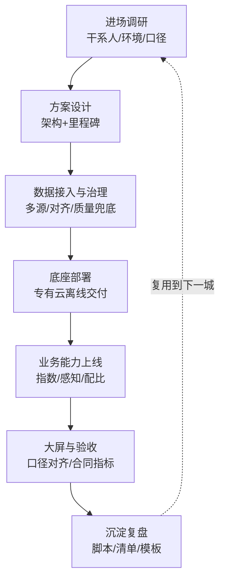

# 政企大客户交付实录：4 城城市大脑与专有云现场

大家好，我是李自在。这些年一直在数据与 AI 领域摸爬滚打，从 2021 年到 2024 年，我在阿里云担任 FDE（Front-end Delivery Engineer），主要职责是面向政府和大型企业客户做现场交付。今天想跟大家复盘一下这段经历，尤其是那几个颇具挑战性的「城市大脑」和专有云项目。这几年做下来，真是一部活生生的政企交付方法论实践史。

简单来说，我的工作就是把阿里云在数据中台、AI 应用、可视化大屏上的能力，完整地搬到客户的生产环境里，并确保它能稳定运行、产生价值。这个「搬」字，可不是简单的拷贝粘贴，它涵盖了从方案设计到最终验收的全周期交付。我们团队这些年陆续交付了 4 座城市的城市大脑项目，还深度参与了多个大型专有云建设。回过头看，这些项目给我最大的财富，就是一套在极端约束条件下，依然能高效率、高质量交付的实战经验。

### 互联网交付 vs. 政企交付：本质差异与 FDE 的价值

很多人习惯了互联网项目的迭代节奏和开发环境，觉得交付就是按部就班。但政企大客户的项目，骨子里就和互联网有本质区别。这好比在自家厨房做饭，和要在太空舱里烹饪，虽然都是做饭，但环境、工具、流程完全是两码事。

| 维度 | 互联网迭代交付 | 传统外包项目制 | 我们的做法（FDE 现场制） |
|------|------|------|------|
| 节奏 | 周级迭代 | 里程碑制 | 里程碑内保持周级小步 |
| 环境 | 自己的云，随时动 | 客户机房，变更审批 | 专有云约束下预演变更 |
| 验收 | 线上指标 | 合同文档 | 合同指标+现场可复演 |
| 沉淀 | 团队内部 | 交付即散 | 脚本模板跨城复用 |

首先是环境。我们面对的往往是客户的专有云或者政务云环境，网络通常是严格隔离的，不能随便访问公网。组件版本通常也是冻结的，想升级？那得走复杂的审批流程。进场更是要层层报备，安全审查是常态。这和互联网公司在自家云上，想用什么组件、想怎么升级都相对自由的环境，形成了鲜明对比。

其次是节奏。政企项目往往是合同里程碑驱动的，交付内容和时间点都写得清清楚楚，一旦延期，后果很严重。这和互联网产品那种“小步快跑、快速迭代”的模式完全不同。我们必须在严苛的合同框架下，想办法保持内部的周级小步迭代，确保每个里程碑都能按时交付可验证的成果。

再来是干系人。一个政企项目，往往牵涉到业务方、信息中心、第三方监理、以及我们作为厂商等多方。每个部门都有自己的诉求和视角，沟通协调的复杂程度远超单一产品团队。比如一个交通领域的城市大脑，可能就需要和交管局、运管处、气象局等多个部门打交道，他们的需求和数据口径都需要我们去协调统一。

最后是验收标准。这块是重中之重，验收标准不是看线上监控指标，而是写进合同里的具体可复演的指标。比如“实时拥堵指数准确率达到 X%”、“事件感知召回率达到 Y%”，这些都必须在客户现场经过严格测试并达到，才算通过。

FDE 的价值，就是在这样的复杂环境中，把云上的“产品能力”翻译成“现场能落地的方案”。所以 FDE 不光要懂技术，还要懂业务、懂管理、懂沟通。我们不是简单地把产品部署上去，而是要根据客户的实际情况，对产品进行适配、调优，甚至进行定制化开发，最终让它在客户环境中跑起来，并真正解决问题。

### 城市大脑：从多源数据到可视化大屏的挑战

聊到城市大脑，这绝对是政企交付中最具代表性也最具挑战性的项目之一。它是一个巨大的系统工程，我们交付的 4 座城市，虽然具体细节有差异，但核心结构和面临的挑战是高度相似的。

典型的城市大脑项目，大致可以分为几个层次：

1.  多源数据接入层：这是地基，需要接入城市运行的各种数据，比如交通卡口数据、浮动车轨迹、公交车 GPS、气象数据、水电气热等传感器数据。
2.  数据底座层：这是核心，负责数据的接入、治理、融合、质量保障，构建统一的数据模型和数据服务。我在这里面主要负责数据底座与孪生计算平台的架构设计与落地。
3.  业务能力层：基于数据底座，开发各种智能应用，比如实时拥堵指数计算、信号灯配比优化、交通事件感知与预警、公共资源调度等。
4.  可视化大屏层（领导驾驶舱）：将各项业务指标和城市运行状态直观地展现出来，供领导决策。

看起来很美好，但魔鬼都在细节里。尤其是在数据底座这一层，我们遇到了海量的“数据苦活”。

以交通场景为例，卡口数据接入就是个老大难。不同路口的设备可能来自不同厂商，命名规则五花八门，同一路口不同设备的命名也可能不一致，甚至时间戳漂移、数据格式不统一的情况屡见不鲜。我们要做的第一步就是把这些“脏乱差”的数据进行清洗、标准化。

接着是多方数据对齐。比如要把卡口数据和浮动车数据结合起来分析，这就涉及到空间对齐（把数据映射到统一的路网模型上）和时间对齐（考虑不同数据源的采样频率和时延差异）。这些操作的背后，是复杂的地理编码、路网匹配算法以及时序数据处理。

最关键的还是数据质量兜底。数据是城市大脑的血液，一旦数据质量出问题，上层的业务应用就成了空中楼阁。比如某一路段数据缺失或错误，直接影响实时拥堵指数的可信度，进而影响交通管理部门的决策。因此，我们必须设计严密的缺数漏报补齐策略、异常数据检测和修复机制。这些“脏活累活”，在演示 demo 里永远看不见，却占据了现场交付工作量的大头。

### 专有云的“紧箍咒”：约束清单与计划性变更

互联网开发习惯了随手 pip install、npm install，或者在公有云上点点鼠标就能弹性扩容。但在专有云环境，这些都是“奢望”。专有云项目有着一套严格的约束清单，好比给我们的工程实践戴上了“紧箍咒”：

*   不能随便连公网：所有的依赖包、镜像都必须提前离线打包，上传到客户的内网仓库。一个看似简单的第三方库，可能需要我们花上几天时间去解决它的离线安装依赖问题。
*   组件版本锁定：专有云平台为了稳定性和安全性，会对内部的各种组件（比如数据库、消息队列、容器平台）的版本进行锁定。我们不能随意升级，任何版本变更都要走平台流程，提交申请、审批、测试、排期，一套下来可能就是几周甚至几个月。互联网公司“顺手升级一下”的操作，在现场是不存在的。
*   扩容要审批：需要增加服务器资源？得提交工单，走客户内部的审批流程。所以容量规划必须提前做，不能等资源不够了临时抱佛脚。

面对这些约束，我们的交付策略必须从“快速试错”转向“充分预演”。每一次部署、每一次配置变更，都必须经过周密的计划和充分的测试。我们甚至会在自己的测试环境模拟客户的专有云环境，预演所有的操作，确保现场一次成功。这不仅是技术挑战，更是对项目管理和风险控制能力的极大考验。

### 4 城交付沉淀的方法论：从手工作坊到流水线

这 4 座城市的城市大脑交付，就是一个从“手工作坊”到“工业流水线”进化的过程。第一次交付，我们基本是“人肉交付”，每一个问题都是现场救火，每个配置都是手动调整。那段时间，我们团队几乎是住在客户现场，每天都像打仗一样。

但我们很快意识到，这种模式是不可持续的。从第二座城市开始，我们就开始有意识地沉淀部署脚本和验收清单。把第一城那些重复、易错的手动操作，都写成自动化脚本。每次部署前，跑一遍脚本；每次交付前，对照验收清单逐项检查。

到了第三座城市，我们更进一步，开始推行组件化和模板化。比如数据接入这块，我们把常用的交通数据源（卡口、浮动车、公交）的接入流程、数据清洗规则、数据模型都抽象成可复用的模板。原本需要一个月才能完成的数据接入与治理工作，通过模板化和自动化脚本，我们最快一周就能搞定。

第四座城市，基本就实现了流水线式交付。整个部署、调试、测试、验收流程，大部分都实现了自动化。我们把之前沉淀的脚本、模板、工具进行整合，形成了一套标准的交付流程和工具集。

这套方法论的沉淀，最终体现在了交付效率上：我们的交付周期缩短了 60% 以上。这并非某次天才的优化，而是把一次又一次的重复劳动，转化成可复用的模板和工具，一点一滴累积起来的成果。

整个交付流程，可以概括如下：

这个流程图，不仅仅是交付步骤，更是我们不断优化的迭代路径。每一次沉淀复盘，都是为了让下一次交付更加顺畅。

### 可视化大屏：不仅仅是技术，更是政治产品

城市大脑的最终呈现，往往是通过一块块巨大的可视化大屏。很多人觉得大屏不就是数据接口加前端展示吗？技术上确实相对简单，但它的“现场哲学”却非常复杂。

在我看来，可视化大屏绝不仅仅是一个技术产品，它更是一个“政治产品”。它要在重要的汇报场合，在短短 3 秒钟内，清晰、直观地向领导展示城市的运行状态，以及决策的效果。它需要做到“一屏观天下”，让非技术背景的领导也能快速理解核心信息。

这就引出了最大的难题：指标口径对齐。比如“拥堵指数”这个指标，不同部门可能有不同的计算方法和理解。交管部门可能有一套传统的、基于路口饱和度的计算口径，而我们的数据平台则可能基于浮动车轨迹、卡口流量等大数据源进行实时计算。如何让这两种口径在数字上保持一致或至少能相互印证，并得到所有相关部门的认可，是交付过程中一个巨大的挑战。这需要我们深入理解业务，与各方反复沟通、协调，最终达成一致的算法定义和呈现方式。这其中，技术只是手段，沟通和协调才是关键。

### AI 应用：先打地基，再盖楼层

这些年，AI 应用在政企场景的落地节奏，相对互联网行业确实要慢一些，但它一旦落地，往往更加扎实。我的经验是，政企场景的 AI 应用，一定要先做好数据治理，再谈智能应用。

很多项目方急于求成，在数据源头质量不高、数据模型不规范的情况下，就直接上 AI 算法，指望通过 AI 解决所有问题。结果往往是 AI 模型效果大打折扣，甚至完全不可用，最终导致项目返工。比如在城市大脑中，如果交通卡口数据的时间戳是漂移的，或者路网匹配有误，那么基于这些数据训练的交通预测模型，其预测结果也必然是不可信的。

我们始终坚持“先地基后楼层”的原则。在开始 AI 应用开发之前，我们会投入大量精力在数据接入、清洗、融合、建模上，确保有一个高质量、结构化的数据底座。有了坚实的数据基础，AI 模型才能真正发挥作用，实现精准的预测、识别和优化。

后来我出来做独立 Agent 业务，这条“先地基后楼层”的经验依然适用。无论是构建知识库，还是训练 AI 模型，高质量的数据和扎实的数据治理工作，永远是成功的基石。

### 结语

回首这几年在政企大客户现场交付的经历，最大的感受是：技术固然重要，但它只是工具，真正决定项目成败的，是对复杂环境的适应能力、对业务的理解深度、以及与多方干系人沟通协调的艺术。

我们从最初的“人肉交付”到最终的“流水线交付”，效率提升了 60%，这背后是无数个昼夜的摸索、一次次失败的教训、以及团队成员们坚持不懈的沉淀和优化。这段经历让我对“工程化”和“方法论”有了更深刻的理解。

政企交付就像一场马拉松，你需要有长远的规划、坚韧的毅力，更需要一套科学的方法论来支撑你跑完全程。希望我分享的这些实战经验，能给大家带来一些启发。我们下期再见！

<!-- gemini: gemini-2.5-flash 生成（作品集·素材经核验） -->
