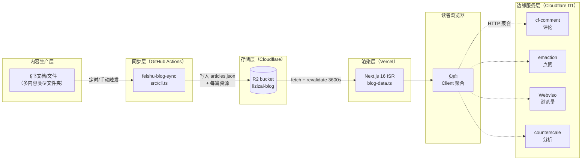
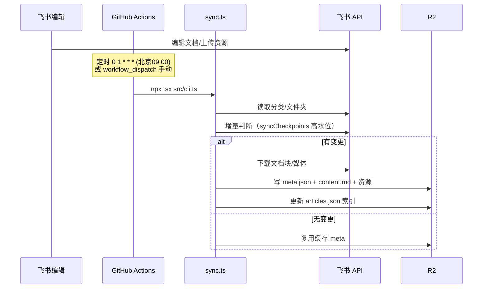
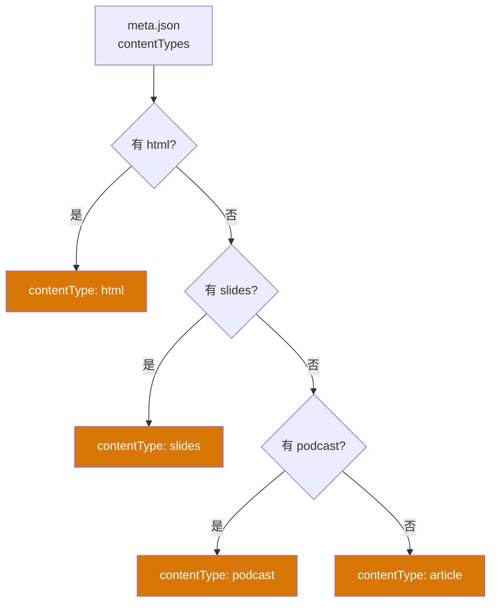
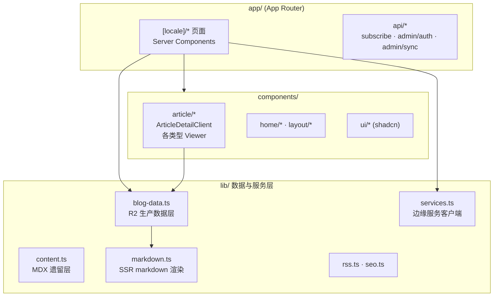
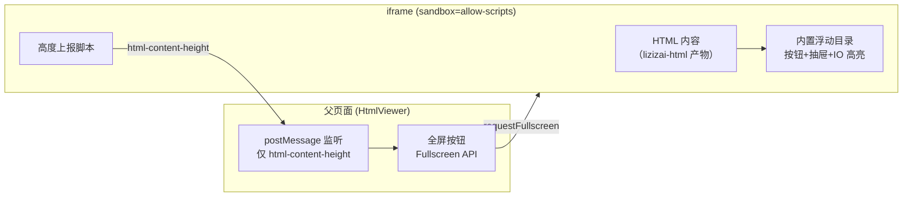
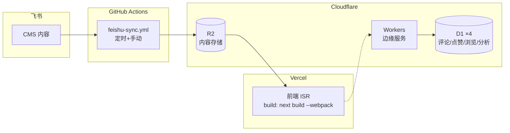

# lizizai-blog 技术架构设计

> 状态：反映 2026-06 当前实现现状
> 定位：整体技术架构总览。各模块深度设计见 `docs/` 下专题文档（同步、多内容类型、迁移等）。

## 1. 设计理念

**无头 CMS + 静态优先 + 边缘服务**的三段式架构：

- **内容与渲染解耦**：飞书文档作 CMS，内容同步到 R2 对象存储，前端纯 ISR 静态渲染，无运行时数据库查询
- **写少读多适配**：内容日更数次、阅读数万次 → 同步是低频批处理，阅读走 CDN + ISR 缓存
- **边缘服务自治**：评论/点赞/浏览量等交互功能由独立 Cloudflare Worker + D1 承载，前端通过 HTTP 聚合，互不耦合
- **零运维数据库**：前端不直连任何 DB，所有动态数据经边缘服务 HTTP 接口

## 2. 系统架构总览



### 技术栈

| 层级 | 技术选型 |
|------|---------|
| 前端框架 | Next.js 16 (App Router) · React 19 · TypeScript 5 |
| 样式 | Tailwind CSS v4 (OKLCH) · shadcn/ui (new-york) |
| 渲染策略 | ISR（文章列表 3600s / 浏览量 300s / 点赞 60s） |
| 内容存储 | Cloudflare R2（对象存储 + CDN） |
| 同步 | GitHub Actions + `workers/feishu-blog-sync` 代码 |
| 交互服务 | Cloudflare Workers + D1（评论/点赞/浏览/分析） |
| 邮件 | Resend |
| 搜索 | Pagefind（构建时静态索引） |
| i18n | next-intl（默认 en，中文 `/zh`） |
| 部署 | Vercel（前端）+ Cloudflare（R2 / D1 / Workers） |

## 3. 数据流

### 3.1 内容写流（低频批处理）



### 3.2 内容读流（高频缓存）

读者请求 → Vercel Edge → ISR 命中？
- **命中**：返回静态页（≤ 3600s 内）
- **过期**：`getAllArticles` 重新 `fetch(R2 /articles.json)`，`getArticleBySlug` 拉取 `content.md` 服务端渲染 markdown → 重生成静态页

### 3.3 交互数据流（客户端聚合）

页面 SSR 时不含点赞/浏览/评论数（避免服务端串行调用边缘服务）。客户端 `useEffect` 批量并发拉取：

| 数据 | 来源 | 时机 |
|------|------|------|
| 点赞数 | emaction | 进入文章页 |
| 浏览量 | Webviso（批量） | 列表页预取 |
| 评论数 | cf-comment | 文章页 |

## 4. 内容架构

### 4.1 内容类型模型

`ContentType = 'article' | 'podcast' | 'slides' | 'html'`，一篇文章可同时具备多种类型（`contentTypes` 字段），按优先级确定**主展示类型**：



主类型优先级：**`html > slides > podcast > article`**（HTML 为第一阅读类型）。

### 4.2 飞书多内容类型文件夹结构

单篇文章在飞书以 blogFolder 形式组织，同步器按子文件夹名识别类型（大小写敏感）：

| 子文件夹 | 类型 | 内容 |
|---------|------|------|
| `文章` / `article` | article | 主 docx + 可选 `cover.{png,jpg,webp}` |
| `播客` / `podcast` | podcast | 同名文件组（音频 + 封面 + 文字稿） |
| `PPT` / `ppt` | slides | `index.html` + `slides/` + `shared/` |
| `html` | html | 独立 HTML（lizizai-html 规范） |

### 4.3 R2 存储布局

```
blog-data/
├── articles.json                    # 全量文章索引（前端入口）
├── categories.json                  # 分类列表
└── articles/{categorySlug}/{slug}/
    ├── meta.json                    # 元数据（含 contentTypes + syncCheckpoints）
    ├── content.md                   # 文章正文 markdown
    ├── cover.png / cover-thumb.webp # 封面原图 + 400px 缩略图
    ├── images/                      # 文章内图片
    ├── podcast/                     # 播客音频/封面/文字稿
    ├── slides/                      # PPT 静态资源
    └── html/index.html              # HTML 内容（iframe 源）
```

### 4.4 增量同步策略

**各类型独立高水位**（`contentTypes.syncCheckpoints`）：每种内容类型记录上次观测到的最大 `modified_time`，任一类型有更新即触发该篇重同步。

> ⚠️ 不能用「子文件 mtime > 文章 mtime」作基准——多内容类型文章生产顺序为文章→播客→PPT→HTML，子文件 mtime 天然偏大，会导致增量永久失效（每次全量重传）。详见 `docs/incremental-sync-design.md`。

## 5. 前端架构

### 5.1 分层



### 5.2 数据访问层（双轨）

- **`lib/blog-data.ts`（生产）**：`getAllArticles` / `getArticleBySlug` 从 R2 `fetch`，`cache()` 同请求去重。文章正文服务端 `renderMarkdown` → 预渲染 HTML 下传 client（避免 client 携带 markdown 运行时）
- **`lib/content.ts`（遗留）**：本地 `content/` 目录 MDX + YAML，仅开发调试

### 5.3 多内容类型渲染（`ArticleDetailClient`）

文章详情页按 `contentType` 切换主内容区 + 侧边栏，多类型文章用 `ContentTypeSwitcher` 切换：

| 主类型 | 主内容 | 侧边栏 |
|--------|--------|--------|
| article | `ArticleContent`（SSR HTML） | `ArticleSidebar`（markdown TOC） |
| podcast | `PodcastList` / `AudioPlayer` | `PodcastSidebar`（章节） |
| slides | `SlideViewer`（HTML iframe / Markdown） | `SlidesSidebar`（页码） |
| html | `HtmlViewer`（iframe + 全屏） | `ArticleSidebar`（元信息） |

### 5.4 国际化

next-intl，`localePrefix: 'as-needed'`（默认 `en` 不带前缀，中文 `/zh`）。**每个 layout/page 必须调 `setRequestLocale`**，否则全站退化为 dynamic rendering，Pagefind 搜索索引失效。

### 5.5 构建说明

`build` 强制 `next build --webpack`——Turbopack 与 `next/font/google` 中文字体不兼容会构建失败。`postbuild` 跑 Pagefind 生成 `public/pagefind` 搜索索引。

## 6. HTML 内容类型架构

设计原则：**目录由 HTML 自带，跨 frame 仅同步高度**。



**关键约束**：iframe `sandbox="allow-scripts"`（无 `allow-same-origin`），父页面**无法访问 iframe DOM**，故：
- 嵌入模式：iframe 高度 = 内容高度，用户滚动父页面，HTML 内 `scrollIntoView` 触发父页面滚动
- 全屏模式：iframe 100vh 独立滚动，HTML 内 `fixed` 目录与 `IntersectionObserver` 高亮完美生效——**这是目录体验的推荐模式**

HTML 产物必须含四要素：主题 CSS（R2 CDN）+ Google Fonts + 高度同步脚本 + 内置目录脚本。由 `/lizizai-html` Skill 保证一致性。

## 7. 边缘服务集成

| 功能 | 服务 | 调用方 | 缓存策略 |
|------|------|--------|---------|
| 评论 | cf-comment | client（CommentSection） | 不缓存 |
| 点赞 | emaction | client（ArticleActions） | revalidate 60s |
| 浏览量 | Webviso | client（getBatchViews 批量） | revalidate 300s |
| 分析 | counterscale | 自动（script 注入） | — |
| 订阅 | Substack | client（SubstackEmbed 跳转） | 见 `docs/subscription-architecture.md` |

服务间完全解耦，各自独立 D1，前端不直连任何数据库。订阅已迁移至 Substack 托管（博客零后端订阅逻辑，邮件投递由 Substack 负责）。

## 8. 部署与运维



- **前端**：push main → Vercel 自动构建部署（ISR）
- **内容同步**：GitHub Actions `feishu-sync.yml`，schedule `0 1 * * *`（北京 09:00，cron 常滞后）+ `workflow_dispatch`（支持 `force_sync` 全量）。详见 `docs/migrate-sync-to-github-actions.md`
- **Worker 代码**：`workers/feishu-blog-sync/` 保留，但生产由 GitHub Actions 跑 `src/cli.ts`，`wrangler.toml` triggers 已注释

### 环境与密钥

| 环境 | 变量 |
|------|------|
| 前端（Vercel） | `NEXT_PUBLIC_SITE_URL` · `R2_PUBLIC_URL` · `NEXT_PUBLIC_{EMACTION,WEBVISO,CF_COMMENT,COUNTERSCALE}_URL` · `RESEND_*` · `ADMIN_PASSWORD` |
| 同步（Actions secrets） | `FEISHU_APP_SECRET` · `FEISHU_FOLDER_TOKEN` · `R2_ENDPOINT` · `R2_ACCESS_KEY_ID` · `R2_SECRET_ACCESS_KEY` |

## 9. 关键架构决策

| 决策 | 选择 | 理由 |
|------|------|------|
| 内容存储 | R2 对象存储 | 无服务器、CDN 内置、免运维 DB；写少读多适配 ISR |
| 同步触发 | GitHub Actions（非 Worker CRON） | 无子请求限制、可跑全量、日志可查、免费分钟数充足 |
| 增量基准 | 各类型独立高水位 | 避免子文件 mtime 天然偏大导致增量失效 |
| HTML 目录 | 内容自带（非跨 frame 同步） | sandbox 下 offsetTop/postMessage 不可靠；自包含零外部依赖 |
| 交互数据 | client 聚合（非 SSR） | 保持 ISR 静态，边缘服务故障不影响内容渲染 |
| 双数据层 | blog-data（R2）+ content（MDX） | 生产用 R2，MDX 层作开发/降级备用 |
| 主类型优先级 | html > slides > podcast | HTML 沉浸阅读体验最佳，作第一阅读类型 |

## 10. 扩展点

**新增内容类型**：`types/index.ts`（ContentType）→ `sync.ts`（`FOLDER_NAMES` + `syncXxxFolder` + 优先级）→ `lib/rss.ts`（`FEED_CONTENT_TYPES`）→ `ArticleDetailClient`（渲染分支）→ `ContentTypeSwitcher`/`ContentTypeBadge`（按钮）→ 翻译键。

**新增分类**：飞书根文件夹下建文件夹即自动识别（`performSync` 扫描根目录生成分类列表）。

**新增边缘服务**：加 `NEXT_PUBLIC_XXX_URL` → `lib/services.ts` 加客户端 → 组件 `useEffect` 聚合。

## 相关文档

- `docs/multi-content-type-sync.md` — 多内容类型同步详细设计
- `docs/incremental-sync-design.md` — 增量同步高水位策略
- `docs/migrate-sync-to-github-actions.md` — Worker CRON → GitHub Actions 迁移
- `docs/feishu-cms-integration.md` — 飞书 CMS 集成
- `.claude/skills/lizizai-html/SKILL.md` — HTML 主题规范
- `CLAUDE.md` — Claude Code 操作指引
