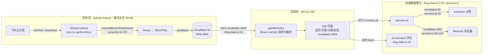
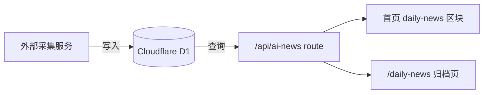

# lizizai-blog 架构梳理（阶段 2 产出）

> 配合阶段 1 的叙事侧重 A（架构演进史）。所有架构描述基于真实代码（`file:line`），不臆测。
> **重要修正**：子请求 saga 的最终结局是**迁移到 GitHub Actions**（非链式分批），见下文第六节。

---

## 一、端到端架构图

### 内容同步 + 渲染流

### AI 资讯流（独立第二条数据流）

---

## 二、核心模块特性分组

| 模块 | 文件 | 职责 | 关键事实 |
|------|------|------|----------|
| **生产数据层** | `lib/blog-data.ts:1-342` | 从 R2 读文章 + 聚合动态数据 | `getAllArticles` 用 `cache()` 请求内去重 + `getBatchViews` 一次拿全部浏览量（首页 2N+2→2 优化的核心，`4ba4201`） |
| **遗留数据层** | `lib/content.ts:1-376` | 本地 MDX 读取 | **当前零引用**（grep 验证），注释"被 blog-data.ts 替代"。保留作调试/降级备用 |
| **同步引擎** | `workers/feishu-blog-sync/src/sync.ts:255` `performSync` | 飞书→R2 全量/增量同步 | 运行在 **GitHub Actions**（非 Worker），`syncBlogFolder`/`syncDocument`/`syncPodcastFolder`/`syncSlidesFolder` 分类同步，`createTrackedR2` 包装追踪文件变更 |
| **格式转换** | `converter.ts:170` `convertBlocksToMarkdown` | 飞书 blocks → Markdown/HTML | 是早期"Markdown 引用块空行 bug"（S12-S14）的发生地 |
| **外部服务集成** | `lib/services.ts:1-137` | emaction 点赞 + Webviso 浏览量 | 带优雅降级开关 `isEmactionEnabled`/`isWebvisoEnabled`；评论（cf-comment）在 `blog-data.ts:16` 直接 fetch，不走 services.ts |
| **访客身份** | `lib/guest-identity.ts` + `lib/wuxia-names.ts` | visitor_id 匿名系统 | **武侠风格昵称**（慕容/独孤/令狐…）确定性生成 + DiceBear 头像。BMA-6 的诗意产物 |
| **ISR 缓存** | `app/[locale]/**/page.tsx` + `services.ts` | 三级 revalidate | 内容 3600s / 浏览量 300s / 点赞 60s（grep 全量验证） |
| **AI 资讯** | `lib/ai-news.ts` + `/api/ai-news` | D1 → API → 页面 | 独立于 R2 内容流的第二条数据流 |

---

## 三、架构章节大纲（融入演进史叙事）

配合侧重 A，架构章节嵌入"三次转向"的演进弧：

1. **起点与第一次瘦身**：Strapi 克隆 → 去 UGC 个人博客
   - `8dc1199` Letters Clone → `007487c` 移除 UGC
   - visitor_id 武侠昵称系统（`guest-identity.ts`）替代用户认证

2. **飞书 CMS：协作工具即内容源** ★核心判断点
   - 同步链路：飞书 → GitHub Actions(`performSync`) → R2 → ISR
   - 为什么飞书（待深挖动机）vs Strapi 的运维成本

3. **多内容形态**：一篇文章的四种 contentType
   - article / podcast（多播客列表 + 旧 audio.mp3 兼容，`blog-data.ts:193-205`）/ slides（json 或 markdown 分割，`:208-224`）/ html（R2 URL，`:227-233`）

4. **子请求 saga → 平台切换** ★最强戏剧性 + 核心判断点
   - Workers 子请求超限 → Queue/自调用/链式均遇阻 → **迁 GitHub Actions**（`a43fcf7`，Worker 降级只读）
   - 判断点：识别平台契合度，而非死磕单平台限制

5. **边缘服务拼装**：乐高式集成
   - 评论/点赞/统计/邮件/搜索各一个 Cloudflare 服务 + 优雅降级
   - cf-comment(D1) / emaction(D1) / Webviso(D1) / counterscale(D1) / Resend / Pagefind(构建时)

6. **缓存三级策略**：ISR revalidate 的分层
   - 3600（内容）/ 300（浏览量）/ 60（点赞）—— 按"变更频率"分层

7. **双数据层**：R2 生产 + 本地 MDX 备用
   - content.ts 已零引用但保留：赌 R2 可靠性 + 保本地可调试性

8. **工具化收尾**：博客生产自己的 skill
   - lizizai-html / ai-daily-extract / ian-xiaohei 配图 / HTML TOC(postMessage)

---

## 四、与阶段 1 叙事弧的对齐

| 演进阶段（阶段1弧） | 对应架构章节 |
|---|---|
| 克隆 → 个人博客 | 章节 1 |
| → 飞书 CMS | 章节 2 |
| → 多内容扩展 | 章节 3 + 5 |
| → 边缘约束与平台切换 | 章节 4 |
| → 工程化（缓存/双数据层/测试） | 章节 6 + 7 |
| → 工具化反哺 | 章节 8 |
